# Objectives

Research Data Management (RDM) is an innovation research project led by the research team of Dr Tyng-Ruey Chuang at Institute of Information Science, Academia Sinica, Taiwan.

The aim of the RDM project is to introduce open culture to the broader academic communities in Taiwan. Dedicated to foster a more open and collaborative research environment, RDM promotes the use of Data Depositar, an open-source database for the researchers and research institutions in Taiwan to manage and share their original research data.

# Role

I served as an independent researcher and UI designer/developer in this project. Their mission deeply resonates with my values on encouraging broader and deeper voluntary civic participation, which I see as an essential foundation of the democracy in Taiwan.

Throughout the collaboration, I defined and developed the desktop and mobile wireframe of the website. As they chose Drupal as the core content management system for the website, there was a need to establish a UI design system for the extensive Drupal modules.

The modules are reusable interactive website components which can be easily customized. The design system that I developed aims to ensure the consistency within the future module development — if the RDM team would like to add up more new modules to the website, the design system will provide clear guidance and corresponding stylesheets for their user interface. It mitigates the hassle for the team to work from scratch.

# Approach

## Establishing a web design system

The workflow for crafting the design system comprises four major stages: backstage setup, mockup design, front-end implementation, and task transfer. Among them, the core “design” activities happened during the second and third stages. I created the structure of UI inventory, established rules and principles, built the colour palette, and also defined the typographic scale for the design system. All the design activities were conducted with the full-stack team and documented carefully. After those design activities, I handed over the work to the full-stack engineers. They then connected the front-end and the back-end Drupal system altogether.

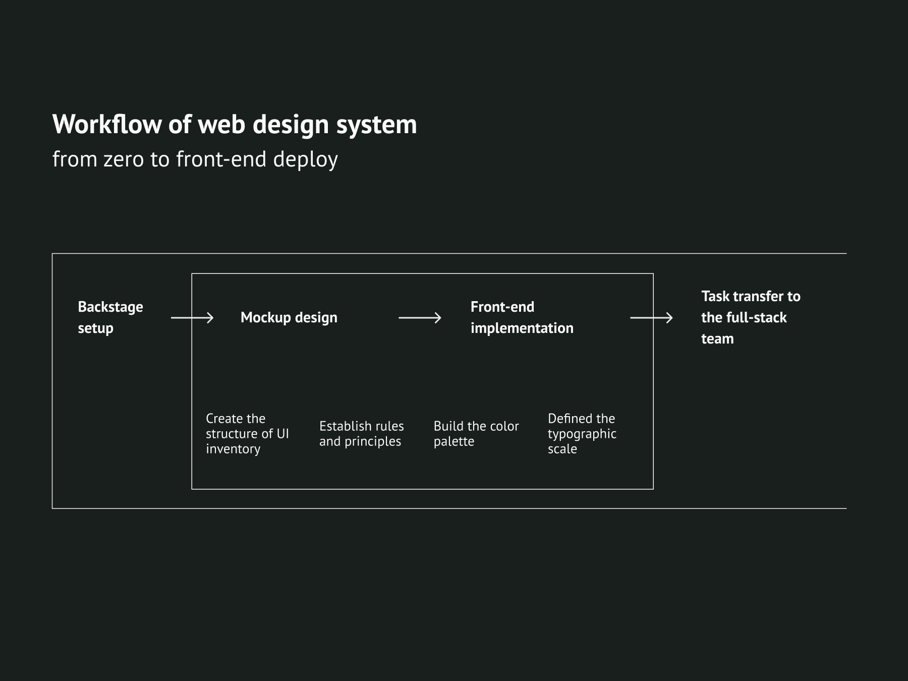

At the beginning of the collaboration, we discussed the “backstage setup” of the project: who are the people that carry on the development? What will the organizational structure be and how will the people work within the structure. In this case, it was simple: I was working as the sole designer and front-end developer in coordination with a team of full-stack and back-end engineers. The team leader and project manager will be facilitating communication and supervise progress.

They have roughly developed the basic structure of the website, so I won’t have to develop the UX and use the flow from zero. What I needed to do was to re-organize the site structure with the systemic thinking and language of a UI inventory. It was a bottom-up approach, through which I counted the web UI components and categorized them. A very rough structure is shown below.

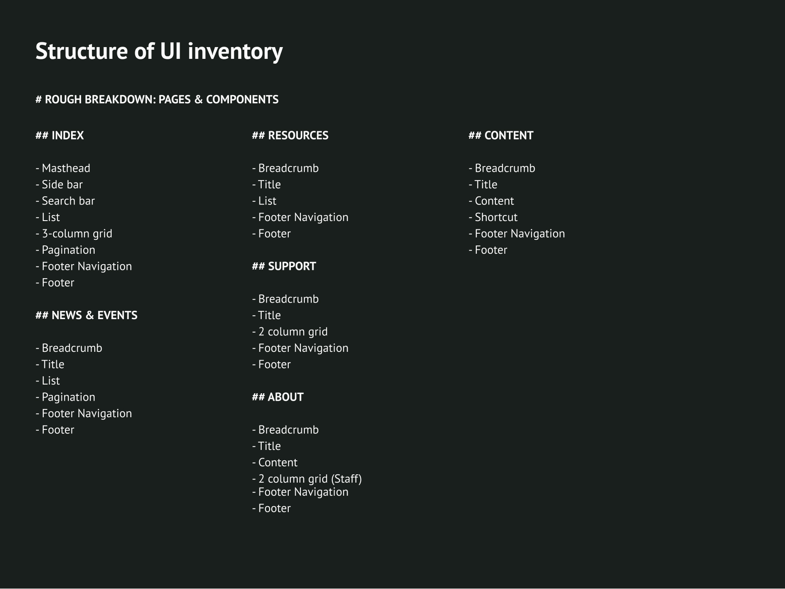

It provided an overview of the design components and their relationship that I needed to consider throughout the project. I then utilized it to create the rules and principles, the colours, and the typographic systems for the website.

## Main base colours and its rules on visual priority

I first determined to define four main base colours as one of the fundamental rules. The four colours were chosen as an extension of the main colour of RDM’s logo, which I designed in accordance with the identity of Data Depositar.

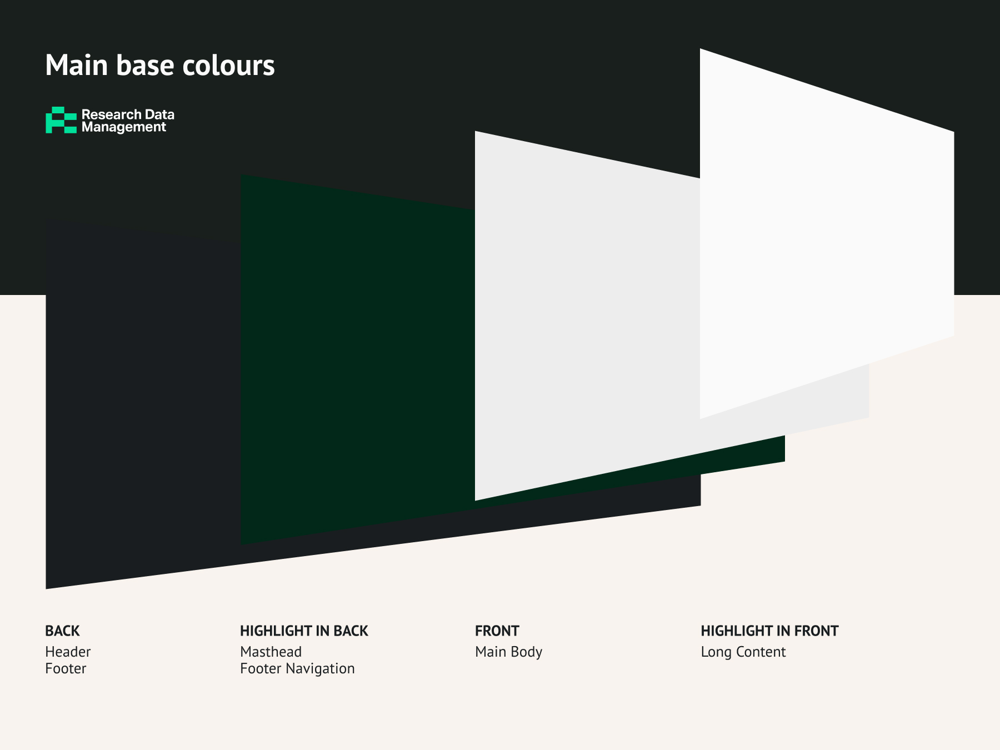

Brightness is the primary factor, which implies the visual priority of the elements on display. Saturation is another factor that could highlight the elements with top priority. In general, the lighter the section/component is, the higher its priority is. Among the light parts, I intentionally made some highlights even a little more brilliant. The distinction in saturation raised the awareness of users and hints that the components are interactive.

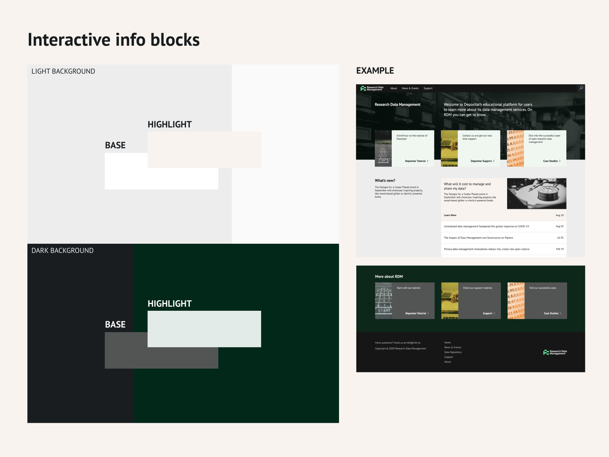

## Alternative Colours

The colours are derived from six fundamental hues, which looks harmonized with the four main base colours mentioned above. They aim to be used in subordinate content, such as the image shown in the info blocks.

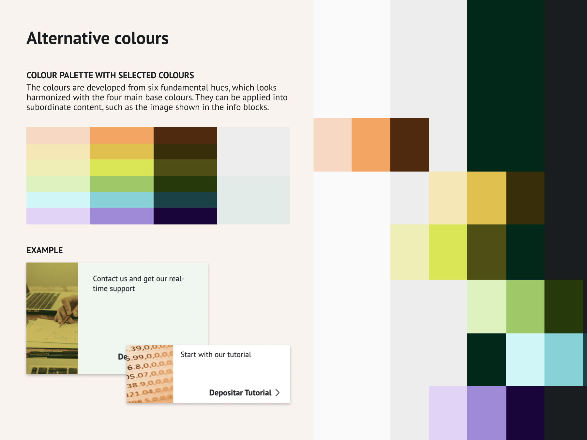

## Typographic Scale

I chose PT Sans as the brand font of RDM. It’s an open font with a libre spirit associated with the mission of RDM: to promote open culture in Taiwan’s academia. It’s a font with quite good legibility and a modern humanistic look.

I defined the typographic scale in SASS and applied it in the global and regional style of the site. Therefore, the scale shown in the site looks consistent.

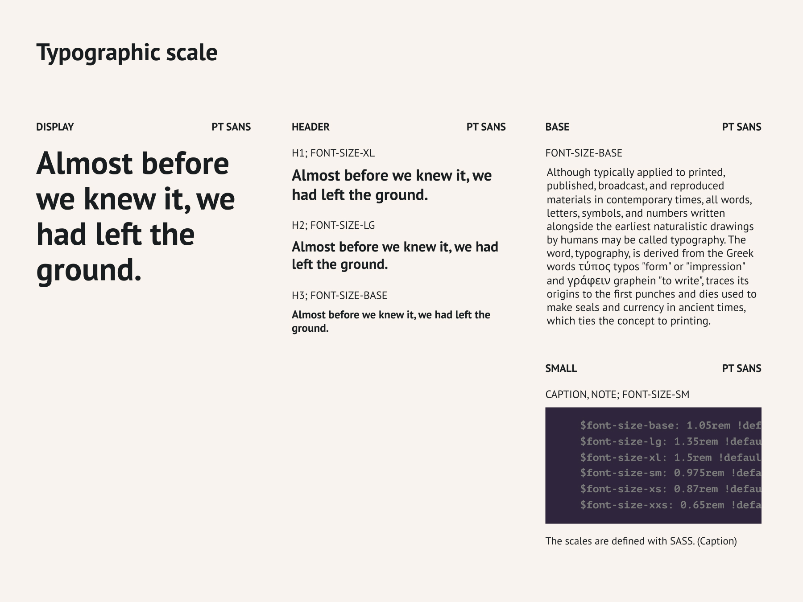

# Outcome

**Front-end for further deployment**

The rules of the website were being developed along with the mockup design and front-end implementation process. Because I was also responsible for the front-end development of the RDM site, I could be crafting the rules with the code-based thinking from the beginning of the project. In other words, I reduced the hurdle of overlapping work between designer and developer. I also avoided creating impossible and hard-to-build features and made the design to the users intact.

# Gallery

Here are a few screenshots of the final front-end that I handed over to the full-stack team, who then would deploy it over the Drupal system. The deployment is currently an ongoing process.

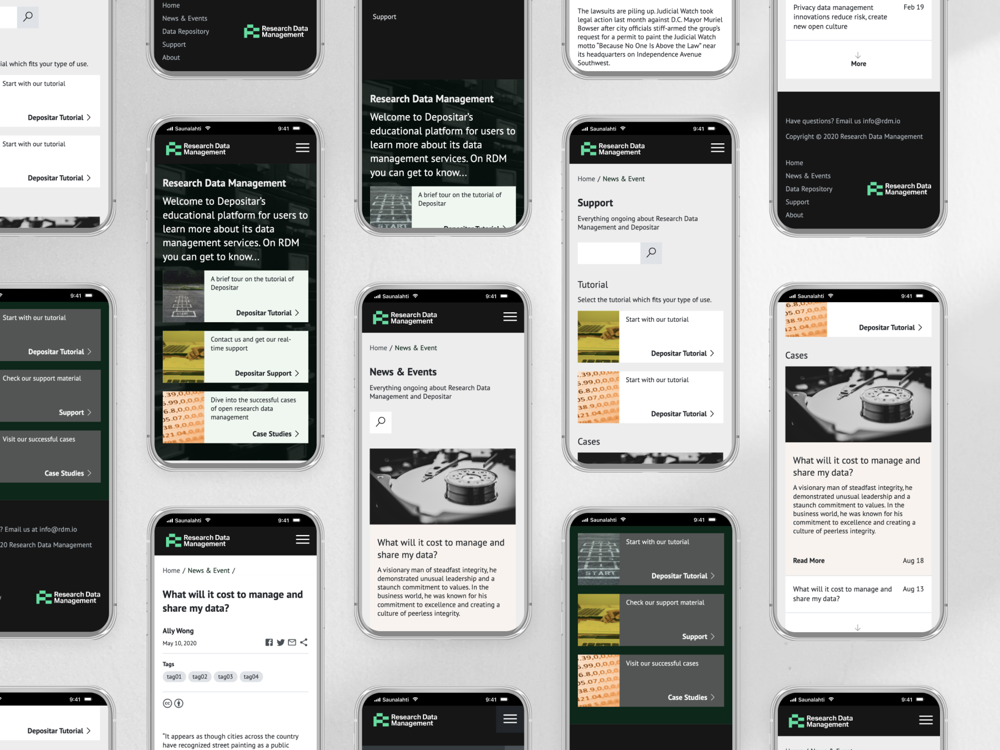

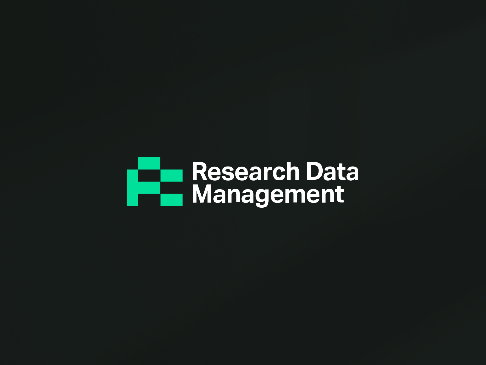

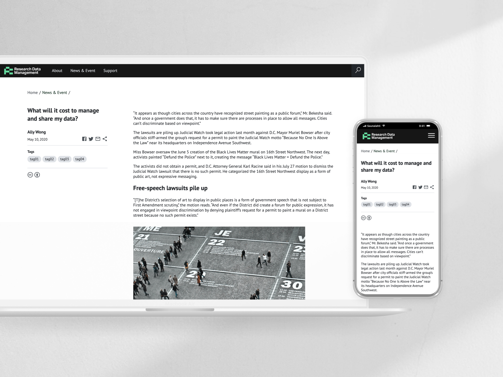

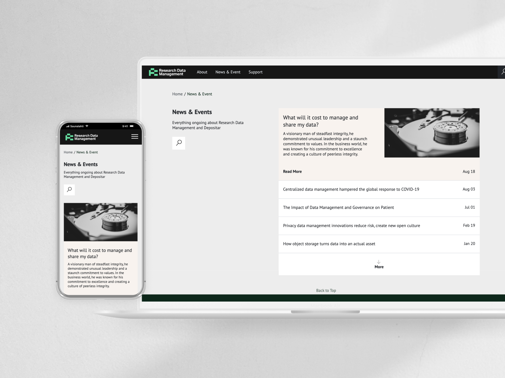

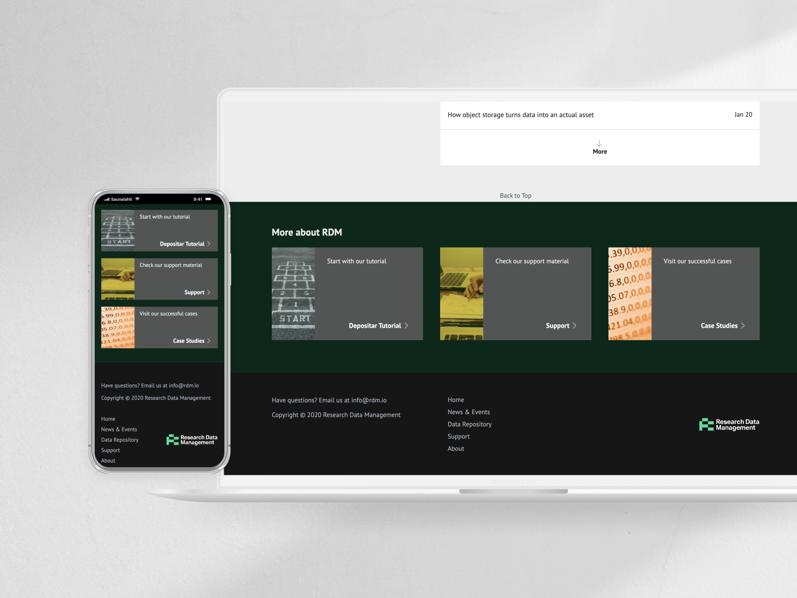

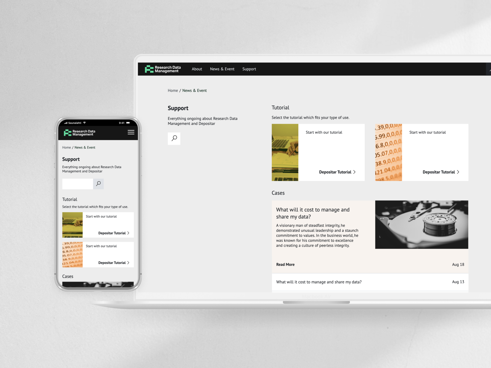