# 目標

研究資料寄存所（RDM）是由中央研究院資訊科學研究所莊庭瑞博士研究團隊主導的創新研究計畫。

RDM 計畫的目標是將開放文化引介至台灣更廣泛的學術社群。致力於促進更開放、更具協作精神的研究環境，RDM 推廣使用 Data Depositar——一套開源資料庫，供台灣研究人員及研究機構管理與分享原始研究資料。

# 我的角色

我在本計畫中擔任獨立研究員暨 UI 設計師／開發者。他們的使命與我對鼓勵更廣泛、更深入的公民自願參與的價值觀高度契合，而我認為這正是台灣民主的重要基石。

在整個合作過程中，我定義並開發了網站的桌機與行動版框線圖。由於他們選擇 Drupal 作為網站的核心內容管理系統，因此需要為龐大的 Drupal 模組建立一套 UI 設計系統。

這些模組是可重複使用的互動式網頁元件，可輕鬆客製化。我開發的設計系統旨在確保未來模組開發的一致性——若 RDM 團隊日後希望新增更多模組，設計系統將為其使用者介面提供清晰的指引與對應的樣式表，減輕從頭開始的繁瑣工作。

# 方法

## 建立網頁設計系統

打造設計系統的工作流程分為四個主要階段：前置準備、設計稿製作、前端實作與任務交接。其中，核心的「設計」工作發生在第二與第三階段。我建立了 UI 清單架構、制定規則與原則、建立色彩系統，並定義設計系統的字體排版比例。所有設計工作均與全端工程團隊協作並仔細記錄。設計工作完成後，我將其移交給全端工程師，由他們整合前端與後端 Drupal 系統。

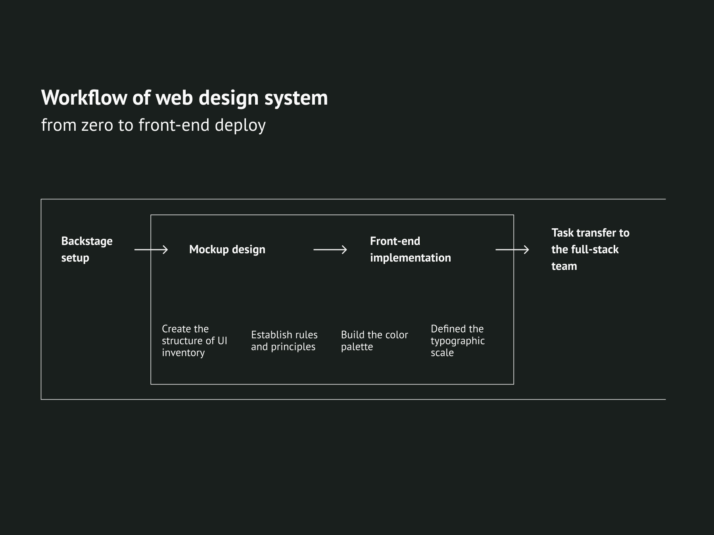

在合作初期，我們討論了專案的「前置準備」：誰來負責後續的開發？組織架構為何，成員又將如何在此架構中協作？在這個案例中，架構相對單純：我擔任唯一的設計師兼前端開發者，與一個全端及後端工程師團隊協作，由團隊領導人和專案經理負責溝通協調與進度監督。

他們已初步搭建了網站的基本架構，因此我無需從零建立 UX 和使用流程，而是要以系統化思維和 UI 清單的語言重新整理網站架構。這是一種由下而上的方法：我盤點網頁 UI 元件並加以分類，形成如下所示的粗略結構。

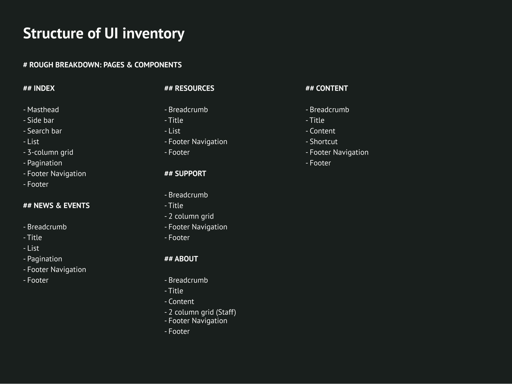

這份清單提供了我在整個專案中需要考量的設計元件及其相互關係的全貌，我據此建立了網站的規則與原則、色彩系統及字體排版系統。

## 主要基礎色彩及其視覺優先層級規則

我首先確立了四種主要基礎色彩作為核心規則之一。這四種顏色是 RDM 標誌主色調的延伸，而標誌本身是我依據 Data Depositar 的識別設計的。

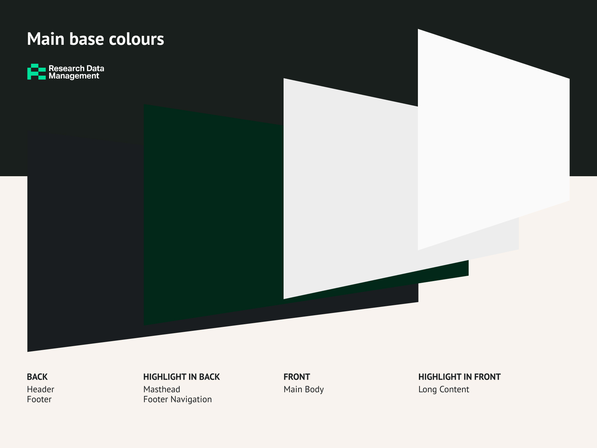

亮度是主要因素，隱含了頁面元素的視覺優先層級；飽和度則是另一個可強調最高優先元素的因素。整體而言，區塊或元件越亮，其優先層級越高；在較亮的部分中，我刻意將某些重點元素調得更加鮮明，飽和度的差異有助於提升使用者的注意力，並暗示這些元件具有互動性。

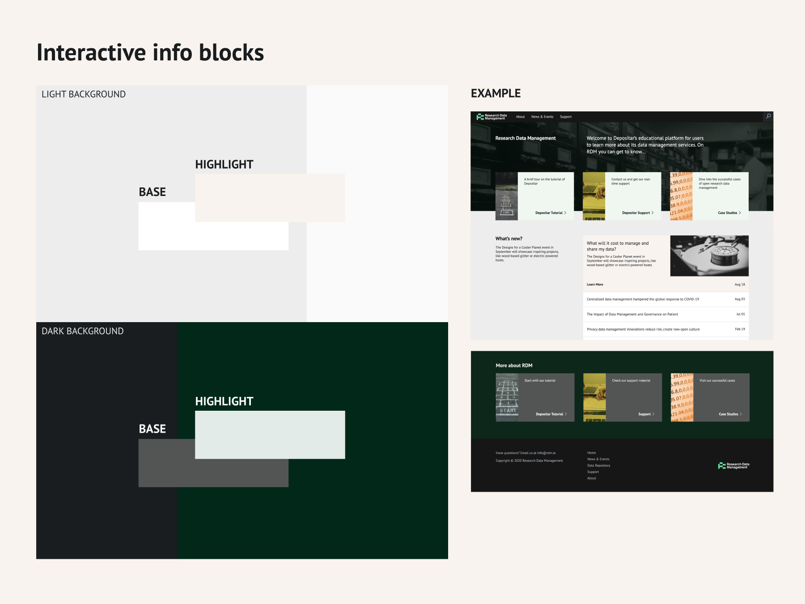

## 輔助色彩

這些色彩衍生自六種基本色相，與上述四種主要基礎色彩形成和諧的視覺效果，主要用於次要內容，例如資訊區塊中的圖片。

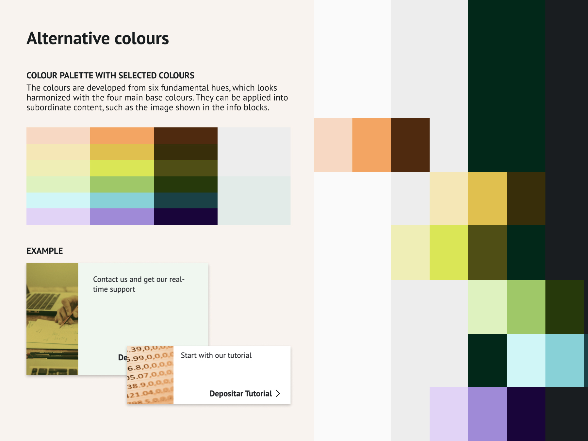

## 字體排版比例

我選擇 PT Sans 作為 RDM 的品牌字型。這是一款開源字型，其自由精神與 RDM 推廣台灣學術開放文化的使命相契合。這款字型具有良好的可讀性與現代人文主義的外觀。

我在 SASS 中定義了字體排版比例，並將其應用於網站的全域與局部樣式，使整個網站的排版呈現一致的視覺效果。

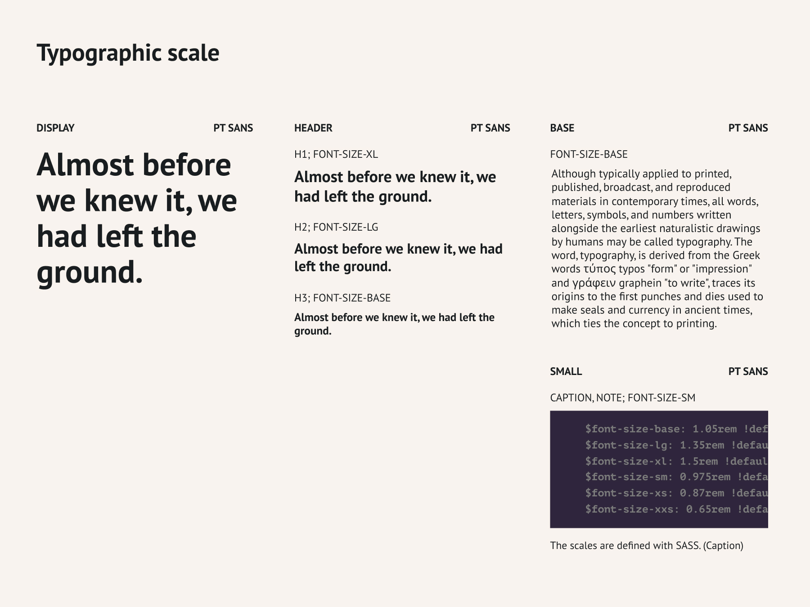

# 成果

**可供後續部署的前端**

網站規則是在設計稿製作與前端實作的過程中同步建立的。由於我也負責 RDM 網站的前端開發，因此從專案之初便能以程式碼思維建立規則，有效減少了設計師與開發者之間的重複工作，同時避免創造不可能或難以實作的功能，讓設計得以完整呈現給使用者。

# 作品集

以下是我移交給全端團隊的最終前端截圖，他們將據此在 Drupal 系統上進行部署，目前部署工作仍在進行中。

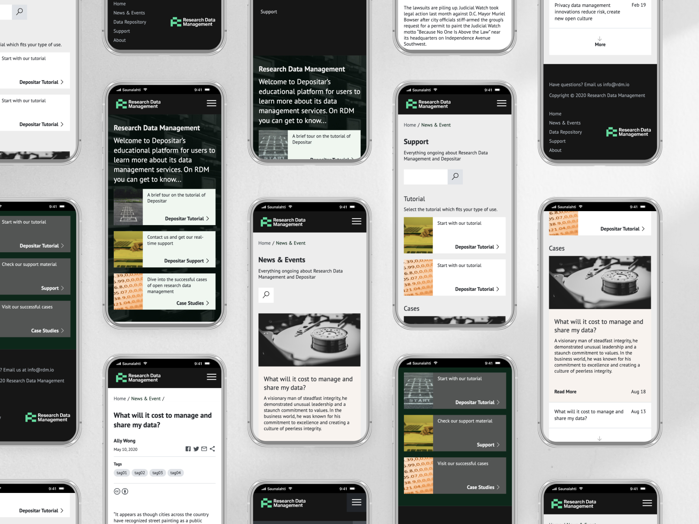

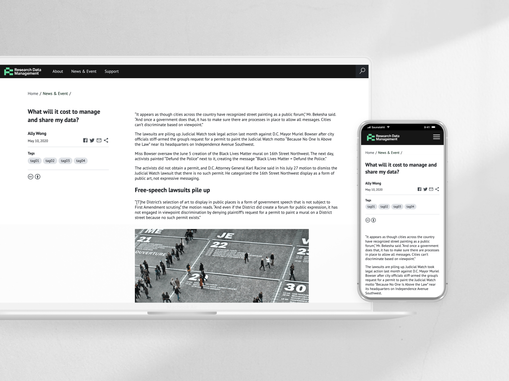

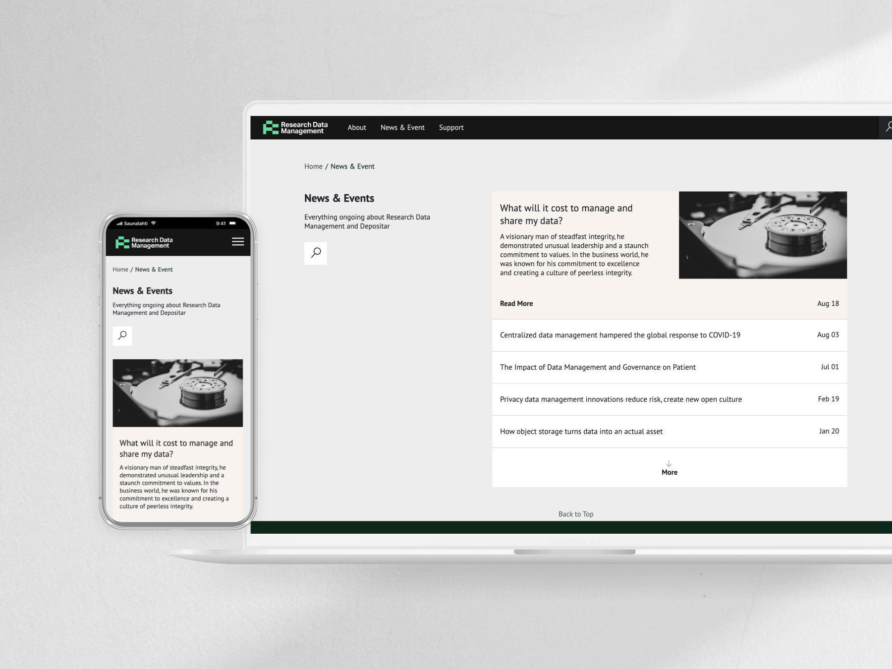

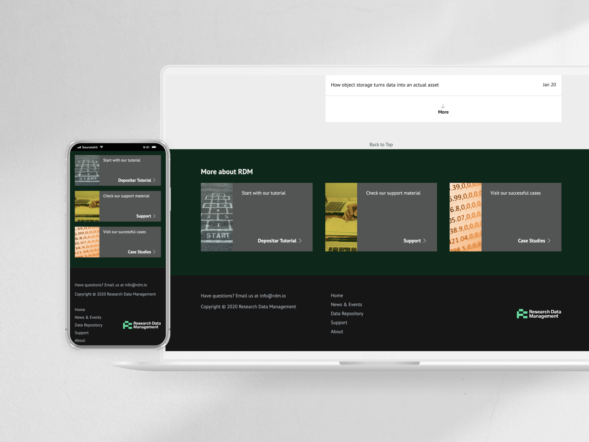

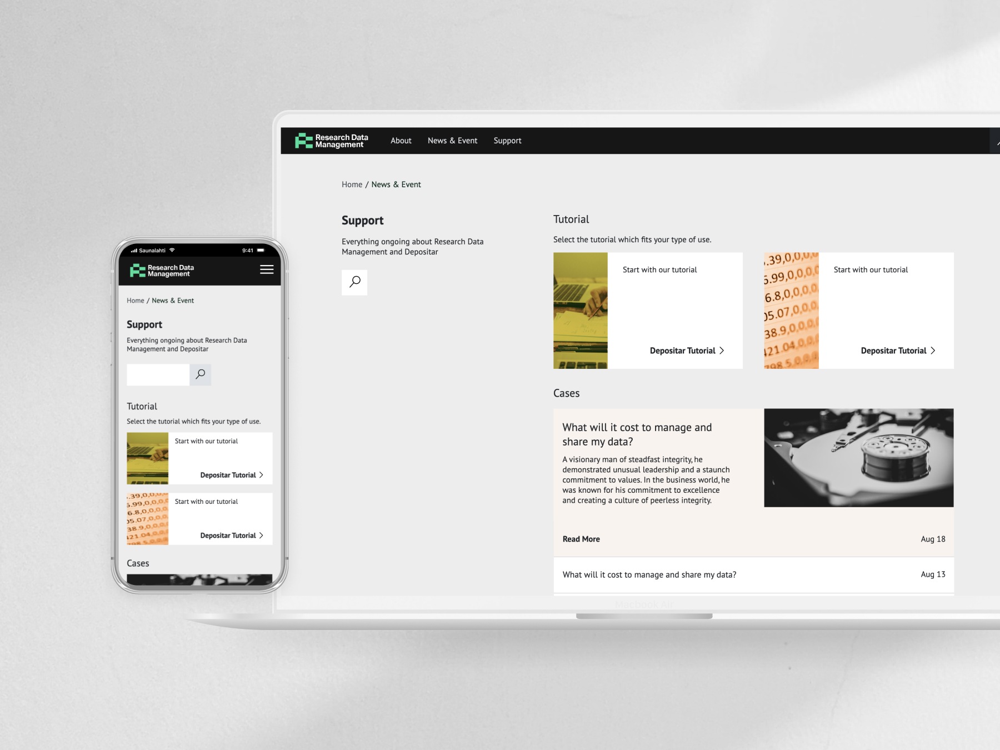
