# Objectives

Aize was spun off from Aker Solutions, a global Norwegian engineering and technology company for the energy industry. When the software department became its own company in 2019, it took with it around 30 to 40 product lines, each one a small application, along with the design system those applications relied on. The product itself is a browser application. It gives customers a digital twin of their assets, so they can inspect and maintain their offshore and onshore energy production equipment.

At the beginning of 2024 the company started to rework the whole product and merge those product lines into one. We were asked to rebuild the design system at the same time. The goal was to unify the user experience, keep what we had learned from the old system, and pay down the design and technical debt that had never had a chance to be dealt with.

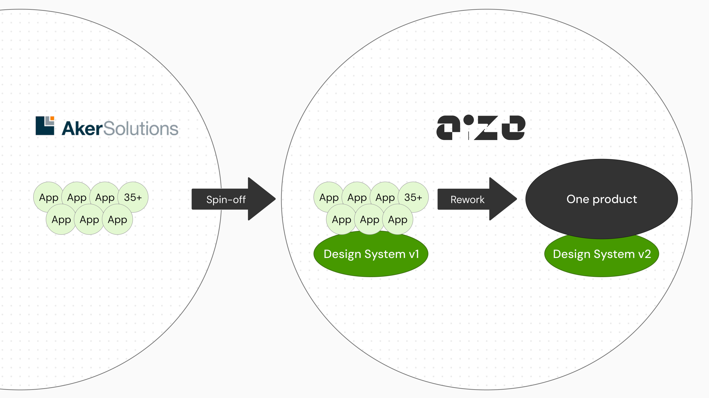

# My role

I spent three years in the design system team with the other designer. In this project I was responsible for around half of the tokens, components and UX patterns. I also worked with the other designer, the design lead of the team, on our strategy and ways of working.

Besides the design work, I ran UX audits, design reviews and knowledge-sharing sessions for more than 150 designers and developers.

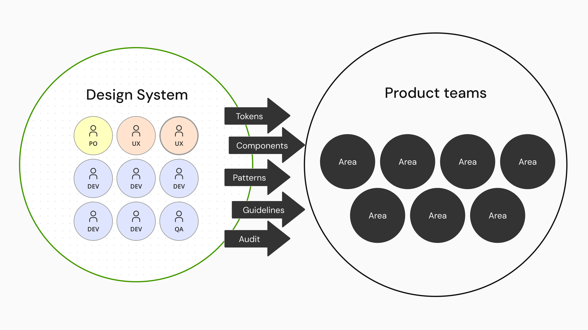

# Challenge

## Rebuilding the system while the product was still being invented

Generally speaking, a design system is supposed to move slowly, and to settle the inconsistencies that come up naturally in fast product development. Our situation was the opposite. The product teams were still exploring, the use scenarios kept changing, and we had to build a stable system quickly at the same time.

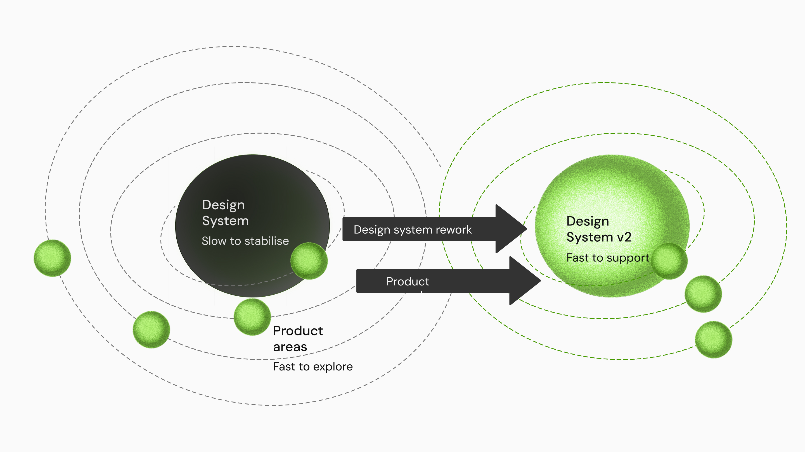

The old design philosophy made it harder. The design system we inherited gave product teams heavy, feature-rich components built for specific industry needs. Research and design of that kind takes a long time, and it could not survive the new requirement to produce product quickly while working in parallel with the delivery teams. If we had insisted on keeping it, the design system would have become the bottleneck for the product teams’ deadlines.

At the same time we had to follow the branding guidelines set by an external consultancy the company had hired. Those guidelines were visually refined, but they lacked consideration for accessibility and for the design system. We had to follow the new design language and localise it into our own product context.

# Approach

## Key offerings from the design system

Before the detail, it is worth saying what the system actually offers. We thought of it as foundations and overarching rules. The foundations are the tokens and the components, which carry the visual language and the building blocks of every screen. The overarching rules are the UX patterns, which govern how those blocks may be assembled. Together they constitute the core product experiences, and each section below is one of those offerings.

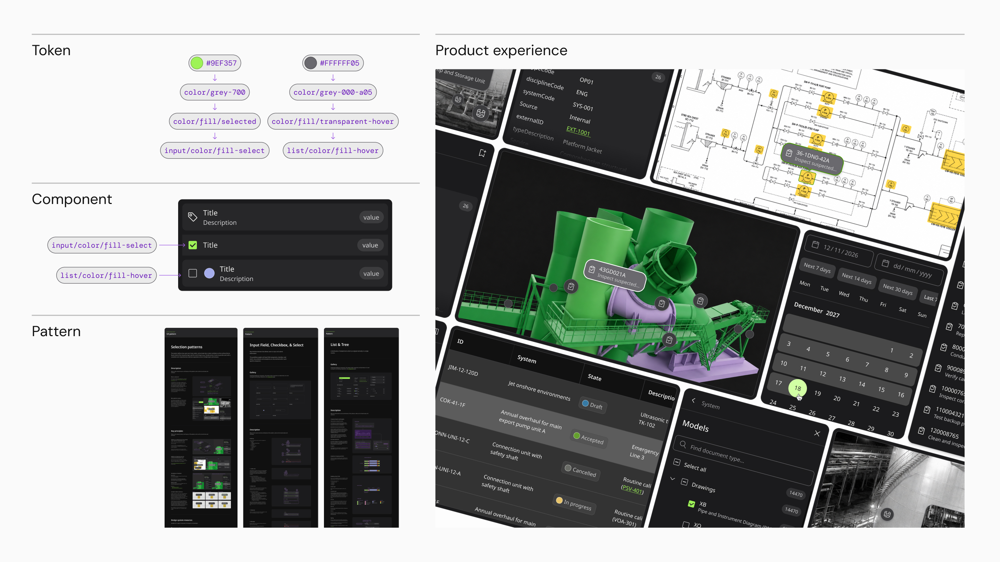

## A three tier token system

We rebuilt the foundation as three tiers of tokens: global tokens, alias tokens and component tokens. The tiers support consistency and customisation at the same time, and they make every design decision traceable. A change to a colour or a spacing step can be traced all the way back to the global tokens, with no guessing about where it came from.

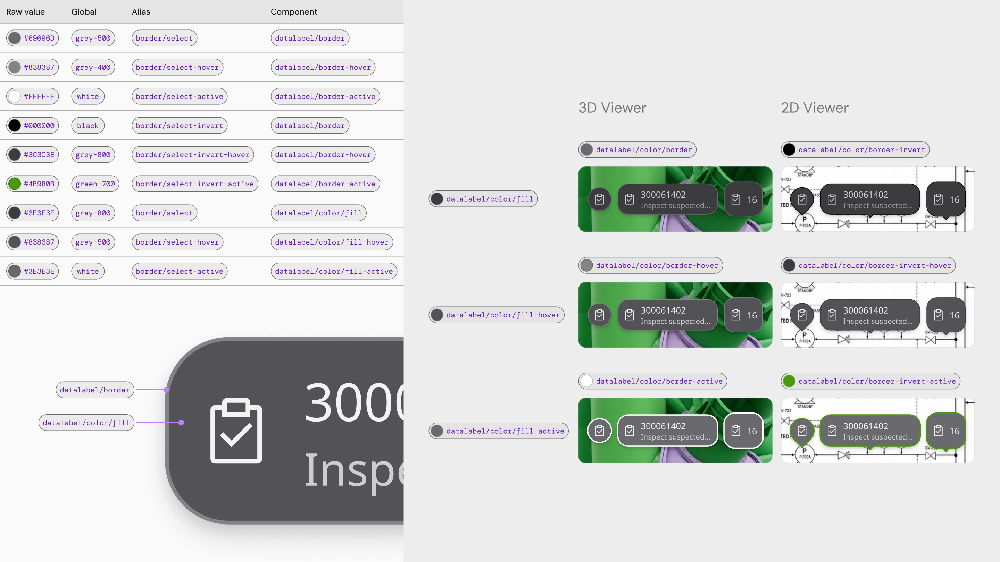

The tiers also give the product teams freedom. When a team needed to build components for a conceptual flow that the library did not cover yet, well-structured tokens still held the design language together. For anything outside the scope of the library, we provided tokens and guidelines so a team could build its own component and keep the look and the experience consistent with the rest of the system. If we decided to adopt that component later, the tokens made the adoption faster and more transparent.

## Decomposing components by appearance rather than by use case

There are two main considerations when deciding how to break a component down: use case and appearance. We deliberately put the weight on appearance, and we were fairly aggressive about it. If two elements looked different, we treated them as two components.

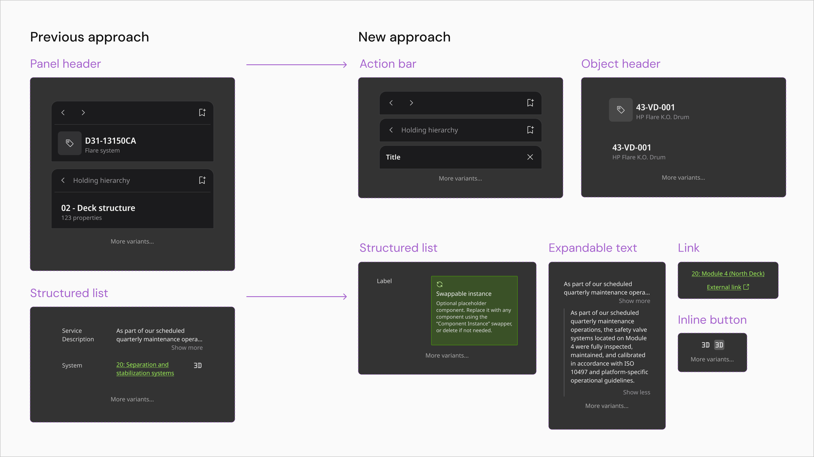

The clearest case was List. The original single large List component carried a lot of variants, because it had to present the very different properties of digital twin objects. We broke it into several smaller List components.

The trade-off was deliberate. Smaller components are more neutral about use case and more opinionated about usage. Usage therefore has to be governed somewhere else, so we moved it into UX patterns. On that basis we built patterns for input, toolbars and lists as well as selection and loading. The centre of gravity of our team moved with it, from producing components to governing how they are used across the product teams.

## Design system operation is about rituals and tools

Governance is easier to name than to run. What worked for us was not a rulebook but a pair of habits. One is a ritual that brings people together. The other is a set of tools that lets them move without us.

During the rebranding we made the team more active and more provocative. We held a weekly sync session with the designers, and prepared the theme, the presentation, a small workshop and the discussion questions in advance. It became a ritual, and it gave every designer a place to see the latest state of the system and to give feedback.

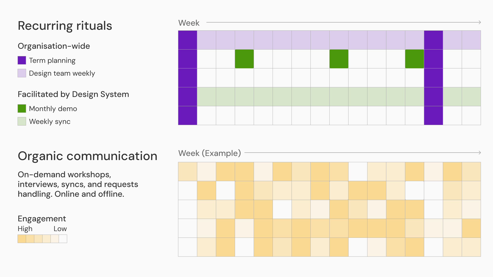

The product teams still needed to build custom components outside the design system quickly. We gave them a process and a shared documentation space, so they could publish their custom components to the other teams and have a clear expectation of when the design system could adopt them.

## Tools that let designers check their own work

We built internal tools for checking accessibility, against WCAG 2.1 AA, and responsive design, from tablet to ultra-wide desktop. Designers could check their own output against the standards and our internal acceptance criteria without waiting for us. It let the design team move forward more independently.

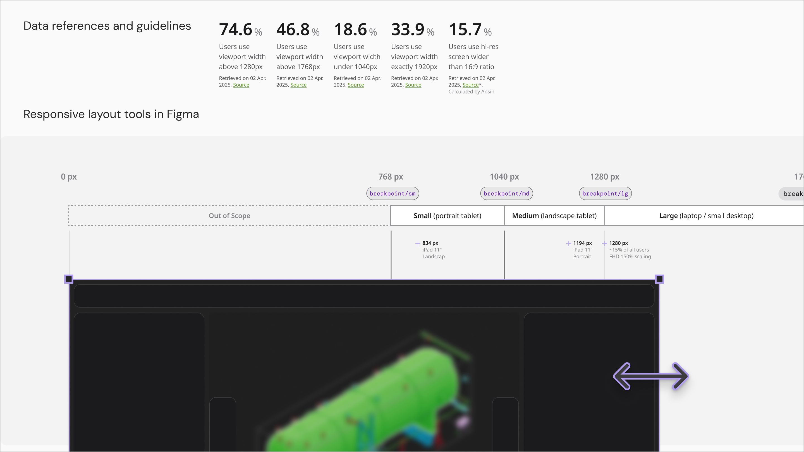

## Prototyping with agentic coding

A digital twin needs a lot of prototyping in 3D model viewers and 2D collaborative canvases, and that is hard to do in Figma Design. We adopted agentic coding tools early, including Figma Make and Codex, to build 2D and 3D prototypes quickly and validate concepts.

The Data Label component is the case with the biggest return. It marks data points in 2D and 3D environments, much like a pin in Google Maps, and we brought its design delivery down from several months in the previous version to a single sprint.

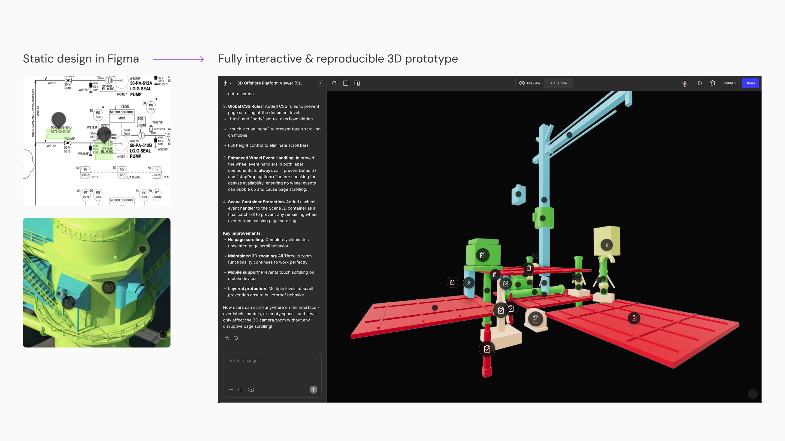

We worked closely with the developers to break the prompts down into small and standardised steps. Small steps reduce errors and stop the result drifting into unrelated directions, so the output keeps a similar quality in the hands of different designers, and a designer can build a 3D test boilerplate on their own.

# Future scalability

The part of this work I expect to outlast my time there is not the library. It is the way the system is operated.

A successful design system is not a collection of components. It is about culture, communication, and the room it leaves for other people to contribute and iterate.

That belief shaped what we built. The token tiers let a team build what the library does not cover yet without breaking the design language. The smaller components and the patterns let usage be governed in one place rather than negotiated case by case. The weekly ritual and the self-check tools let work be reviewed without the design system team in the room. Each of those is a way for the system to take on a new product area without the team growing at the same rate.

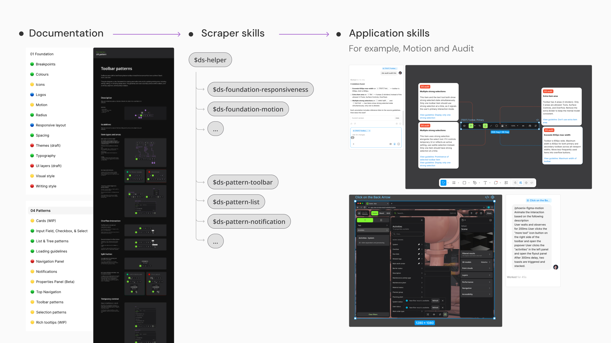

# Outcome

The rebuild window was about eighteen months, inside my three years in the design system team. In that time we delivered:

- a new token system in three tiers of global, alias and component tokens. It covers colour, spacing, typography, radius and breakpoints. I was responsible for part of the colour, spacing, radius and breakpoint tokens.
- more than 30 core components, small enough to keep the ongoing UX exploration moving. I was responsible for around half of them.
- a pattern library. I was responsible for the input, selection, list and toolbar patterns.
- a regular design audit and sync ritual, which became part of how the company works. I ran half of those sessions.

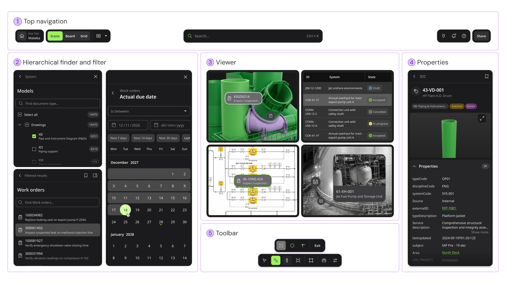

The new design system is more efficient than what came before. After the spin-off in 2019, the company spent four years trying to merge those product lines into a single product, and it did not really work out. The rework that started in 2024 delivered a beta that merged them well, in about eighteen months.

What we handed over is not only a library. It is an ecosystem of tokens, components, patterns and rituals, and it supports the key product areas as they keep evolving.

---

# Note

## Confidentiality concerns

All visual materials in this article were created solely to illustrate the process and outcomes of this project. They do not represent the actual product and respect the company’s intellectual property and the client’s business confidentiality.
