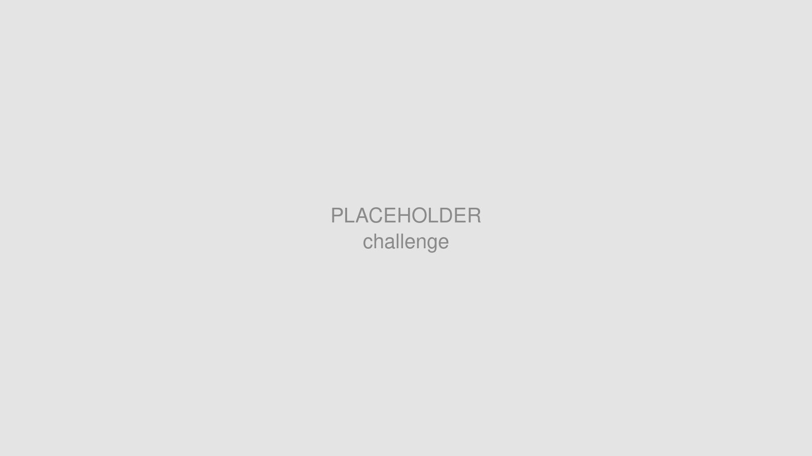
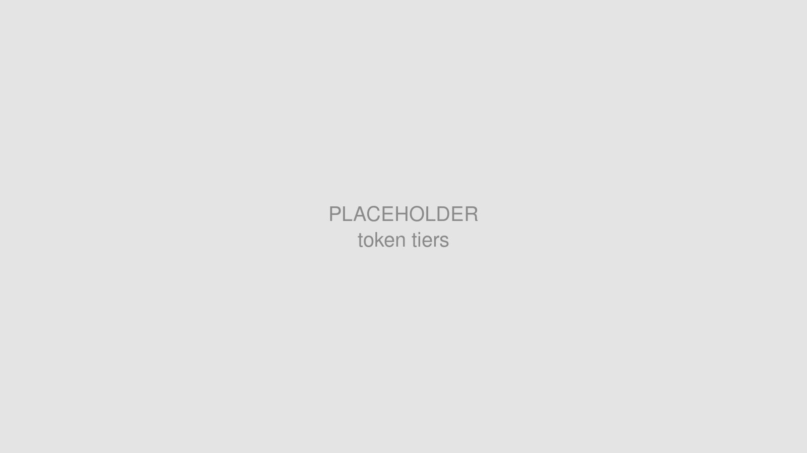
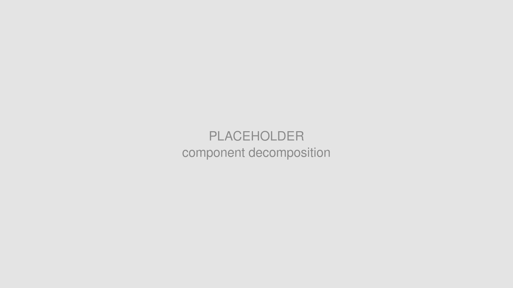
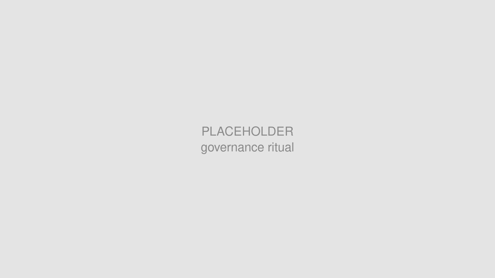
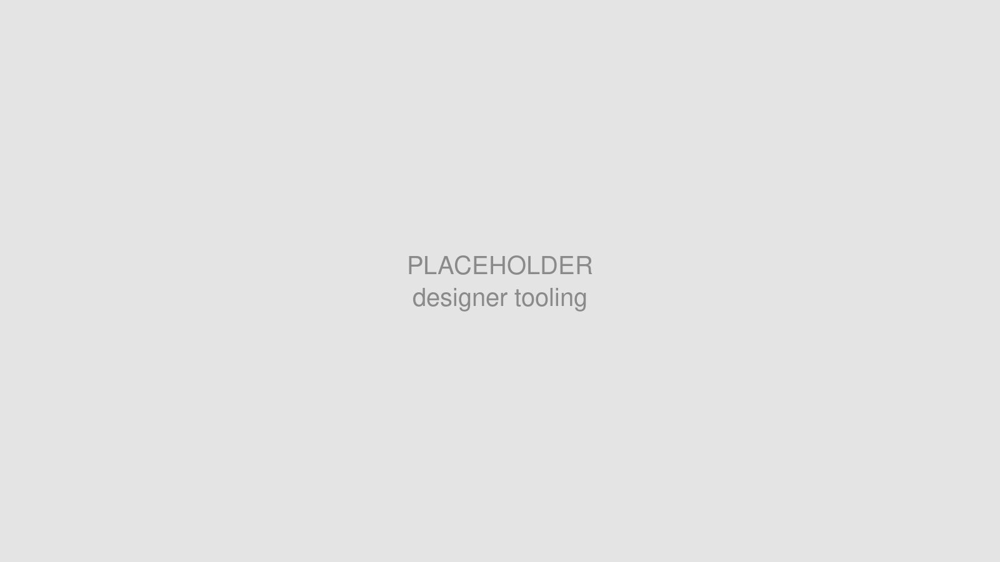
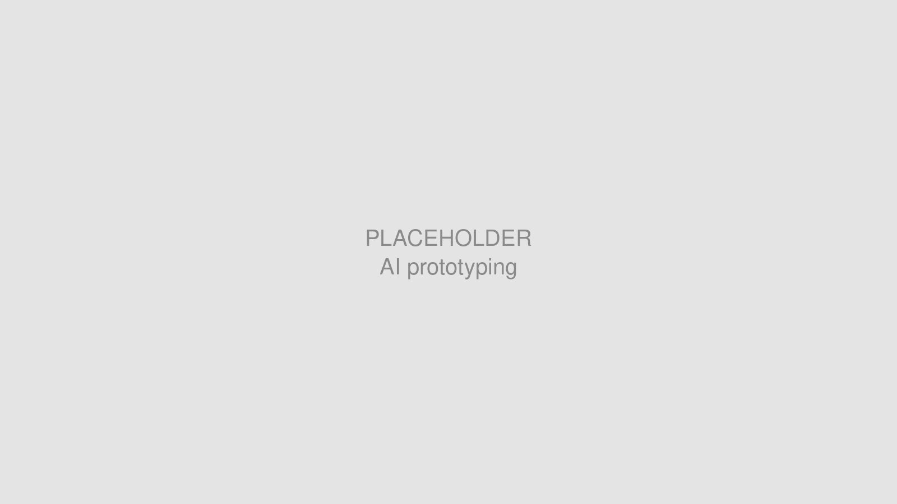
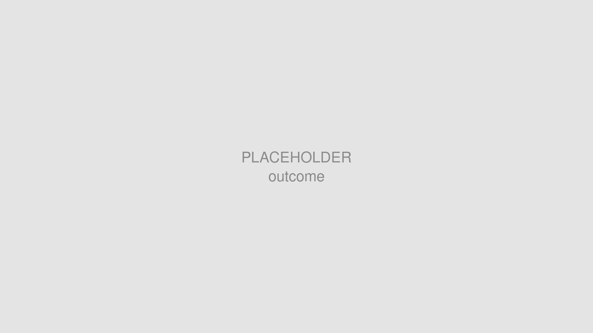

# 目標

Aize 是從 Aker Solutions（挪威的全球性工程與技術公司，客戶為能源產業）分拆出來的公司。2019 年軟體部門獨立時，帶走了約 30 至 40 條產品線，每一條都是一個小應用程式，以及這些應用程式所依賴的設計系統。產品本身是瀏覽器應用，為客戶提供資產的數位孿生，讓他們得以檢視並維護離岸與陸基的能源開採設備。

2024 年初，公司啟動了整個產品的重構，要把這些產品線整併為一。我們被要求同時重建設計系統。目標是統一使用者體驗、保留我們從舊系統學到的經驗，並償還過去始終沒有機會處理的設計與技術債。

Placeholder：重構前後對照。約 30 至 40 個小應用程式，被整併為一個產品。

# 我的角色

我在設計系統團隊待了三年，團隊由兩位設計師組成。在這項計畫中，我負責約一半的 Tokens、Components 與 UX Patterns，也與另一位設計師（團隊的設計主管）共同制定策略與工作方式。

除了設計工作之外，我也主持 UX 稽核、設計審查與知識分享會議，對象超過 150 位設計師與開發者。

Placeholder：設計系統團隊與七個產品團隊之間的位置關係。

# 挑戰

## 在產品仍被發明的同時重建系統

一般而言，設計系統理應走得慢，用來穩定快速產品開發過程中自然產生的不一致。我們的處境正好相反：產品團隊仍在探索，使用情境不斷變動，我們要在同時快速建立穩定的系統。

Placeholder：設計系統端與產品端，兩條同時進行的遷移。

舊的設計哲學讓情況更棘手。我們繼承的設計系統，給產品團隊的是為特定產業需求打造、功能豐富的重型元件。這種元件的研究與設計相當耗時，無法在「與交付團隊平行、且必須快速產出產品」的新要求下存活。如果我們硬是維持下去，design system 就會成為產品團隊交期上的瓶頸。

我們同時必須沿用公司外聘顧問公司所制定的品牌規範。那套規範視覺上相當精緻，但對無障礙與 design system 的考量都欠缺。我們得在遵循新設計語言的同時，將它在地化到自己的產品脈絡中。

# 方法

## 三層 Token 架構

我們把基礎重建為三層 Tokens：primitive tokens、alias tokens 與 component tokens。分層讓每個設計決策都能追溯，一個色彩或間距級距的變更，能夠一路接回最基礎的 primitive tokens，不需要猜測它從哪裡來。

Placeholder：三層 token，以及一個值在其中的傳遞路徑。

分層也讓產品團隊能自由。當某個團隊需要為一套 library 尚未覆蓋的概念性流程建立元件時，結構良好的 tokens 仍能撐住設計語言的一致性。對於 library 範疇之外的東西，我們提供 tokens 與 guidelines，讓團隊自行打造 component，而外觀與體驗仍與系統其他部分一致。若我們日後決定納入該 component，這些 tokens 也能讓採納過程更快速、更透明。

## 以外觀而非使用情境來拆解元件

決定一個 component 如何拆解，有兩個主要考量因素：使用情境與外觀。我們刻意把權重放在外觀，並且在這一點上拆得相當積極。只要兩個元素看起來不同，我們就把它們視為兩個 components。

Placeholder：一個帶有大量 variants 的大型 List 元件，被拆解為數個更小的 List 元件。

最清楚的案例是 List。原本單一的大型 List 元件承載了大量 variants，因為它必須呈現數位孿生物件差異極大的屬性。我們把它拆成數個更小的 List 元件。

這個取捨是刻意的。更小的 components 對使用情境更中立，對使用方式更有主張。使用方式因此必須在別的地方被治理，於是我們把它移進 UX patterns。我們依此建立了 input patterns、toolbar patterns、list patterns、selection patterns、loading patterns 等等。我們團隊的重心也隨之移動，從生產 components，轉為治理它們在各產品團隊之間如何被使用。

## 治理與參與式貢獻

品牌重塑期間，我們讓團隊更主動、也更具挑釁性。我們每週與設計師舉辦同步會議，事先準備主題、簡報、小型工作坊與討論題目。它成為一種儀式，也讓每位設計師都有地方看見系統的最新狀態，並提出回饋。

Placeholder：每週同步儀式與貢獻流程。

產品團隊仍然需要快速建立在 design system 外的自訂 components。我們給了他們一套流程與共用的文件空間，讓他們可以把自訂的 component 發布給其他團隊，並對 design system 何時能採納他們的自訂元件有明確期待。

## 讓設計師自己檢查的工具

我們建立了內部的無障礙規範（ WCAG 2.1 AA 標準）與響應式設計（支援 tablet 到 ultra wide Desktop）檢查工具，讓設計師不必等我們，就能對照標準與內部驗收準則檢查自己的產出。這讓設計團隊能更自主地往前跑。

Placeholder：內部的無障礙與響應式檢查工具。

## 以 Agentic Coding 製作原型

數位孿生需要在 3D 模型檢視器與 2D 協作畫布中進行大量原型製作，而這在 Figma Design 裡相當困難。我們提早採用了 agentic coding 工具，包含 Figma Make 與 Codex，用來快速製作 3/2D 原型並驗證概念。

Data Label 元件是效益最大的案例。它用來標記 2D 與 3D 環境中的資料點，作用近似 Google Maps 裡的 pin，而我們把它的設計交付從前一版的數個月，縮短到單一個 Sprint。

Placeholder：Figma Make 與 Codex 的原型製作循環。

我們與開發者密切合作，把 prompt 拆解為細小而標準化的步驟。小步驟能降低錯誤，也能防止成果飄移到無關的方向，讓成果在不同設計師手裡，可以有接近的重現品質，讓設計師能自行建立 3D 測試樣板。

# 成果

重建的時間窗大約十八個月，落在我在設計系統團隊的三年之內。在這段期間，我們交付了：

- 全新的三層 Token 體系，由 primitive、alias 與 component tokens 構成，涵蓋色彩、間距、字體、圓角與 breakpoints。我負責其中部分色彩、間距、圓角、breakpoint。
- 30 個以上的核心 components，小到足以讓持續進行中的 UX 探索不被卡住。我負責其中大約一半的components。
- 一套 pattern library，我負責 input, selection, list, toolbar patterns。
- 定期的設計稽核與同步儀式，並成為公司工作方式的一部分。我主持其中一半的會議。

Placeholder：交付出來的系統。Tokens、components、patterns 與文件。

新的 design system 與之前相比更加高效。2019 年分拆之後，公司花了四年試圖把那些產品線整併為單一產品，結果並不理想。2024起的這次重構，在大約十八個月內交付了一個把它們整合得宜的 beta 版本。

這再次印證了我的信念：一套成功的設計系統，並不是 components 的集合。它是文化、是溝通，也是它為其他人的貢獻與迭代所留下的空間。

---

# 備註

## 保密聲明

本文所有視覺素材均為說明本專案流程與成果而製作，不代表實際產品，並尊重公司的智慧財產權及客戶的商業機密。