# 目標

Aize 是從 Aker Solutions（挪威的全球性工程與技術公司，客戶為能源產業）分拆出來的公司。2019 年軟體部門獨立時，帶走了約 30 至 40 條產品線，每一條都是一個小應用程式，以及這些應用程式所依賴的設計系統。我們的產品本身是瀏覽器應用，為客戶提供複雜能源基礎設施的數位孿生，讓他們得以檢視並維護離岸與陸基的原油開採設備。

2024 年初，公司啟動了整個產品的重構，要把這些產品線整併為一。我們被要求同時重建設計系統。目標是統一使用者體驗、保留我們從舊系統學到的經驗，並償還過去始終沒有機會處理的設計與技術債。

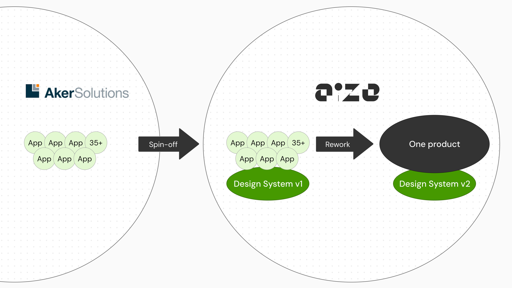

# 我的角色

我在設計系統團隊待了三年，團隊由兩位設計師組成。在這項計畫中，我負責約一半的 Tokens、Components 與 UX Patterns，也與另一位設計師（團隊的設計主管）共同制定策略與工作方式。

除了設計工作之外，我也主持 UX 稽核、設計審查與知識分享會議，對象超過 150 位設計師與開發者。

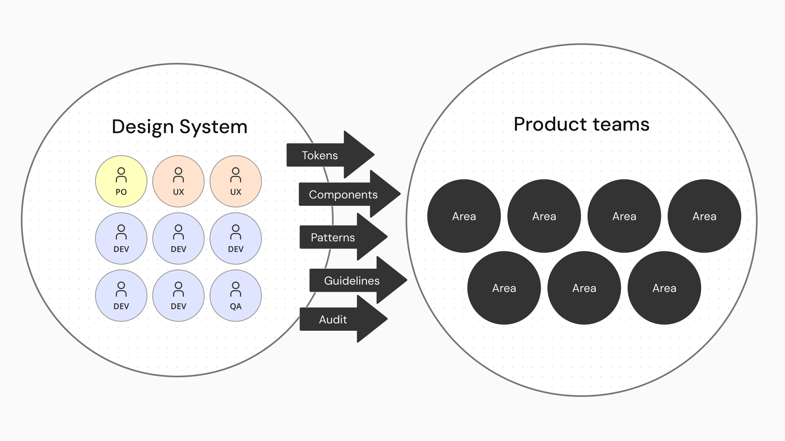

# 挑戰

## 在產品重構的同時，重建設計系統

一般而言，設計系統理應走得慢，用來穩定快速產品開發過程中自然產生的不一致。我們的處境正好相反：產品團隊仍在探索，使用情境不斷變動，我們要在同時快速建立穩定的系統。

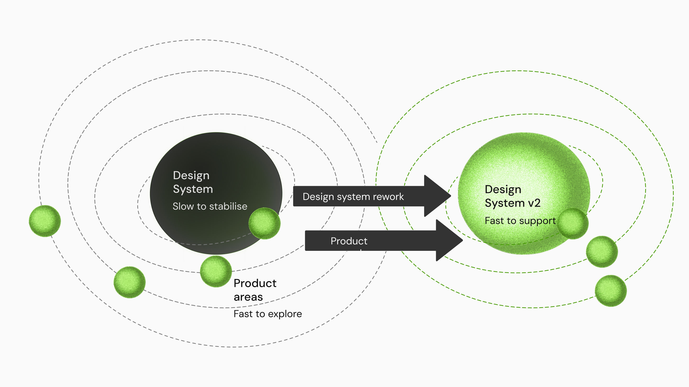

舊的設計哲學讓情況更棘手。我們繼承的設計系統，給產品團隊的是為特定產業需求打造、功能豐富的重型元件。這種元件的研究與設計相當耗時，無法在「與交付團隊平行、且必須快速產出產品」的新要求下存活。如果我們硬是維持下去，design system 就會成為產品團隊交期上的瓶頸。

我們同時必須沿用公司外聘顧問公司所制定的品牌規範。那套規範視覺上相當精緻，但對無障礙與 design system 的考量都欠缺。我們得在遵循新設計語言的同時，將它在地化到自己的產品脈絡中。

# 方法

## 設計系統的核心

在進入細節之前，值得先說清楚這套系統實際提供什麼。我們把它想成兩件事：基礎，以及貫穿其上的規則。基礎是 tokens 與 components，承載視覺語言，以及每一個畫面的構件。貫穿其上的規則是 UX patterns，規範這些構件可以如何被組裝。兩者共同構成產品的核心體驗，而底下每一節都是其中一項。

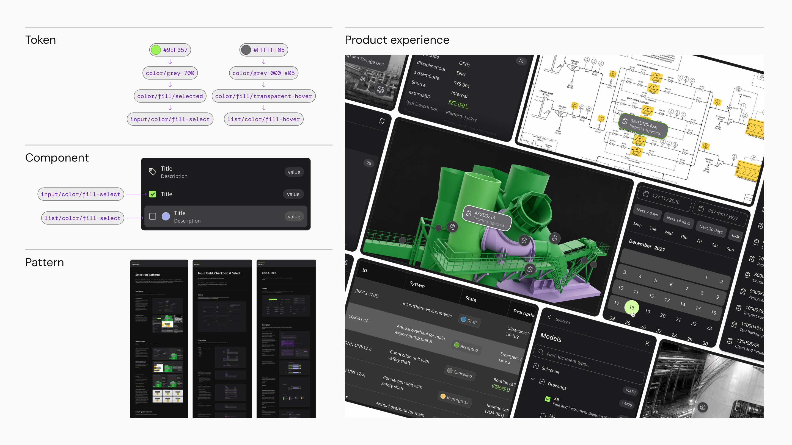

## 三層 Token 架構

我們把基礎重建為三層 Tokens：global tokens、alias tokens 與 component tokens。分層支撐使用者體驗的一致性與設計彈性，也讓設計系統可以追溯不同產品團隊的設計決策。比如，產品團隊若需要變更 Component 的色彩或空間間距，他們的變更仍能接回 alias tokens 或最基礎的 global tokens。設計系統仍然能追蹤與管理。

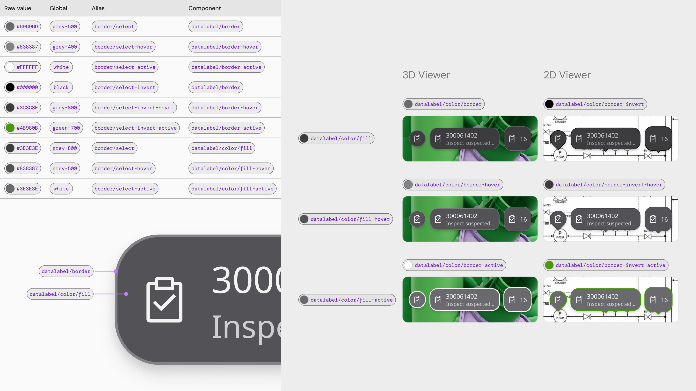

分層也給予產品團隊探索設計可能的自由空間。當某個團隊需要為一套 library 尚未覆蓋的概念性流程建立元件時，結構良好的 tokens 仍能讓設計語言維持一致。對於 library 範疇之外的東西，我們提供 tokens 與 guidelines，讓團隊自行打造 component，而外觀與體驗仍與系統其他部分一致。若我們日後決定納入該 component，這些 tokens 也能讓採納過程更快速、更透明。

## 以外觀而非使用情境來拆解元件

決定一個互動如何拆解成 Components ，有兩個主要考量因素：使用情境與外觀。我們刻意把權重放在外觀，並且在這一點上做得相當積極。只要兩個元素看起來不同，我們就把它們視為兩個 components。

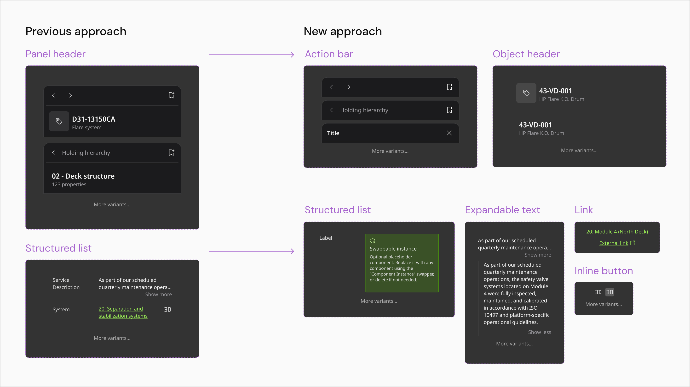

最清楚的案例是 List。原本單一的大型 List 元件承載了大量 variants，因為它必須呈現數位孿生中非常不同的各種物件。我們把它按照外觀所需，拆成數個更小的 List 元件。

這個取捨是刻意的。更小的 components 結構更簡單、更能快速開發。但同時，長相相似的 List components 也變多了，要如何選擇，或是結合它們，就必須更妥善地被定義與治理。於是我們把 List 相關的跨元件治理視為 patterns 移進 UX patterns。

按照相同的邏輯，除了 list pattern 外，我們還在設計系統中建立了 input patterns、toolbar patterns、selection patterns、loading patterns 等等。設計系統的團隊的重心也隨之移動，不僅僅是生產 components，還花更多時間治理它們在各產品團隊之間如何被使用。

## 設計系統的營運，仰賴儀式與工具

設計系統要真能順利治理整個產品的體驗，仰賴的不僅僅是長長的規則書，而是還包含動態的儀式與工具。儀式賦予不同團隊的設計師與開發者歸屬感、對彼此工作的了解、與合作習慣，工具則幫助他們更有效率且一致地達成共同目標。

產品重構期間，我們建立各種儀式，讓團隊更主動發聲與交流，並對設計系統的使用與共同工作方式有更深入認識。舉例而言，我們每週與設計師舉辦同步會議，事先準備主題、簡報、小型工作坊與討論題目。我們每月也有固定的 demo 時間，讓每位設計師都有地方看見系統的最新狀態，並提出回饋。除此之外，我們建立隨時有人回覆的 Slack channel。隨設計、開發進度所需，我們也總確保 stakeholder 參與相關訪談與工作坊，讓資訊透明，讓使用者能參與設計決策。

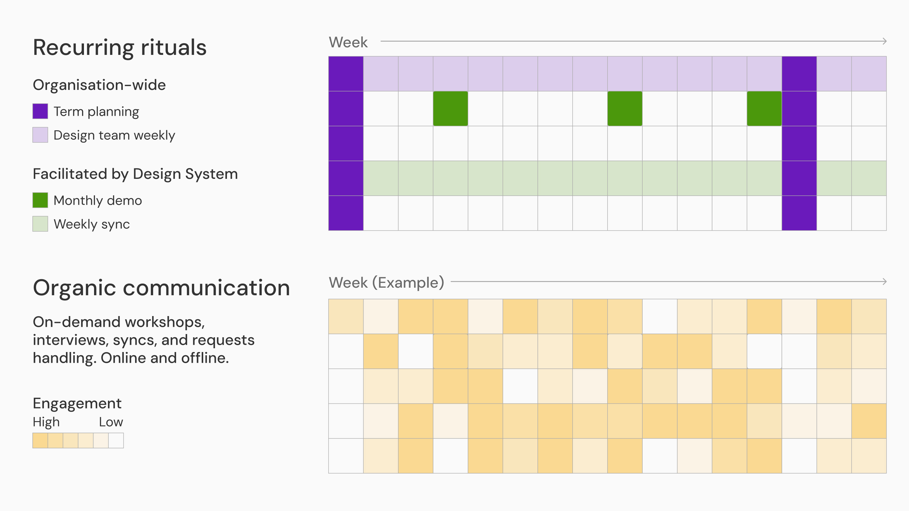

隨產品重構，產品團隊仍然需要快速建立在 design system 外的自訂 components。我們給了他們一套流程、共用的文件空間，讓他們可以把自訂的 component 發布給其他團隊，並對 design system 何時能採納他們的自訂元件，以及對規格的要求為何，有明確期待。

## 讓設計師自己檢查的工具

我們建立了內部的無障礙規範（ WCAG 2.1 AA 標準）與響應式設計（支援 tablet 到 ultra wide Desktop）檢查工具，讓設計師不必等我們，就能對照標準與內部驗收準則檢查自己的產出。這讓設計團隊能更自主地往前跑。

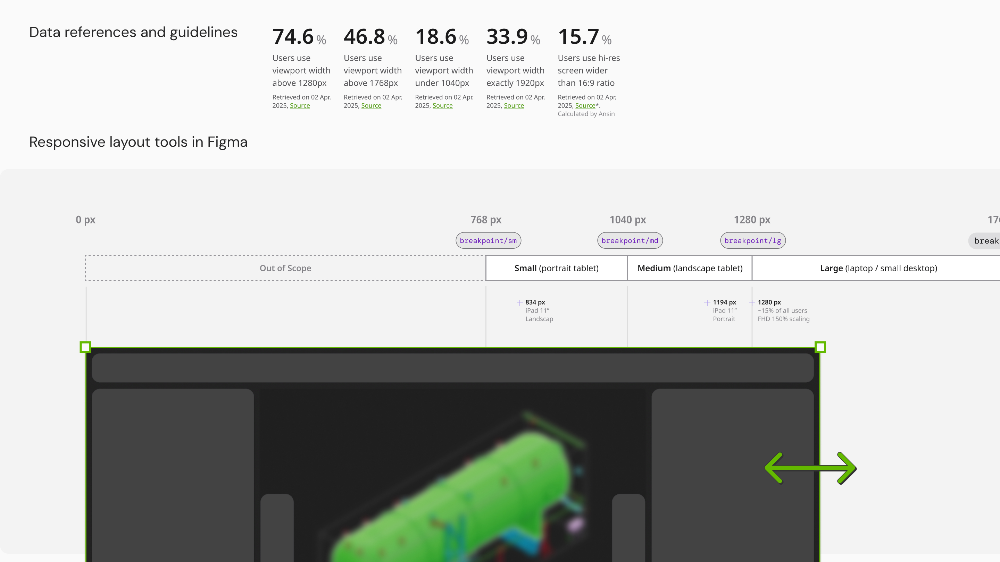

## 以 Agentic Coding 製作原型

數位孿生需要在 3D 模型檢視器與 2D 協作畫布中進行大量原型製作，而這在 Figma Design 裡相當困難。我們提早採用了 agentic coding 工具，包含 Figma Make 與 Codex，用來快速製作 3/2D 原型並驗證概念。

Data Label 元件是效益最大的案例。它用來標記 2D 與 3D 環境中的資料點，作用近似 Google Maps 裡的 pin，而我們把它的設計交付從前一版的數個月，縮短到單一個 Sprint。

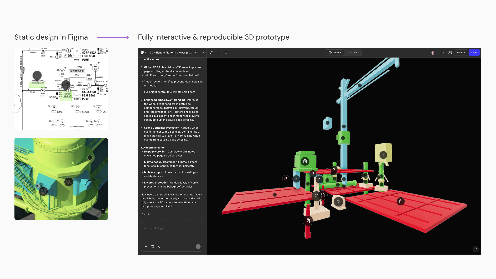

我們與開發者密切合作，把 prompt 拆解為細小而標準化的步驟。小步驟能降低錯誤，也能防止成果飄移到無關的方向，讓成果在不同設計師手裡，可以有接近的重現品質，讓設計師能自行建立 3D 測試樣板。

## 降低 AI 導入成本同時，確保架構的擴充性

在 AI Skill 的設計上，我們將設計系統的讀取與應用分離。

我們設計了可以完整爬取內容的 Agent Skill，讓 Figma 跟 Codex Agent 在執行相關任務時，都能抓取目前存放在 Figma 上的最新 Guidelines。這樣降低我們要搬遷既有 Guidelines 的成本，而未來若需要搬遷到更為原生 Machine-readable 的格式，也不會影響應用層的 Skill 與工作流程。

而藉由設計系統的 Guidelines，我們的設計師可以利用 AI 在 Figma 與前端中自行執行 audit 跟快速原型製作。例如 Toolbar pattern 的 audit，或是應用 motion guideliens 與 token 的動態原型製作。

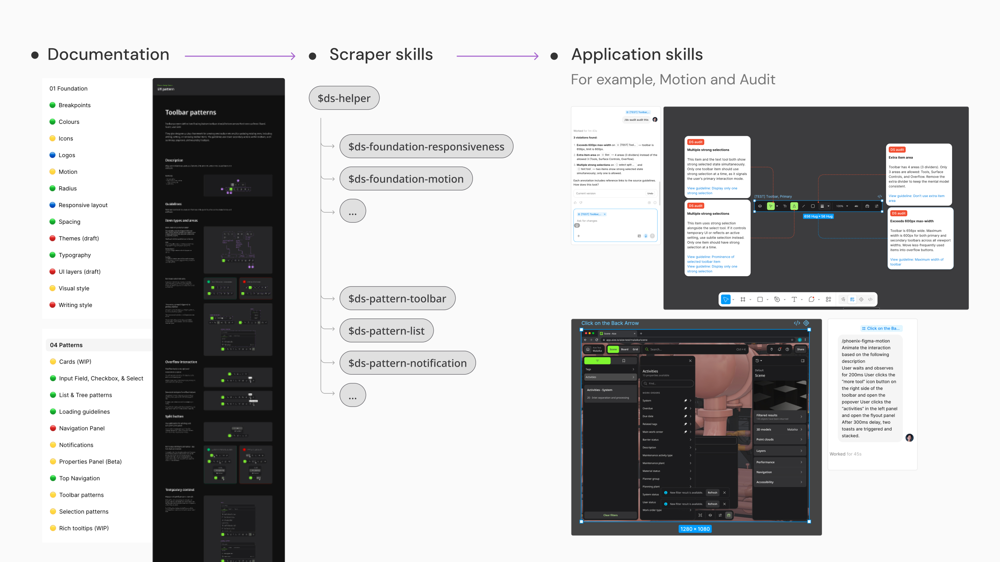

 

# 成果

重建的時間窗大約十八個月，落在我在設計系統團隊的三年之內。在這段期間，我們交付了：

- 全新的三層 Token 體系，由 global、alias 與 component tokens 構成，涵蓋色彩、間距、字體、圓角與 breakpoints。我負責其中部分色彩、間距、圓角、breakpoint。
- 30 個以上的核心 components，小到足以讓持續進行中的 UX 探索不被卡住。我負責其中大約一半的components。
- 一套 pattern library，我負責 input, selection, list, toolbar patterns。
- 定期的設計稽核與同步儀式，並成為公司工作方式的一部分。我主持其中一半的會議。

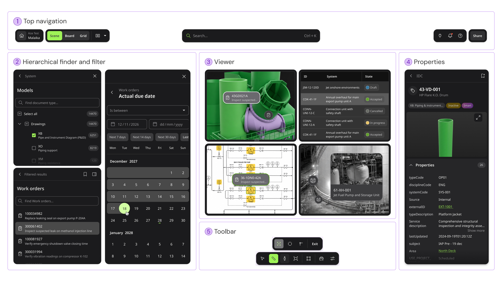

新的 design system 與之前相比更加高效。2019 年分拆之後，公司花了四年試圖把那些產品線整併為單一產品，結果並不理想。相形之下，2024起的這次重構非常成功，在大約十八個月內交付了一個把它們整合得宜的 beta 版本。

這項工作裡我認為最有價值的，是這套系統的營運模式，而不僅僅是一套 component library。因為成功的設計系統，促進團隊合作與資源共享，讓產品擴張時，不需要同時等比擴張人力。

這個信念決定了我們的工作方向：

- Token 的分層讓團隊能做出 component library 尚未覆蓋的東西，而不破壞設計語言。
- Patterns 讓 Component 的創造與使用，在同一個地方被治理，而不需要每次都重做研究跟跨組別協商。
- 每週的儀式與各種設計工具，則讓產出不必等待設計系統團隊在場就能被審查。

這個生態系支撐著產品持續演進。

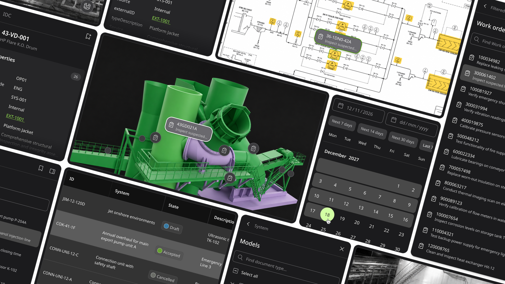

---

# 備註

## 保密聲明

本文所有視覺素材均為說明本專案流程與成果而製作，不代表實際產品，並尊重公司的智慧財產權及客戶的商業機密。