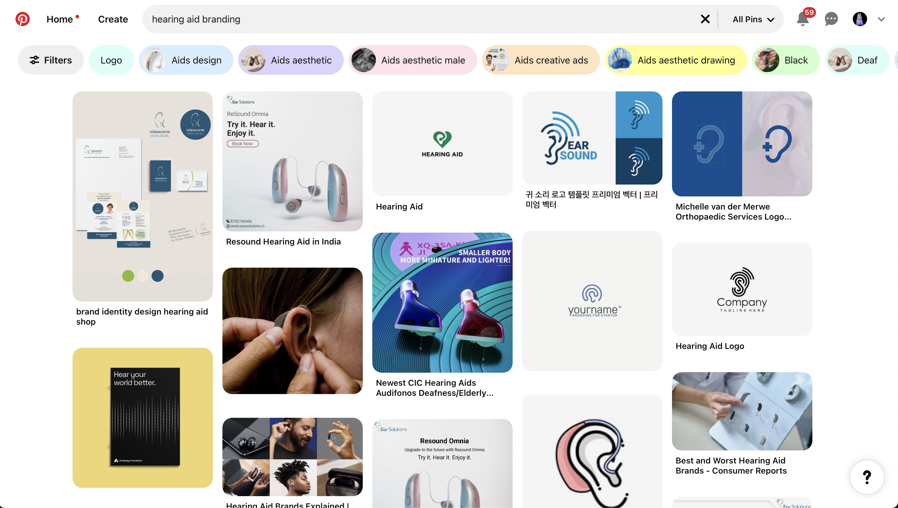
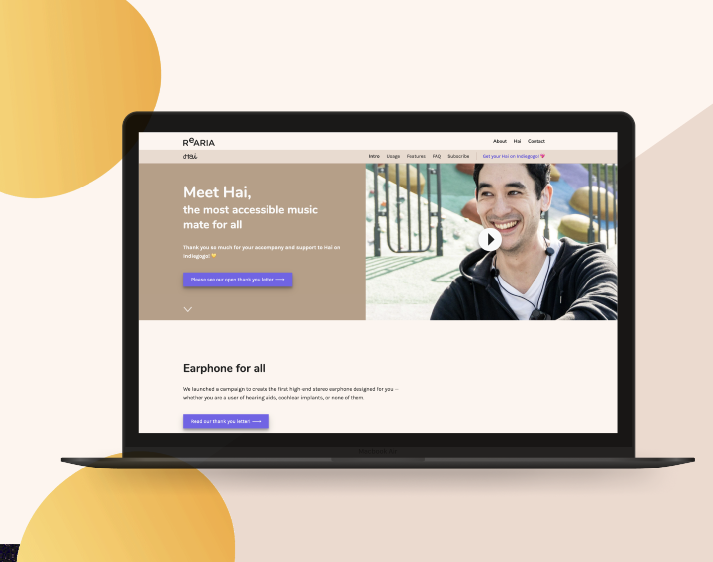
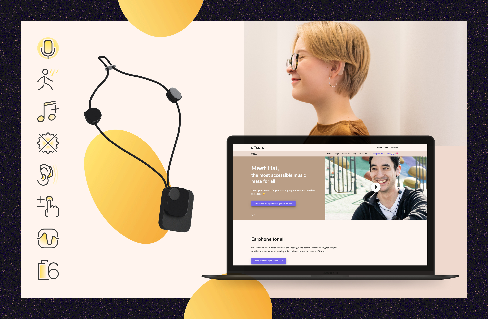

# Objectives

To create a distinctive and inclusive brand identity for the assistive headphone product, combating stigma and reinforcing its mission of empowering hard-of-hearing users. The branding needed to evoke warmth, innovation, and accessibility while differentiating the product from traditional medical devices.

# My Role

As the lead designer, I was responsible for:

- Crafting the visual identity, including colour palette, typography, and logo design.
- Developing marketing materials that align with the product’s inclusive and empowering vision.
- Ensuring the branding reflected user feedback and cultural insights.
- Collaborating with the 2 other team members in marketing to maintain consistency across all touchpoints.

# Challenge

Assistive devices often have a clinical and utilitarian appearance, which reinforces stigma and discourages their use. The challenge was to design branding that appeals to users’ emotions, communicates warmth, and challenges stereotypes, while maintaining functionality and clarity.

Even on Pinterest, the keywords related to hearing aid return clinical, medicalised, and utilitarian design to you

# Approach

1. **Design Principles**
    - Prioritised a vibrant, warm colour palette to convey optimism and friendliness.
    - Used organic shapes to break away from the rigid, medical aesthetic typical of assistive products.
    - Selected legible yet inviting typography to balance functionality and style.
2. **Brand Integration**
    - Incorporated branding into product design, packaging, and marketing.
    - Developed visual guidelines to ensure consistency across platforms and media.

# Outcome

- Delivered a cohesive brand identity that resonates with users and challenges the stigma associated with assistive devices.
- Introduced a colour palette and design system celebrated for its warmth and inclusivity.
- Created marketing materials that effectively communicated the product’s value and mission.
- Received positive feedback from users and stakeholders, reinforcing the alignment of the branding with the product’s goals.

# Gallery

Landing page of official website

The indiegogo campaign page

We managed to ensure that our photograph and video comply with the brilliant and warm colour parlette.

Pictogram for highlighting the features of product

The Facebook group and edm templates for marketing purposes

## Visit the legacy website

[Rearia Hai](https://rearia.github.io/hai)

The business has been terminated in 2020, but you can still visit the archived legacy site.