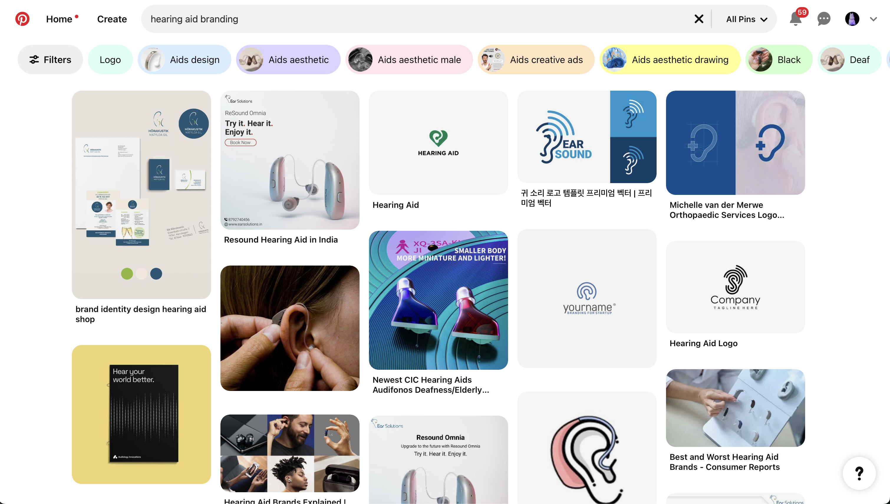
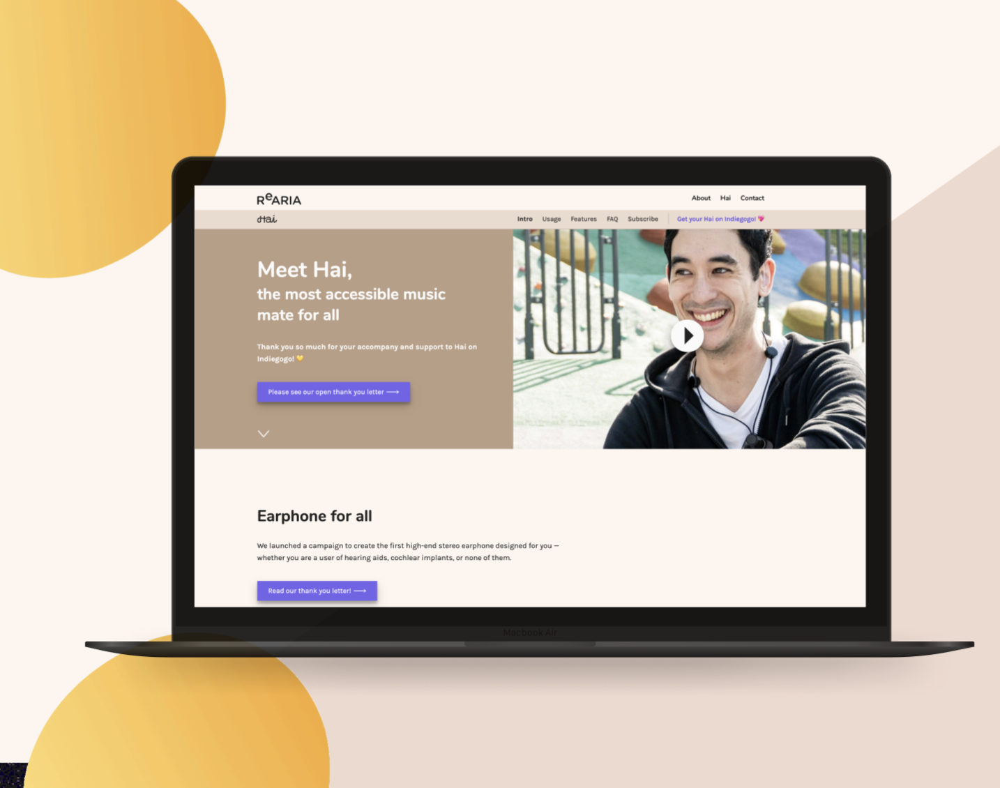
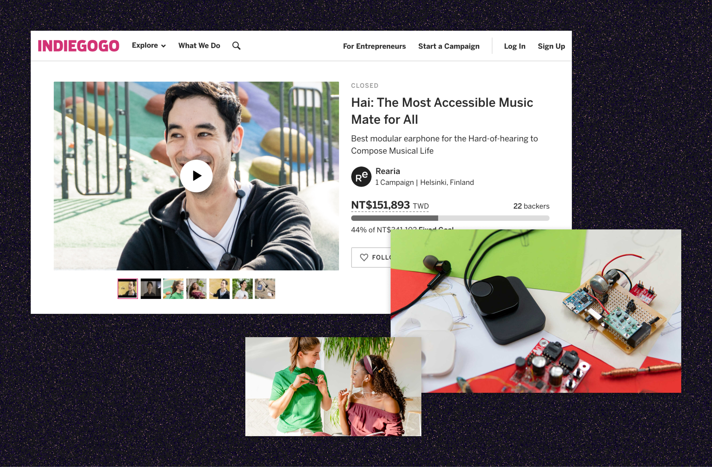
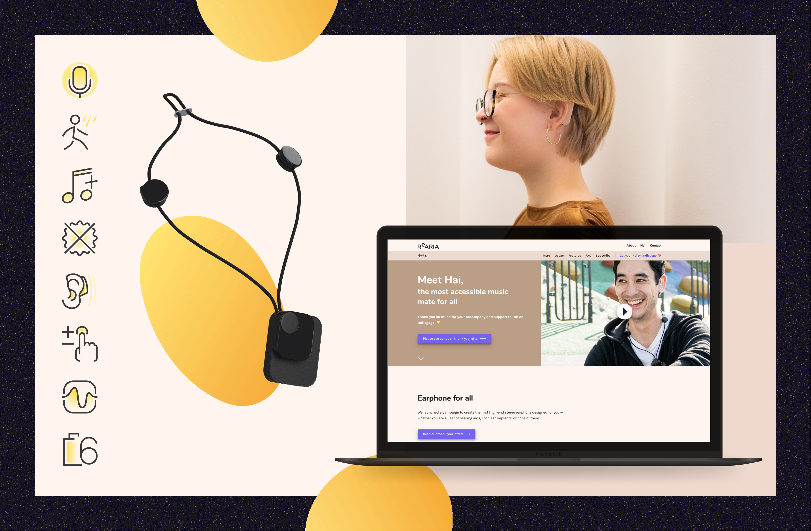

# 目標

為輔助耳機產品打造獨特且具包容性的品牌識別，對抗污名，並強化其賦能聽障使用者的核心使命。品牌設計需要傳遞溫暖、創新與可及性，同時讓產品有別於傳統醫療器材。

# 我的角色

身為首席設計師，我的職責包含：

- 打造視覺識別，涵蓋色彩系統、字體排版與標誌設計。
- 開發與產品包容性願景一致的行銷素材。
- 確保品牌設計反映使用者回饋與文化洞察。
- 與另外 2 位行銷團隊成員協作，維持所有接觸點的品牌一致性。

# 挑戰

輔具產品通常給人臨床且功能性的印象，這強化了社會污名，並讓使用者卻步。挑戰在於設計出能觸動使用者情感、傳遞溫暖、挑戰刻板印象的品牌，同時兼顧功能性與清晰度。

即便在 Pinterest 上，與助聽器相關的關鍵字搜尋結果，呈現的也是冰冷、醫療化且功利主義的設計。

# 方法

1. **設計原則**
    - 優先採用鮮豔、溫暖的色彩系統，傳遞樂觀與親切感。
    - 使用有機形狀，突破輔具產品慣有的生硬醫療美學。
    - 選用易讀且具親和力的字體，在功能性與風格感之間取得平衡。
2. **品牌整合**
    - 將品牌融入產品設計、包裝與行銷。
    - 制定視覺規範，確保跨平台與媒介的一致性。

# 成果

- 交付了一套完整的品牌識別，能與使用者產生共鳴，並挑戰輔具污名。
- 推出以溫暖與包容性著稱的色彩系統與設計規範。
- 製作的行銷素材有效傳遞了產品的價值與使命。
- 獲得使用者與利害關係人的正向回饋，印證了品牌設計與產品目標的高度契合。

# 作品集

官方網站首頁

Indiegogo 群眾募資頁面

我們確保照片與影片符合鮮明而溫暖的色彩系統。

用於強調產品特色的圖示

用於行銷目的的 Facebook 社團與 EDM 範本

## 參觀舊版網站

[Rearia Hai](https://rearia.github.io/hai)

公司已於 2020 年結束營運，但您仍可前往瀏覽封存的舊版網站。
