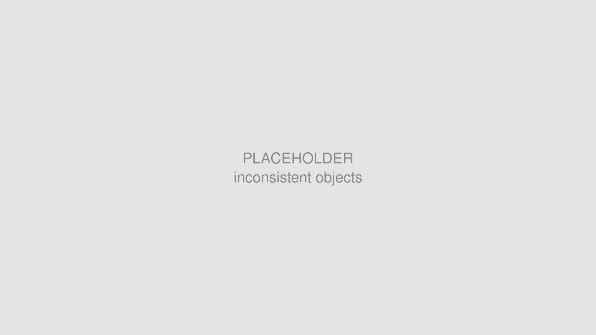
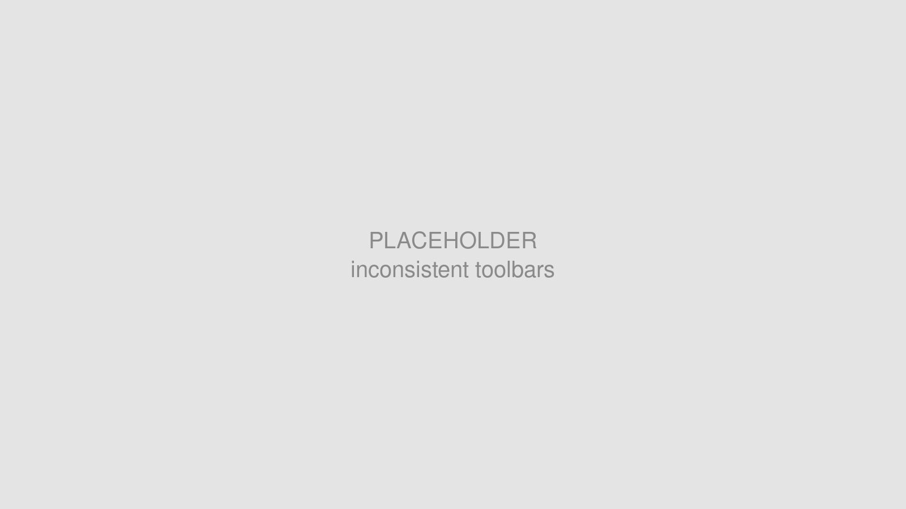
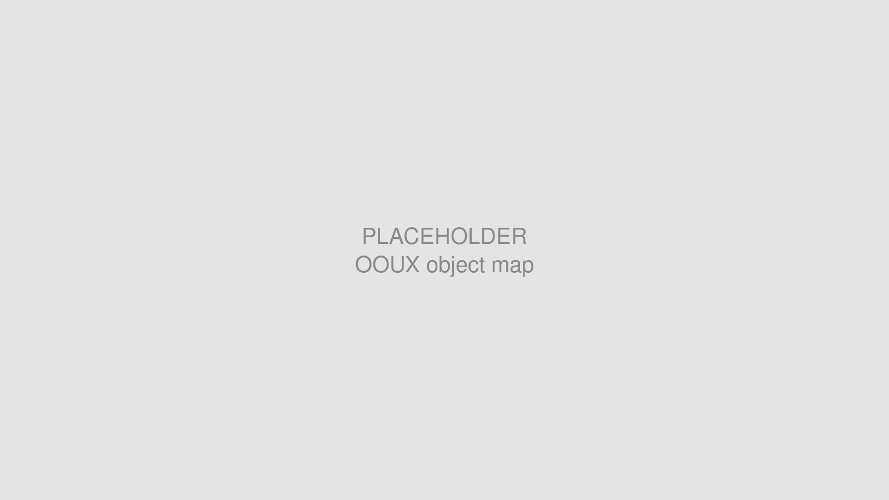
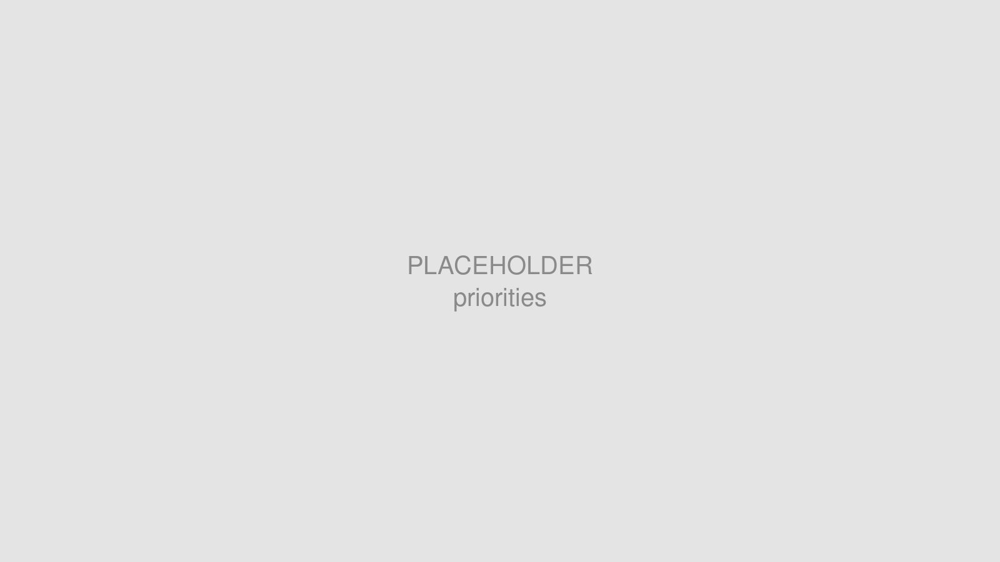
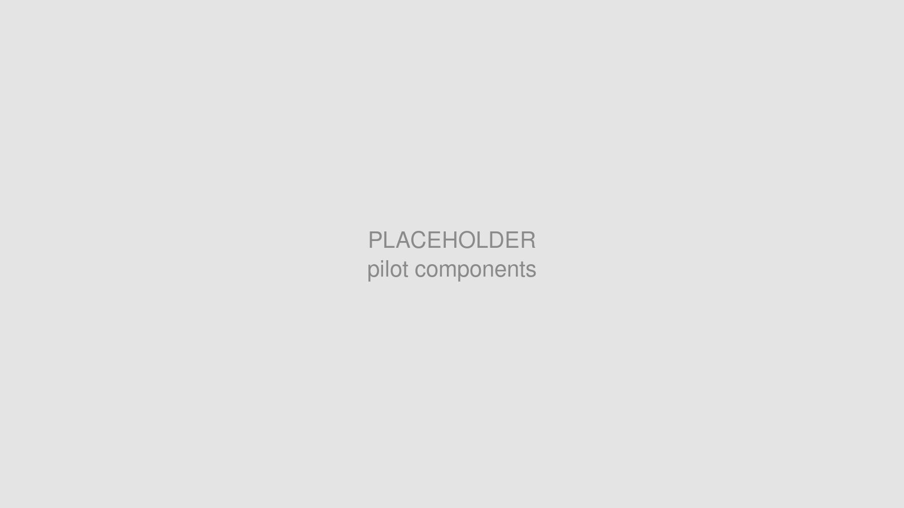
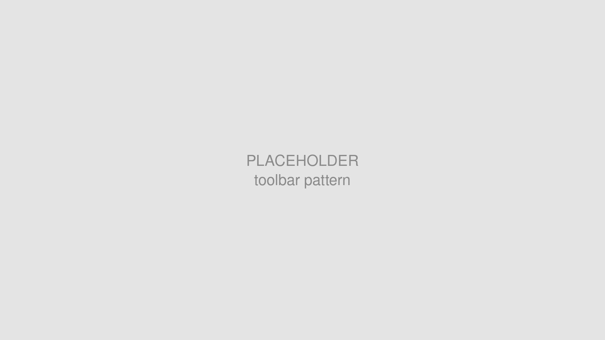
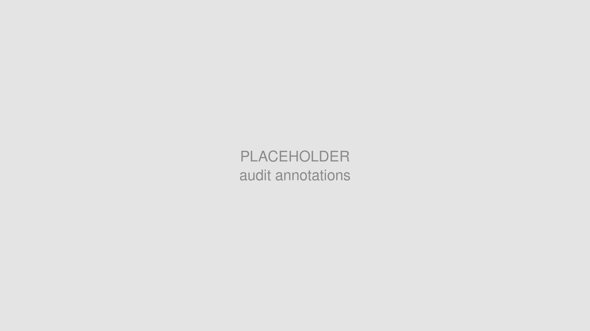
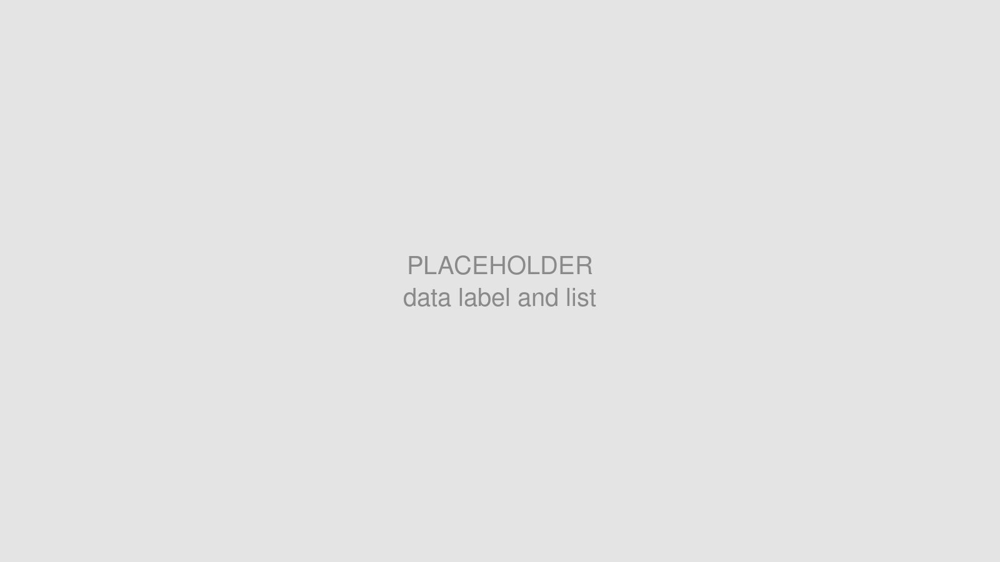
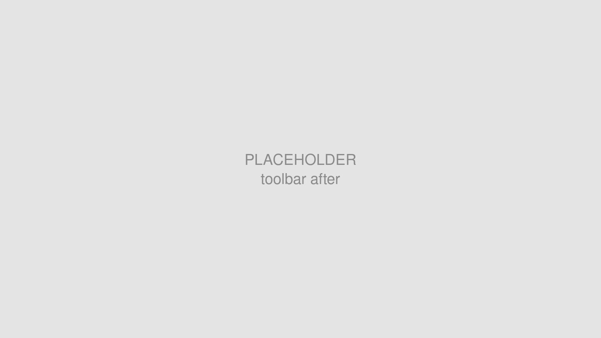
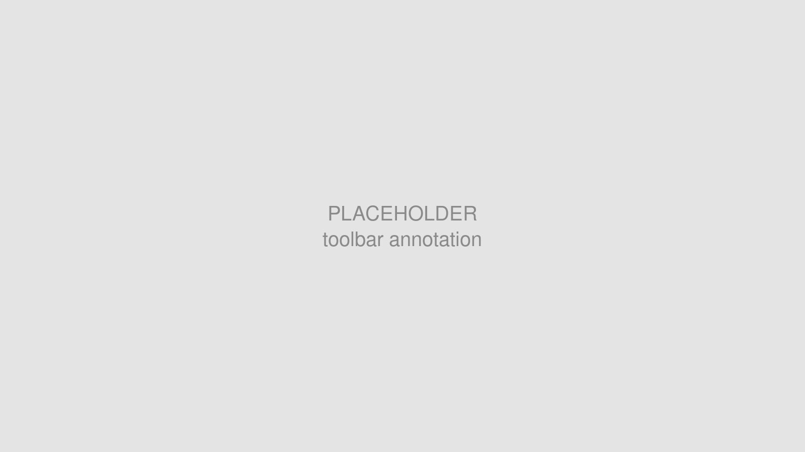

# Objectives

The goal of this project was to integrate the UX patterns of our digital twin and improve the product experience. Our digital twin product was spun off from the software department of Aker Solutions, a global Norwegian engineering and technology company for the energy industry. It inherited around 30 to 40 product lines, which were solutions built in different periods for different use scenarios. That made integrating their user experience a difficult process. Here I want to share how we integrated the UX patterns for objects and tools. I picked these two because I was the person responsible for this work, and because they are particularly important in a digital twin.

The first one is **Objects**. Objects are the most basic data a digital twin presents. In the energy industry the common ones include physical objects (Tag), work orders, documents and anomalies. Our users have to work with these objects to get their jobs done. In the past, the same object often did not look or behave the same way across our user flows, and different objects were not distinguished in a consistent way. It fragmented our users’ mental model, raised the cost of learning and using the product unnecessarily, and made the product hard to use.

The second case is **Tools**. Tools decide how users interact with the digital twin. They sit in the toolbar at the bottom of the screen, and four of our seven product teams designed their own tools, but there was little consistency between them. Similar tools ended up in different positions and behaved differently from team to team. The same tool could sit on the left of the toolbar in one place and on the right in another. Sometimes it opened a menu, sometimes a popover or a secondary toolbar, with no consistent rule behind it.

Placeholder: objects and tools, the two things our patterns had to govern.

# My role

I led and owned the UX patterns for tools and objects, working with the design system team and the seven product teams. Inside the design system team I mapped out the objects and tools of the digital twin. I redesigned the related tokens, components and patterns, and delivered them together with our engineers. After that I worked with the product teams on the guidelines, the agent skills and the prototypes.

Placeholder: my role across the object work and the later pattern audit work.

# Challenge

## Objects were presented without a clear mental model

The original 30 to 40 product lines were built separately, so each of them presented objects in its own way, which reflected how little the original organisation was integrated.

Placeholder: several list treatments of the same object type, side by side. The diversity without clear logic harmed our UX.

This led to cognitive fragmentation in our user flows. Our users hold deep domain knowledge of the equipment in the energy industry, and the product could not give them a mental model that matched it. Planning, operation and maintenance of heavy assets all rely on the user’s mental model.

## The tool experience was messy and inconsistent, and the design system documentation was too long to read

The toolbar problem had a different cause. The four teams using it each had their own schedule and goals. Previously we only had a guideline for where the toolbar sits at the bottom of the screen. The four teams (3D Viewer, 2D Viewer, Table view, Webapp) were free to design the inside of it themselves. Changing the toolbar meant booking a meeting or a long async exchange. Our designers were also spread between the UK and Norway, and some colleagues only met once or twice a year, which made organic and direct communication hard.

This left many inconsistencies and defects in the toolbar experience. For example, the toolbar led by one team ordered its areas as layer control, tool, surface settings and overflow button. In other areas of the product, led by other teams, that order changed. Users also told us in earlier testing that the inconsistency confused them.

Placeholder: the same toolbar in two product areas, with the areas ordered differently.

We also found that our design system guidelines often fell short when it came to patterns. Guideline documents tend to be long, long enough that people do not always have time to read them through, and do not absorb them even when they do.

# Approach

## 1. Mapped out the objects and tools in the digital twin

To work on how objects are presented, we first had to be clear about which objects exist in the digital twin. We chose the [OOUX framework](https://www.ooux.com) as our mapping technique and built the map together with stakeholders from different teams. It gave us an overview of every object in the product, and it forced us to align our understanding with each other, since this is a domain that needs deep prerequisite knowledge.

Placeholder: the collaborative object and tool map.

We also took stock of all the tools, classified them by their characteristics, and discussed the priority of their presentation and usage with the stakeholders.

Besides giving us a clear overview, these maps helped us anticipate the new objects and component requirements we would have to consider later, so that what we designed at the time stayed scalable.

## 2. Defined the priorities

For objects, we picked the components around Data Label and List as our two priorities. Both are everywhere in the digital twin, so investing in them returns the most. For tools, the components had already been finished in earlier work, so we focused on the patterns.

Placeholder: prioritising components against their reach in the product.

## 3. Developed the components with the highest return

We designed and developed **Data Label** and a set of **List** components as pilots. They validated the object-oriented approach and answered the most urgent needs of the product teams at the same time. Along with them we created the related alias tokens, so that new components in the same family could follow the same visual language later.

Placeholder: the pilot Data Label and List components.

## 4. Governed the components with patterns

List consists of five components, and Data Label has two sets of components. The toolbar involves many different buttons, menus and popovers. We needed UX patterns to help designers understand which kind of component belongs to which area of the product, in what order they are arranged, and which interactions are allowed and which are not.

Placeholder: patterns help designers understand which kind of component belongs to which area of the product, in what order they are arranged, and which interactions are allowed.

## 5. Built the patterns up through collaboration, iteration and review

Providing components alone was not enough. We interviewed and ran workshops with managers, designers and developers to build trust and collect feedback on how the components were used. We documented the key experience patterns that cut across several components, which are the list and selection patterns for objects, and the toolbar pattern for tools. These patterns include key examples, so they can be referenced and also improved.

## 6. Turned the design system documentation into a design tool

Design systems generally rely heavily on documentation as the cornerstone of governance. But as the product grows, the documentation gets longer and harder to read, which turns review into a specialised skill of the design system team. Often what people need is to review their own early work themselves, immediately.

I tried to solve this with AI. We wanted to turn static documentation into a dynamic tool for the members of the design and development teams.

I built two agent skills, Scraper and Audit.

The first one is the Scraper skill. It converts our existing design system documentation in Figma into a form that both Figma Agents and Codex can work with. It does not require us to redo the guidelines. Instead it follows the existing structure of the documentation, converts the text content into markdown, and saves the guideline’s example illustrations as PNGs, so the LLM reads them visually and we spend fewer tokens.

Placeholder: the guideline extraction and audit flow.

The second one is the Audit skill. It reviews a design the user selects against what Scraper produced. It can run either in Figma or in Codex.

Placeholder: the audit output, placed in Figma as annotations.

# Outcome

## Objects in the digital twin became clear and readable

Placeholder: Data Label across 2D and 3D environments.

The **Data Label** component signifies different object types with strong visual connections to other elements like List, displaying key information such as ID, description and time series across single, group or cluster labels. It supports colour coding for data visualisation and adapts seamlessly to both 2D and 3D industrial environments.

The **List** components provide a consistent structure for the object-oriented user journey, covering search results, object history and user-created folders, while maintaining visual coherence with Data Label. They include well-defined interactive states, clear usage guidelines and configurable swap-in actions, and their usage is governed by the pattern documentation, which keeps them consistent.

After release both were widely adopted, and they replaced the various custom components that had accumulated across the software.

## Users got a consistent toolbar experience

Placeholder: the toolbar after the work.

We classified the tools and built the basic interaction principles around interaction type and priority. We also named the UX patterns the product tended to fall into, and wrote them into the documentation.

## AI accelerated the design system audit

Placeholder: toolbar annotation.

I tested the Scraper and Audit skills on the toolbar patterns. The two skills fetch the latest pattern, then give the designer feedback as annotations, together with the original source in the design system documentation.

In one toolbar draft made by a product team, the audit caught four problems. The aim is to make design system review more efficient and more democratic, and to spend fewer working hours in meetings.

Besides that, we found that using AI points at the gaps in the existing design system. For example, **ambiguous guidelines produce inconsistent audit results.** The quality of the annotations is highly correlated with the clarity of the guidelines behind them. If we do not write it clearly, **the AI cannot tell an optional recommendation from a mandatory rule.** This helps the design system improve the quality of its own documentation.

## Shared and aligned roadmap

Placeholder: the component roadmap. Tree, Card and Tag.

Besides the pilot components, we also designed the wireframes and guidelines for the component updates further along the product roadmap, such as Tree, Card and Tag. This gave the stakeholders a shared goal to develop towards.

---

# Note

## Confidentiality concerns

All visual materials in this article were created solely to illustrate the process and outcomes of this project. They do not represent the actual product and respect the company’s intellectual property and the client’s business confidentiality.
