# 目標

這個專案的目標，是整合數位孿生產品的 UX patterns，藉此改善產品體驗。我們的數位孿生產品，是從 Aker Solutions（挪威的全球性工程與技術公司，客戶為能源產業）的軟體部門分拆出來的。它繼承了約 30 至 40 條產品線，分別是在不同時期、為不同使用情境打造的解決方案，這讓整合使用者體驗成為巨大挑戰。

這裡我想分享我們如何整合物件（Object）與工具（Tool）的 UX patterns。選這兩者，是因為我是主要負責人，也因為它們在數位孿生產品中格外重要。

第一個是**物件（Object）**。物件是數位孿生所呈現最基本的資料。在能源產業，常見的物件包含實體物件（Tag）、工單（Work order）、文件（Document）與異常（Anomaly）等。我們的使用者必須與這些物件互動才能完成工作。過去，同一個物件在不同的使用者流程中，外觀與行為常常不一致，不同物件之間也沒有一致的區分方式。這讓產品變得難用，因為它切碎了使用者的心智模型，不必要地提高了學習與使用產品的成本。

第二個是**工具（Tools）**。工具決定使用者如何與數位孿生互動。它們位於畫面底部的 toolbar。我們七個產品團隊中有四個設計了自己的工具，以致於彼此之間缺乏一致性：相似的工具出現在Toolbar的不同位置，互動也因團隊而異。同一個工具可能在某處靠左、在另一處靠右。它有時開啟 menu、有時是 popover 或第二層 toolbar，背後沒有一致的規則。

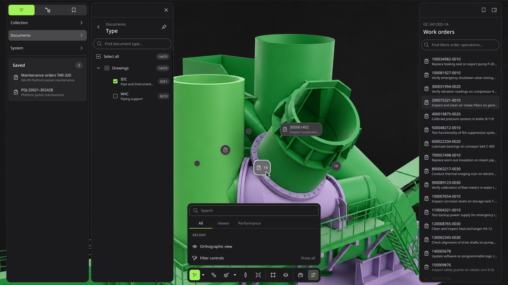

# 我的角色

我主導並負責工具與物件的 UX patterns，與設計系統團隊及七個產品團隊協作。我盤點了數位孿生的物件與工具，凝聚利益相關者的共識。我重新設計了相關的 tokens、components 與 patterns，並與工程師合作交付。在那之後，我與使用它的產品團隊一起完善設計系統 guidelines、設計 agent skills 以提升原型製作效率、以及將設計品質檢查自動化。

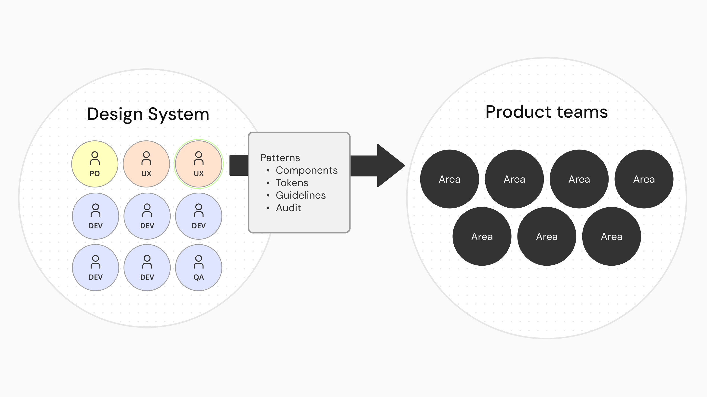

# 挑戰

## 相似的物件，分歧的體驗

原本數位孿生產品中的 30 至 40 條產品線是各自獨立建造的，因為 spin-off 才被併入 Aize 一間公司，所以每一條都用自己的方式呈現物件，欠缺好理解的心智模型（Mental model）。

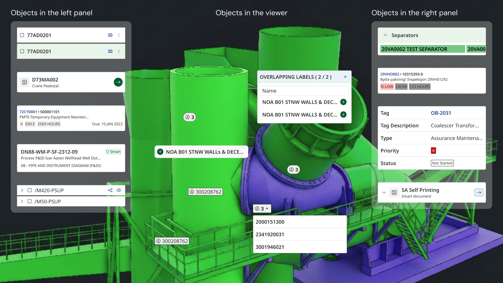

這使得我們的使用者遭遇使用困難。雖然他們對能源產業的設備擁有深厚的領域知識，只要產品欠缺能與真實世界對應的心智模型，他們就會難以學習與使用我們的產品。

## 一個 toolbar，四個作者

Toolbar 的問題同樣出自組織的整合不順。總共有四個團隊（3D Viewer、2D Viewer、Table view、Webapp）參與它的設計，但卻各有自己的時程與目標。先前我們只有一條規範，要求 toolbar 必須位於畫面底部。四個團隊可以自由設計它的內部。因為欠缺其他的規範，每次要改動 toolbar ，就得約會議，或進行冗長的非同步往返。我們的設計師又分散在英國與挪威，有些同事一年只見一兩次面，這讓有機而直接的溝通變得困難。

這在 toolbar 體驗中留下許多不一致與缺陷。舉例來說，某個團隊主導的 toolbar，裡頭的工具類型順序是 ABCD。但另一個團隊主導的 toolbar，順序就變成 DCAB。在先前的測試中，使用者就告訴我們，這種不一致令人困惑。

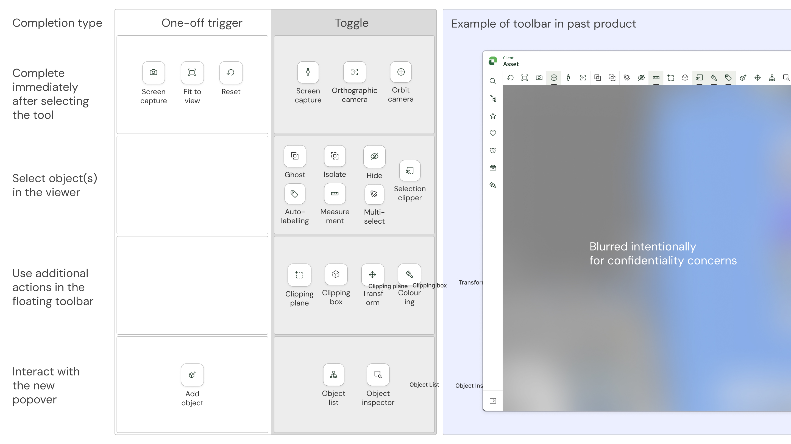

我們也發現，設計系統的 patterns 規範文件往往很長，長到人們不一定有時間讀完，就算讀完也未必吸收。換句話說，就算規範有了，我們還必須提升冗長文件在設計實戰中的 Usability。

# 方法

## 宏觀的交付策略

針對物件與工具遭遇的問題，我們有宏觀的交付策略。Tokens、components 與 patterns 是同一套交付的三個層次，每一層都倚賴它下面那一層才成立。Tokens 承載視覺語言，components 是基礎零件，而 patterns 規範這些零件可以如何被組裝。

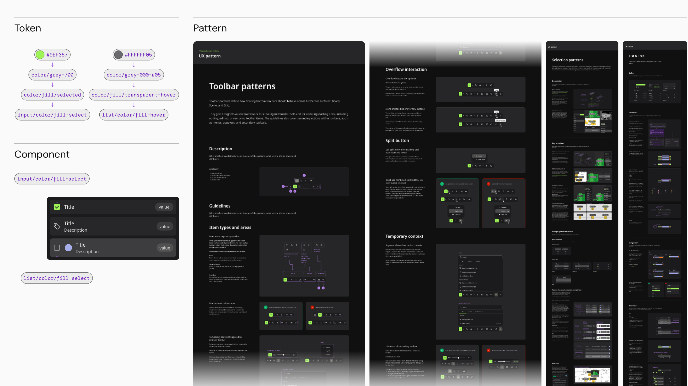

## 盤點物件與工具

要處理物件的呈現，勢必先搞清楚數位孿生中的物件有哪些。我們選用 [OOUX 框架](https://www.ooux.com)作為盤點方法，並與不同團隊的利益相關者協作，建立這張地圖。它讓我們鳥瞰產品裡的所有物件，也逼迫我們對齊彼此理解——畢竟這是一個需要深厚前置知識的領域。

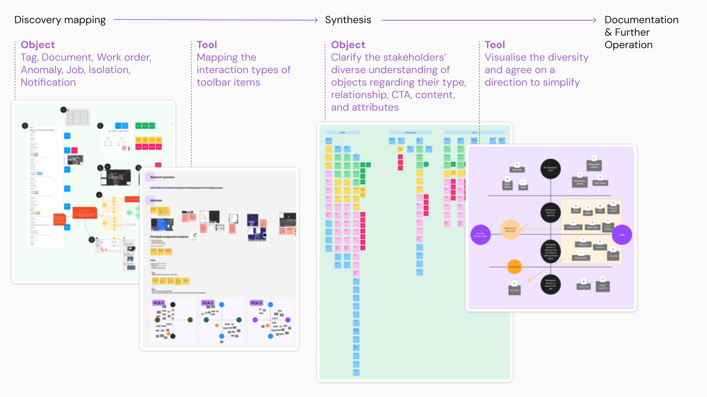

我們也清點所有的工具，並按照他們的特性分類，並與利益相關者溝通呈現與使用的優先順序。

這些地圖除了給我們清晰的概覽，也幫助我們預測未來需要考慮的新物件和 component 需求，進而確保當下的設計有擴充彈性（Scalability）。

## 排定 component 的建置順位

以物件而言，我們選定 Data Label 與 List 相關的 component，作為兩項優先項目。兩者在數位孿生中無所不在，投資效益最大。以工具而言，因為 Components 已經在先前的工作中完成，我們專注在 patterns。

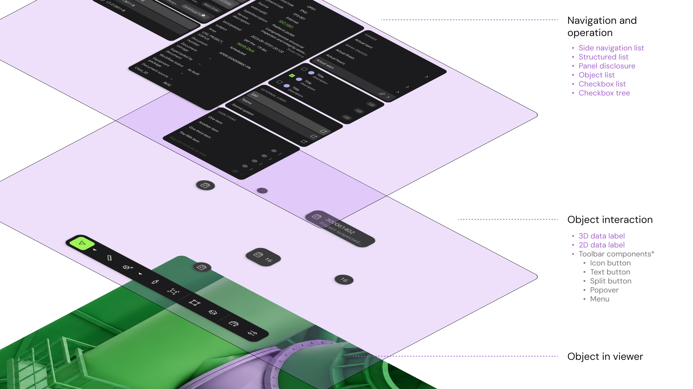

## 效益最高的試驗性 component

我們設計並開發了 **Data Label** 與一組 **List** components 作為試驗。它們同時驗證了物件導向的方法，也回應了產品團隊最迫切的需求。與此同時，我們也建立了相關的 alias tokens，確保後續的相關新 components 可以遵循同樣的視覺語言。

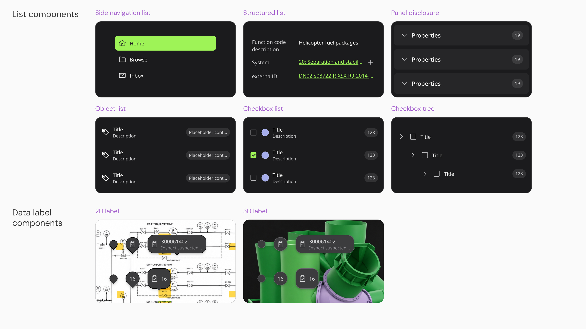

## 治理物件與工具的關鍵 patterns

List 包含六個 components，Data Label 則有兩組 components。Toolbar 則牽涉到多種不同 buttons, menu, popover 等。我們需要 UX pattern 來幫助設計師理解哪一類 component 屬於哪一個產品區域、以什麼順序排列，以及允許跟禁止怎麼樣的互動發生。

我們寫了三套。List /Tree pattern 與 Selection pattern 治理物件，Toolbar pattern 治理工具。

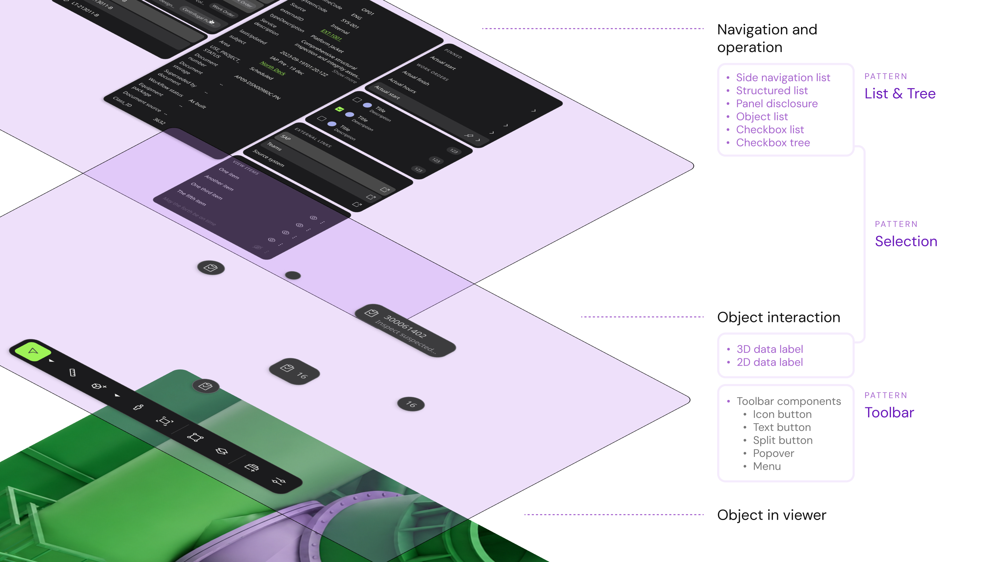

### 統整物件呈現的分歧

List 與 Tree pattern 對齊同一個物件的不同呈現方式。舉例來說，同一張工單，可以出現在搜尋結果、歷程面板與使用者自建的資料夾裡。我們要讓它們看起來跟感覺起來是同一個物件，但又要能支持不同情境下的使用行為。

我們藉由統一類似元件內的 UI 資訊架構，來達成這種同中存異的目標。

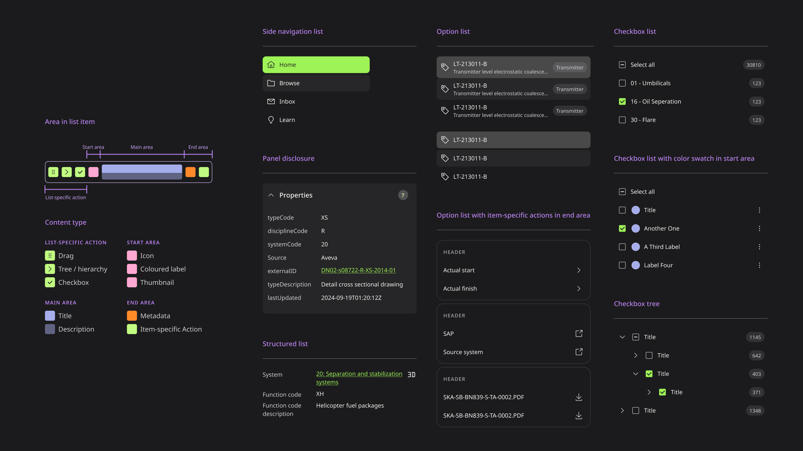

### 建立物件的強認知連結

Selection pattern 讓物件跨區域被攜帶。當使用者在某個面板選取一個物件，同一個物件會在 viewer 與其他面板中一同被 highlight。這個體驗上的連結，讓使用者能在產品旅程中，能始終在心裡攜帶同一個物件。

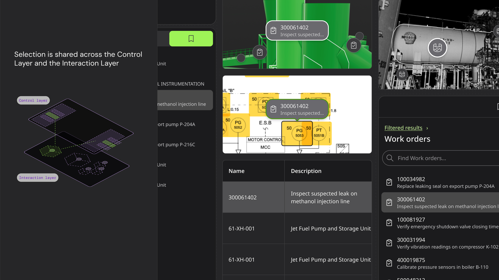

### 讓使用者在點擊之前就知道會發生什麼

Toolbar pattern 關乎可預期性。我們讓工具依互動類型與優先順序分組，並且預先定義使用某類型工具時，會開啟怎麼樣的介面。舉例來說，只要該工具改變的是 Viewer 的環境設定，它就只能用 icon button 而不是 split button 元件。

學會 Toolbar 部分工具的使用者，就能自然預測其他類似工具如何使用，這正是降低認知負荷的方式。

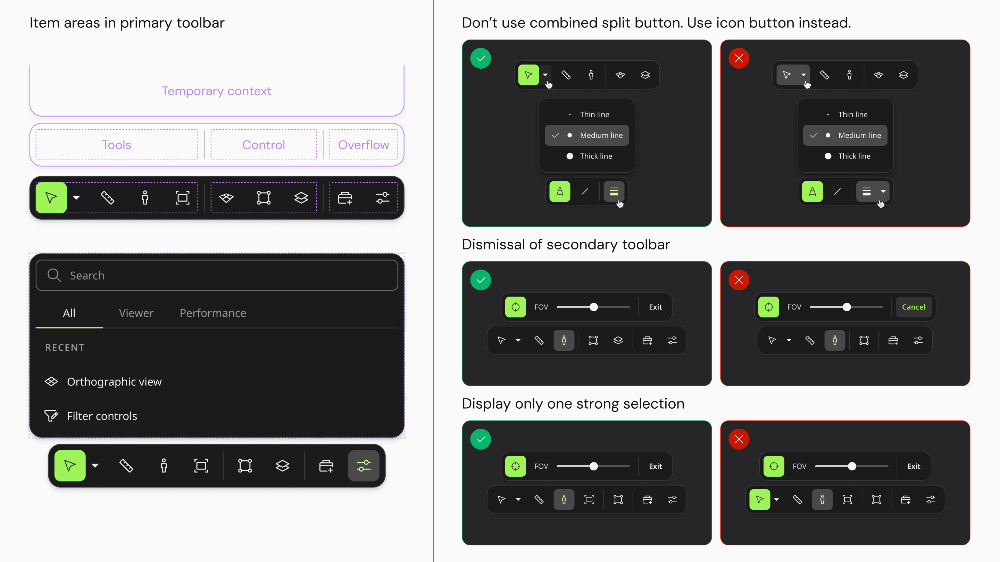

## 以協作、迭代與審查逐步完善 Guidelines

僅僅提供 component 並不夠。我們與主管、設計師和開發者進行訪談與工作坊，建立互信、蒐集 component 使用的回饋。我們將橫越數個 component 的關鍵體驗 pattern 記錄下來。這些 patterns 包含關鍵範例，讓它們可以被引用，也可以被改進。

## 設計品質保證的內部工具

一般而言， Design system 高度仰賴 documentation 來作為治理的基石。但隨產品成長，design system 文件變得越來越長，也越來越難讀，這使得審查變成 design system team 的專門技術。但很多時候，使用者需要的是即時能自行審查初步成果。

所以我們一方面提供產品團隊大幅簡化的 Checklist，另一方面藉助 AI 自動化設計品質 audit 的流程。

AI 協助自動化的部分，我們把流程拆成讀取的 Scraper 跟應用的 Audit。

Scraper skill 把 Figma 中既有的 design system 文件轉換成同時支援 Figma Agents 與 Codex 的形式。它不需要我們重做 guidelines，而是遵循既有的文件結構，把文字內容轉成 markdown，並把 guideline 的範例儲存成 png，以利 LLM 的視覺讀取並節省 token。

Audit skill 則以 Scraper 產出的內容，對使用者指定的設計進行審查，可以在 Figma 或在 Codex 中執行。回饋以 annotation 的形式呈現，每一則都附上設計系統文件中的原始出處。

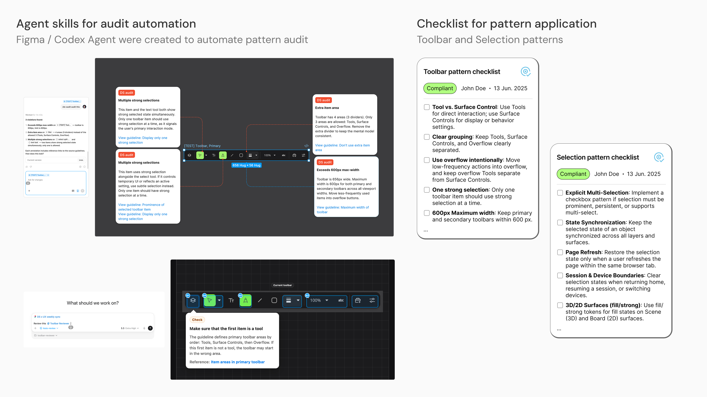

# 成果

## Toolbar 體驗被整併起來

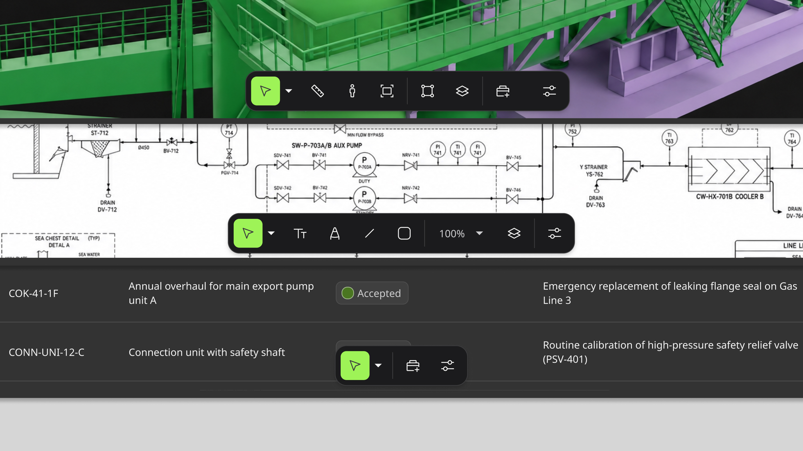

我們將工具分類。並依照互動類型、優先順序建立基本的互動原則。我們也明確指出過往產品中容易出現的 ux pattern 並將其列入文件中。同一個工具現在不論使用者身處產品的哪一個區域，都在同樣的位置、以同樣的方式運作。

## Viewer 上的物件選取體驗趨於一致

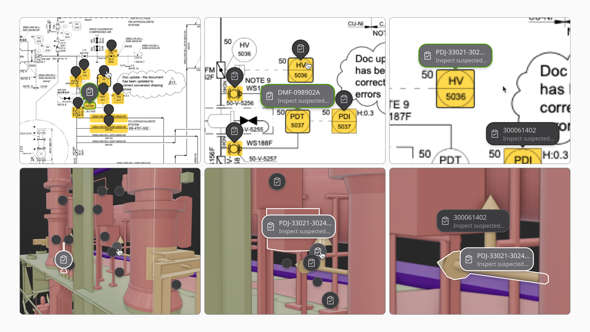

**Data Label** component以強烈的視覺關聯標示不同物件類型，並連結到 List 等其他元素。它顯示 ID、描述與時間序列等關鍵資訊，支援單一、群組與叢集標籤三種形式，支援資料視覺化的色彩編碼，並能適應 2D 與 3D 的工業環境。

## 物件在產品各處彼此連貫

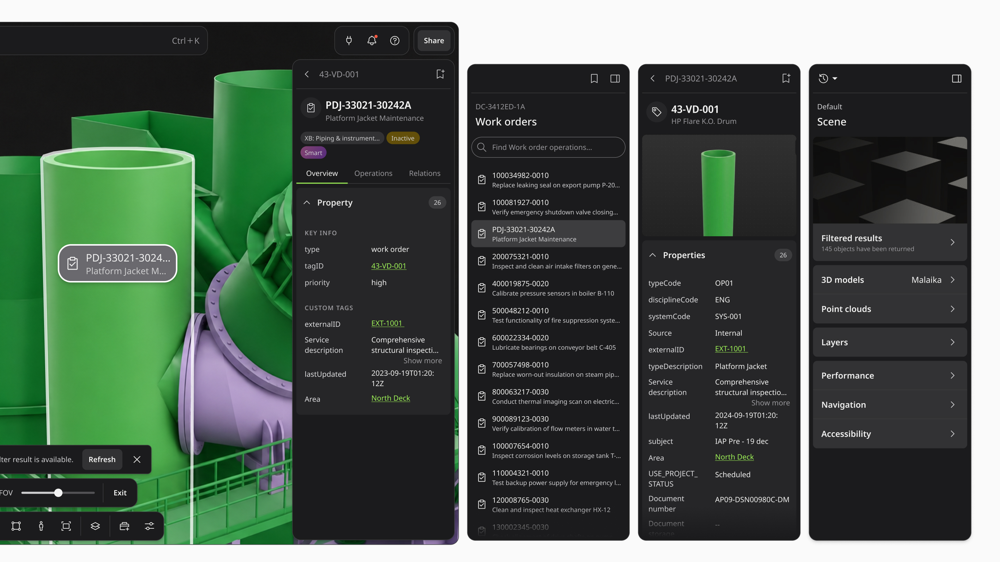

**List** components 則為物件導向的使用者旅程提供一致的結構，涵蓋搜尋結果、物件歷程與使用者自建資料夾，同時與 Data Label 保持視覺一致。它們具備定義明確的互動狀態、清晰的使用指南與可設定的替換操作；而它們的使用方式由 pattern 文件治理，確保一致。

兩者發布後都被廣泛採用，並取代了先前累積在軟體各處的各種自訂 component。

## 共同發展目標和未來改進方向

我們藉發展 Toolbar, Selection, 與 List/Tree patterns 的契機，為這三個 patterns 相關的 Tree、Card 與 Tag 設計了符合 patterns 的框線圖與 roadmap，讓利益相關者對設計系統未來的工作有合理預期，在產品開發上也有共同的發展目標。

而使用者也反饋，**模糊的 guidelines 會讓 audit skill產出不一致的稽核結果。** Annotation 的品質，與它背後 guidelines 的清晰度高度相關。如果不寫清楚，**工具無法分辨軟性的 optional 建議與硬性 mandatory 規則。** 使用者與 AI 協作帶來的反饋，成為 design system 改進自身 guidelines 品質的方式。

---

# 備註

## 保密聲明

本文所有視覺素材均為說明本專案流程與成果而製作，不代表實際產品，並尊重公司的智慧財產權及客戶的商業機密。