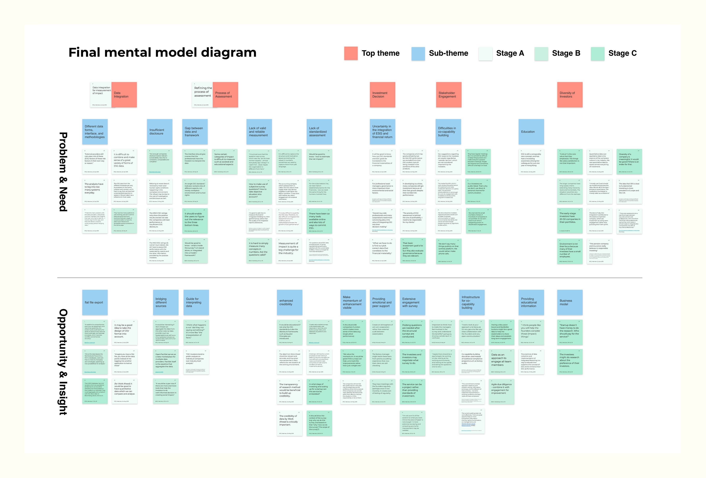
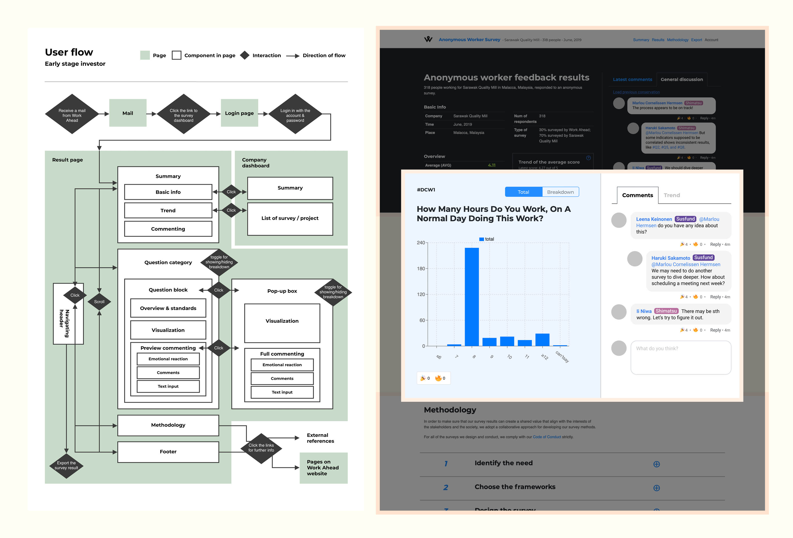

# Objectives

This thesis examines **how the capability approach and constructive design can enhance the capabilities of investment professionals in socially responsible investing**. In order to answer this question, this thesis employed a constructive design process iterated through cycles of prototyping and validation in coordination with Work Ahead, a Finnish startup that develops software for businesses to enhance ethics and sustainability performance in supply chains.

# My role
I led and conducted this MA thesis design research project in collaboration with Work Ahead Oy, Finland. The thesis received a full grade (5 out of 5) by the thesis supervisory committee at School of Arts, Design and Architecture, Aalto University.

The thesis was supervised by Andrés Lucero, Associate Professor of Interaction Design at Aalto University, and advised by Matti Nelimarkka, University Lecturer at the Faculty of Social Science, University of Helsinki.

# Approach 

## Theoretical Frameworks

The concept of socially responsible investing has raised awareness among investment professionals. The enterprises want to be more competitive in attracting investment by demonstrating outstanding performance in their social and environmental sustainability. On the other hand, those investors who value sustainability and impact are also keen to figure out an effective way to manage and track the data from the supply chains of their investee.

In the project, I employed two theoretical frameworks to further investigate the issues.

The first one is the Constructive Design approach, where the research and design methods lay. Throughout the iterations of construction process, I gathered rich research data and built up design outcome from scratch to hi-fidelity mockup.

The second one is the Capability Approach, another theoretical framework of this research. The approach, mainly developed by Nobel laureate Amartya Sen and Martha Nussbaum, was introduced into design research as a way to shift the focus from the utilitarian values, such as happiness and user satisfaction.

## Data and Methods

Throughout the research, 18 participants (investment professionals, consultants, and core members of Work Ahead) were recruited for interviews and tests. Moreover, a workshop was organized at the annual conference of European Business Angels Network 2019 in Helsinki for gathering feedback from investment professionals.

Prototyping and testing: the thesis employed the methods in user-centered design, but try to shift the focus from usability to capability.

Workshop: a workshop was organized at the annual conference of European Business Angels Network 2019 in Helsinki for gathering feedback from investment professionals

## Data Synthesis

I gathered an enormous amount of qualitative data from the interviews, the tests, the workshop, and the desktop research. Making sense of the data requires careful synthesis. I synthesized the data into useful and communicable information by using a combination of visualized mapping techiques based on mental model diagram, POINT analysis, and affinity diagram.

I categorized the data into the five categories on sticky notes: P(Problem), O(Opportunity), I(Insight), N(Need), T(Theme).

I mapped the sticky notes with a mental model diagram customized for the project.

The themes emerged from the data were put on blue sticky notes for a better visibility. I groupped the blue themes and its secondary notes with a few new top-tier themes in the red sticky notes.

Based on the synthesis, I developed further customer journeys and user flows.

Throught out the iterations, the mental model diagrams were modified and updated with the new research data gathered on a wall of the office. I transformed into digital version at the end of research with Figma.

Early stage prototypes: the prototypes were also modified and further developed based on the feedback gathered from research activities and the updated diagrams.

# Research outcome and discussion

A glance at the screenshot of final interactive demo

The primary outcome of this research is a web-based interactive reporting platform, which visualizes the data of workplace wellbeing survey conducted by Work Ahead. This platform also allows its users to communicate with each other for further engagement. The proposed website design was prototyped iteratively and tested as to whether it would enhance the capabilities for socially responsible investing of its users. The findings revealed that the proposed design should:

1. provide various options for data export and guidance to integrate the results of the surveys to the other relevant data sources
2. deal with the data insufficiency by offering suggestions on the relevance between data, standards, and frameworks
3. deliver encouragement and facilitate peer support
4. enable stakeholders to cooperate through a better communication channel

The final user flow and screenshots of the interactive demo

I crafted the frontend in coordination with the engineering team of Work Ahead. The tech stack employed includes Gatsby (a React framework), RESTful API, styled component, and Docker.

The design would still require further observation of the actual long-term cooperation enabled by this platform and the capabilities it serves to enhance. As the capability approach functioned merely as an analytical framework, this thesis also sheds light on the future development of epistemology and methodology for applying this approach in the field of design.

---

# Endorsement

My work was [endorsed by Ilona Mooney](https://www.linkedin.com/in/yentsenliu/), CEO of Work Ahead:

> Yentsen worked independently on a complex, novel topic that applied sociological perspectives to impact investing and included building a functional prototype that we tested with high-profile investors. Yentsen’s thesis work kick-started our front-end development, and his work was of such high quality that we could immediately use large parts in our product. As a person, our team describes Yentsen as talented, goal-oriented and very positive.
> 

I received a full grade (5 out of 5) for the thesis by the thesis supervisory committee at Aalto University. The thesis was supervised by Andrés Lucero, Associate Professor of Interaction Design at Aalto University, and advised by Matti Nelimarkka, University Lecturer at the Faculty of Social Science, University of Helsinki.