# 目標

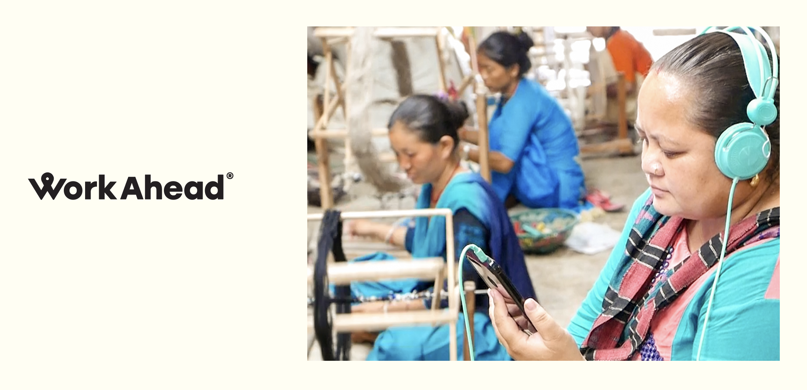

本論文探討**能力取向與建構式設計如何提升投資專業人士在社會責任投資領域的能力**。為回答這個問題，本論文採用建構式設計流程，透過與芬蘭新創公司 Work Ahead 的合作，反覆進行原型製作與驗證的循環。Work Ahead 開發供企業提升供應鏈倫理與永續績效的軟體。

# 我的角色

我主導並執行了這個碩士論文設計研究專案，與芬蘭 Work Ahead Oy 密切合作。本論文由阿爾托大學藝術、設計與建築學院論文審查委員會評定，獲得最高分（5 分滿分 5 分）。

論文指導教授為阿爾托大學互動設計副教授 Andrés Lucero，共同指導人為赫爾辛基大學社會科學學院講師 Matti Nelimarkka。

# 方法

## 理論框架

社會責任投資的概念已在投資專業人士中引發廣泛關注。企業希望透過展現卓越的社會與環境永續績效來吸引投資，而重視永續與影響力的投資人，也迫切需要有效的方式來管理和追蹤被投資企業供應鏈的相關資料。

在本專案中，我採用了兩個理論框架深入探討這些議題。

第一個是建構式設計取向，研究與設計方法均奠基於此。在整個建構過程的迭代循環中，我蒐集了豐富的研究資料，並從零開始建構設計成果直至高保真設計稿。

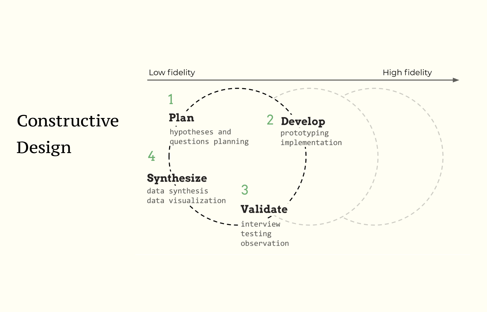

第二個是能力取向，這是本研究的另一個理論框架。這個取向主要由諾貝爾獎得主阿馬蒂亞·森（Amartya Sen）和瑪莎·努斯鮑姆（Martha Nussbaum）發展，被引入設計研究領域，作為將焦點從效用主義價值（如幸福感和使用者滿意度）轉移的一種方式。

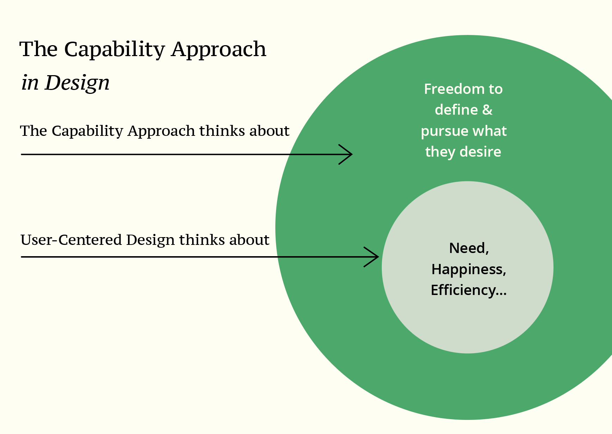

## 資料與方法

在整個研究過程中，共招募 18 位參與者（包含投資專業人士、顧問及 Work Ahead 核心成員）進行訪談與測試。此外，我還在 2019 年赫爾辛基歐洲天使投資人網絡年會上組織了一場工作坊，蒐集投資專業人士的回饋。

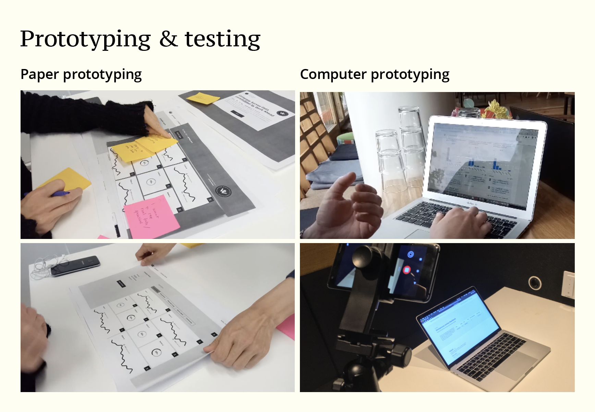

原型製作與測試：本論文採用以使用者為中心的設計方法，但試圖將焦點從可用性轉移到能力。

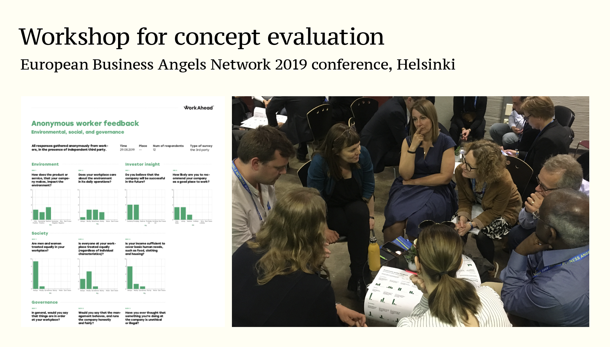

工作坊：在 2019 年赫爾辛基歐洲天使投資人網絡年會上組織工作坊，蒐集投資專業人士的回饋。

## 資料綜合

我從訪談、測試、工作坊和桌面研究中蒐集了大量質性資料。要從這些資料中提煉洞察，需要仔細的綜合分析。我結合心智模型圖、POINT 分析和親和圖等視覺化映射技術，將資料綜合為有用且可溝通的資訊。

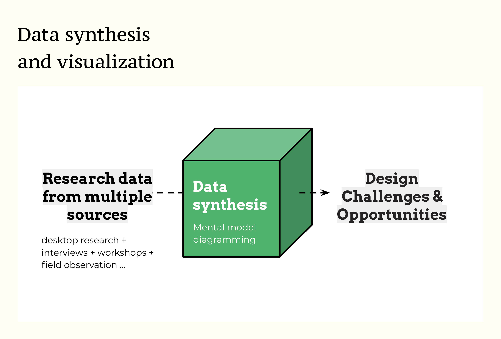

我將資料分類為五個類別的便利貼：P（問題）、O（機會）、I（洞察）、N（需求）、T（主題）。

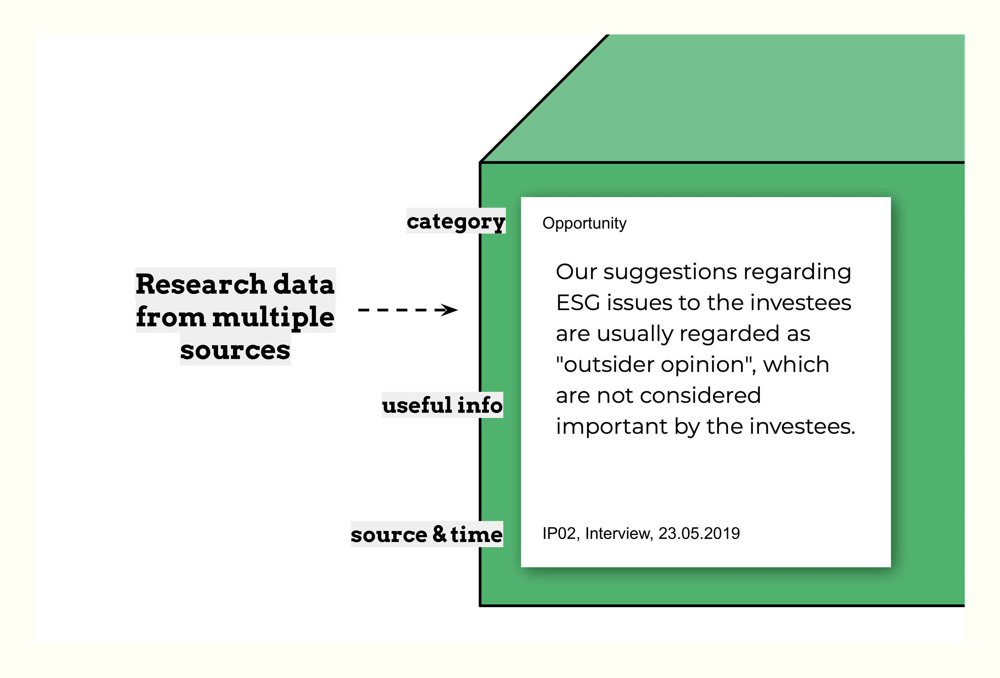

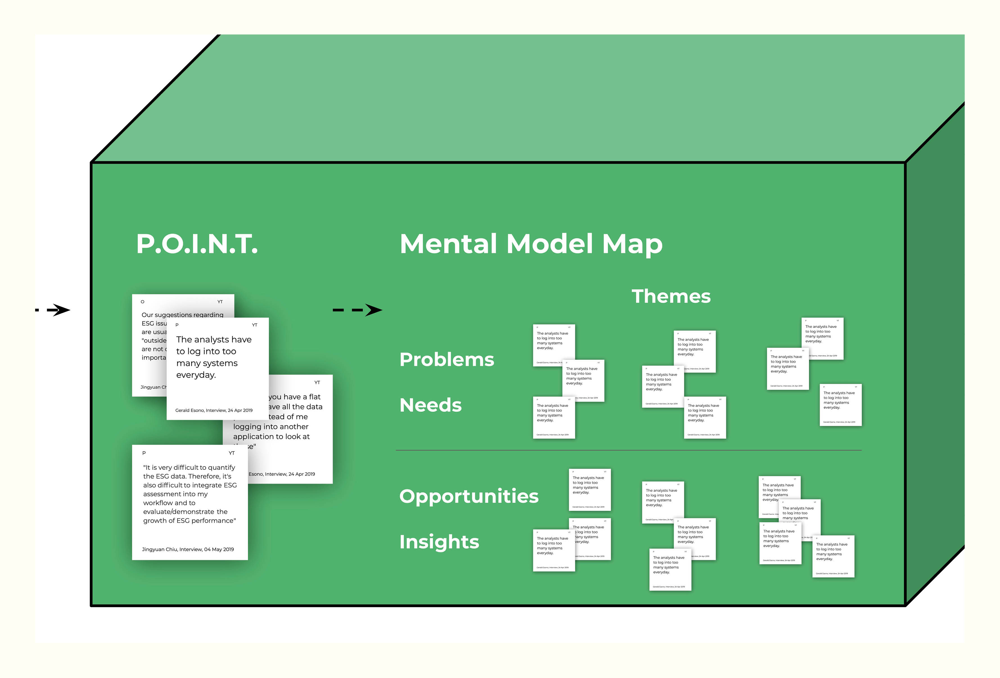

我用針對本專案客製化的心智模型圖來整理這些便利貼。

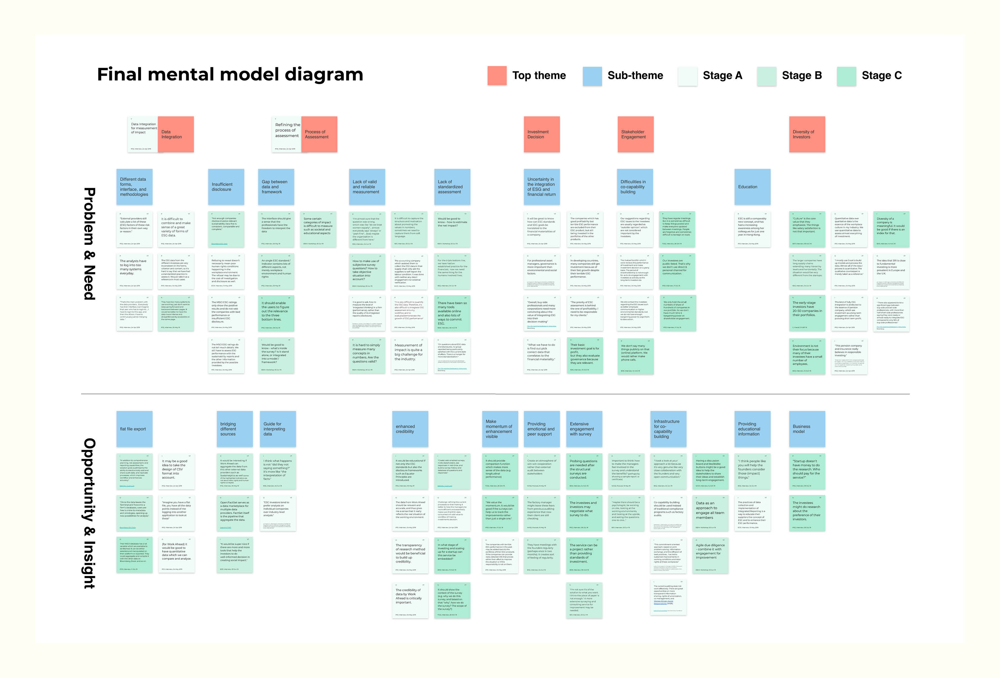

從資料中浮現的主題以藍色便利貼標示，以提高可見性。我將藍色主題及其次要便利貼，以紅色便利貼上的若干更高層次主題進行分組。

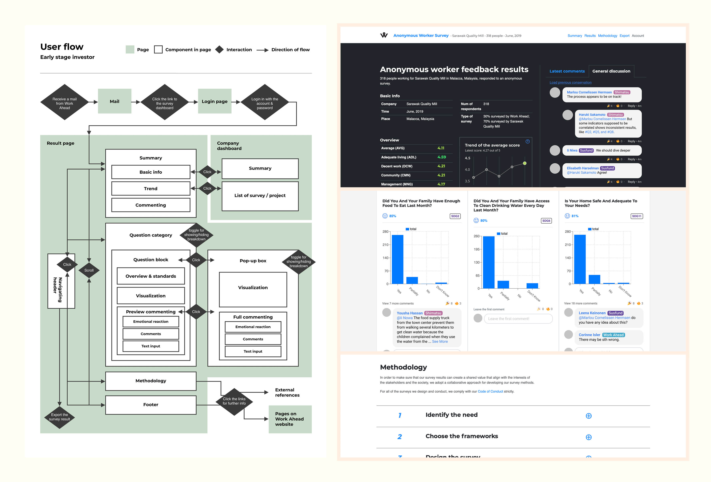

根據綜合分析，我進一步開發了顧客旅程與使用者流程。

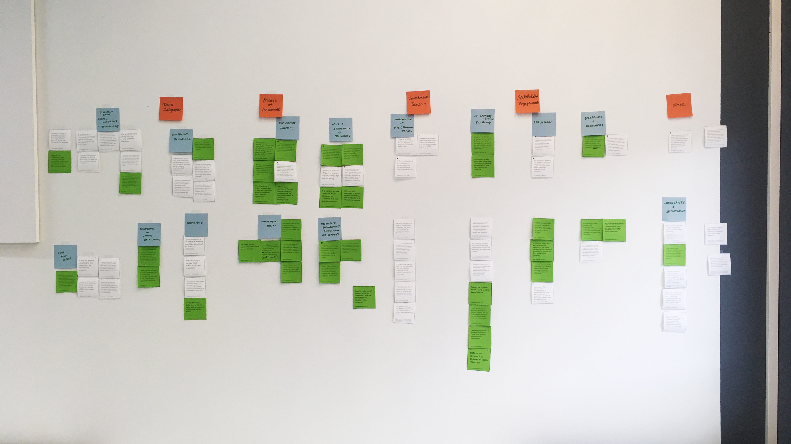

在整個迭代過程中，心智模型圖不斷根據辦公室牆上收集到的新研究資料進行修改和更新，最終在研究結束時使用 Figma 轉化為數位版本。

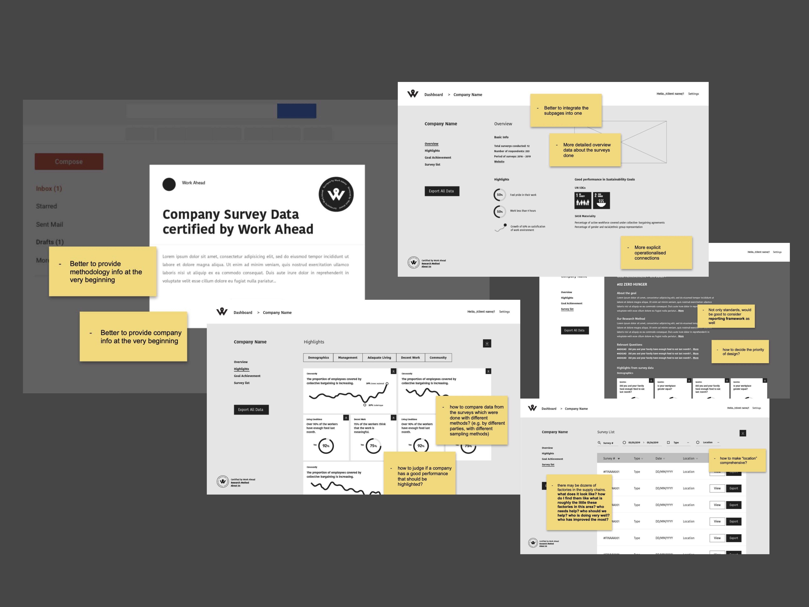

早期原型：原型也根據研究活動收集的回饋和更新的圖表不斷修改和進一步開發。

# 研究成果與討論

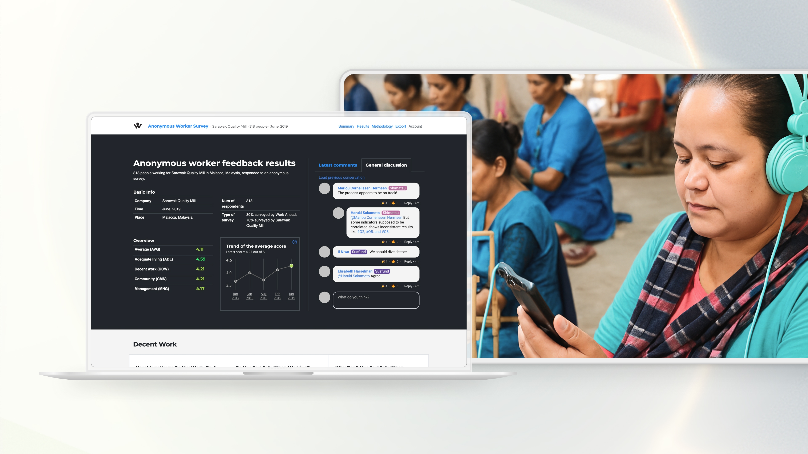

最終互動演示截圖一覽

本研究的主要成果是一個基於網頁的互動式報告平台，將 Work Ahead 進行的職場福祉調查資料加以視覺化，並允許使用者相互溝通以促進進一步參與。提出的網站設計經過迭代原型製作和測試，以驗證是否能提升使用者進行社會責任投資的能力。研究發現，提出的設計應：

1. 提供多種資料匯出選項，並提供將調查結果整合至其他相關資料來源的指引
2. 透過提供資料、標準和框架之間相關性的建議，處理資料不足的問題
3. 傳遞鼓勵並促進同儕支持
4. 透過更好的溝通管道使利害關係人能夠合作

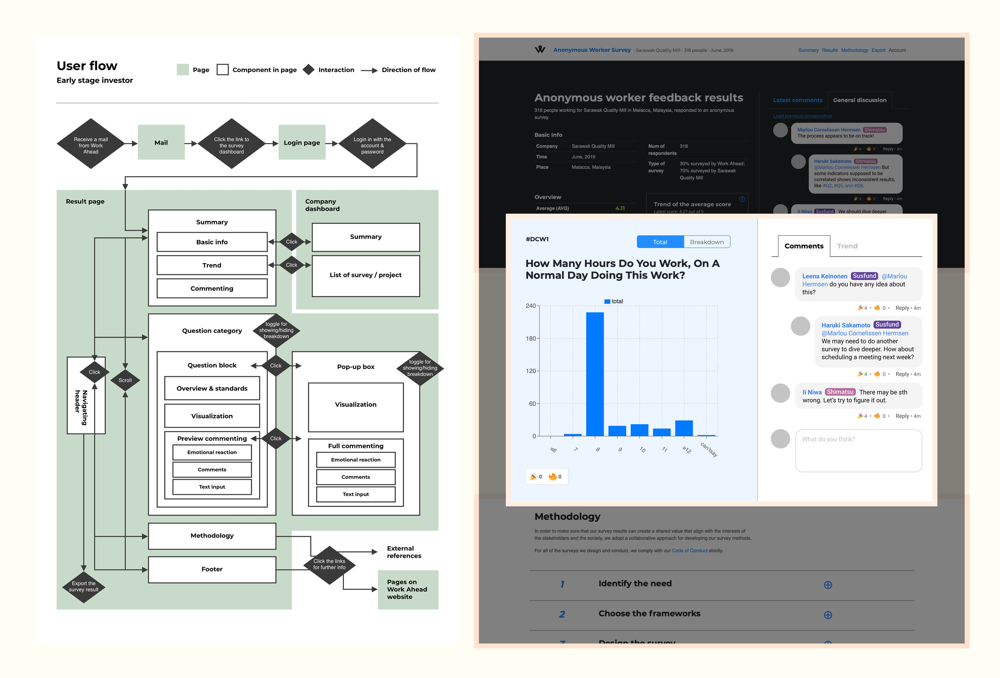

最終使用者流程和互動演示截圖

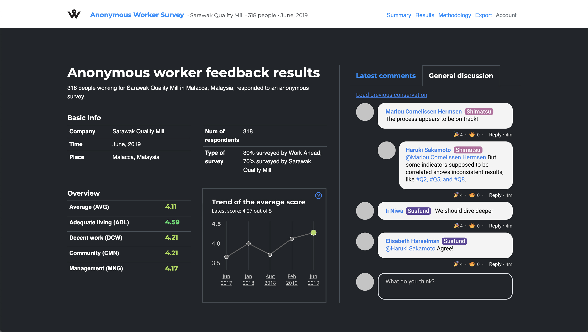

我與 Work Ahead 的工程團隊協作打造前端，採用的技術棧包括 Gatsby（React 框架）、RESTful API、Styled Component 和 Docker。

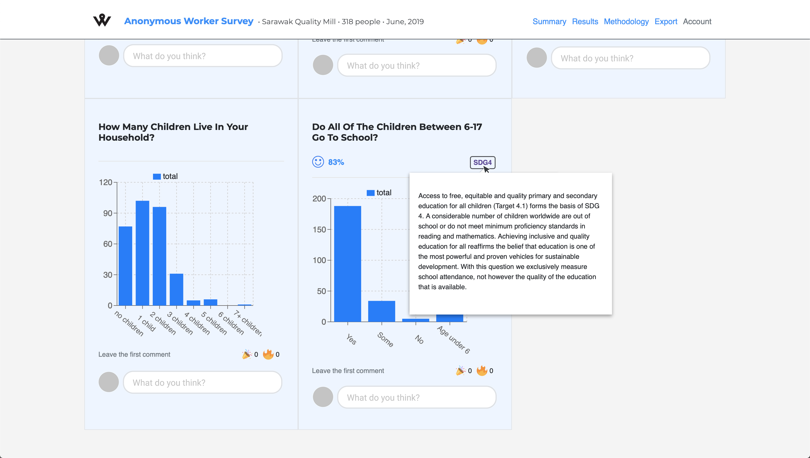

這個設計仍需要對此平台實現的長期合作及其所服務的能力進行進一步觀察。由於能力取向僅作為分析框架，本論文也為將這種方法應用於設計領域的認識論和方法論的未來發展提供了啟示。

---

# 推薦

我的工作獲得 Work Ahead 執行長 Ilona Mooney 的[推薦](https://www.linkedin.com/in/yentsenliu/)：

> Yentsen 獨立完成了一個複雜且新穎的主題，將社會學視角應用於影響力投資，並建立了一個我們與高知名度投資人測試的功能性原型。Yentsen 的論文工作啟動了我們的前端開發，他的工作品質如此之高，以至於我們可以立即在我們的產品中使用大部分內容。從個人層面而言，我們的團隊形容 Yentsen 是一位才華橫溢、目標導向且非常積極的人。
> 

我的論文由阿爾托大學論文審查委員會評定，獲得最高分（5 分滿分 5 分）。論文指導教授為阿爾托大學互動設計副教授 Andrés Lucero，共同指導人為赫爾辛基大學社會科學學院講師 Matti Nelimarkka。
