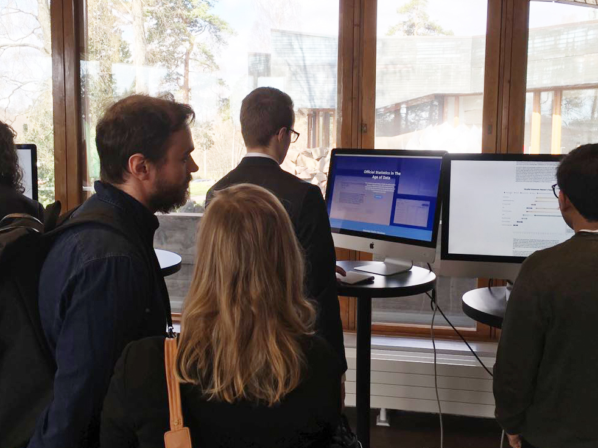

# Objective

By redesigning the user interface of Statfin, the official statistics database of Finland, the project aims to demonstrate how design could help interactively visualise data, and how design can lower the threshold of transforming raw data into conprehensive information. It could be helpful not only to the citizens, but also to the government employees who need to make data-based reports. This transformation could also provide a basis for strengthening civil society.

# My Role

I independently led the design, research, and prototyping of this coursework project, which was selected as a showcase piece for the *Visualising Knowledge* Conference 2018 in Helsinki. The work explored the intersection of data visualisation and public communication. Following the conference, I was invited by Statistics Finland—the central statistics authority of Finland—to present a live demo and discuss the project's relevance to their public outreach and data communication strategies.

# Approach

The documentation of this project is illustrated with the **Double Diamond model** with the four phases – **Discover, Define, Develop and Deliver**.

## 1. Discover

This design project was the term assignment of a 3-week intense course at Aalto University. Given the limitation of time, the research is mainly based on my *auto*ethnographical usage experience and desktop research. In addition, I also had several times of tutoring with the teachers and guest lecturers from Terveyden ja hyvinvoinnin laitos (THL). They gave me lots of feedback and insight for proceeding the project. The main finding can be illustrated with the three personas of the user groups as follows:

## 2. Define

How “data” can be used as valuable “information” is equally important as the the accessibility of data (Kenett & Shmueli, 2016). A good quality of official statistical data doesn’t guarantee qualified use/transformation of data. Taking official statistics as an example, most of the common measurement methods focus merely on the quality of statistical data, such as the indicators (e.g. Relevance of Concept, Accuracy of Estimates, Timeliness and Punctuality in Disseminating Results, etc) used by Eurostat and by the OECD. As we can see, there is few common standards established on how to assess its usabilities. The current measurement for assessment may be just beneficial for the professionals who are familiar with how to utilise raw data for further analysis.

In order to address this problem, I used Experience Map for visualising the general experience of the different user groups.

Customer Journey Map

## 3. Develop

### Design Principle

Based on the pain points shown on Experience Map, three principles were developed as a guidance for creating the new design.

- **Visualisation First**: Always visualise raw data at the first glance, than provide tools for further investigation.
- **Intuitive Interaction**: Reduce cognitive load and keep the interface intuitive and effective.
- **Seamless Experience**: Make experience consistent while producing, interacting, and viewing information.

### Sitemap and value proposition

A sitemap was then developed for aggregating the emerging design ideas. This one shown below was refined with the final design for a clear overview.

# Outcome

Because of the limitation on time and resouces, I didn’t iterate prototyping and testing for many times, and I didn’t implement fully interactive computer prototypes. Instead, I developed a website showcasing my design concepts. The website serves as a provotype for shifting awareness and further discussion. I submitted this work to the open call for showcase work at Visualizing Knowledge 2018 Conference, Finland, and got selected.

The work got noticed by Statistics Finland (Tilastokeskus), the statistics authority of Finland, during the showcase session. I was then invited to give an informal presentation of this work at their head office in Helsinki.

A glance at website showcasing at Visualizing Knowledge 2018

You can visit a report introducing the design in details available on [Gitbook](https://yentsenliu.gitbook.io/redesign-statfin/).

Redesign the national statistics database of Finland, which was accepted as a showcase work at Visualizing Knowledge 2018 Conference, Finland.

A few more glances at website showcasing at Visualizing Knowledge 2018:

