# 目標

透過重新設計芬蘭官方統計資料庫 Statfin 的使用者介面，本專案旨在展示設計如何協助以互動方式視覺化資料，以及如何降低將原始資料轉化為易於理解資訊的門檻。這不僅有助於一般公民，也能幫助需要製作數據報告的政府工作人員，從而為強化公民社會提供基礎。

# 我的角色

我獨立主導這個課程作業的設計、研究與原型製作，該作品獲選在 2018 年赫爾辛基《Visualising Knowledge》研討會展示。這項工作探索資料視覺化與公共傳播的交匯點。研討會結束後，我受芬蘭統計局（芬蘭中央統計機構）邀請，進行現場演示並討論本專案與其公共推廣及資料傳播策略的關聯。

# 方法

本專案的文件以**雙鑽石模型**的四個階段呈現——**發現、定義、開發與交付**。

## 1. 發現

這個設計專案是阿爾托大學一門為期 3 週密集課程的學期作業。受限於時間，研究主要基於我的**自身**民族誌使用體驗與桌面研究。此外，我也多次與來自芬蘭國家健康與福利研究所（THL）的教師和客座講師進行指導交流，他們提供了許多推進專案的回饋與洞察。主要發現可透過以下三個使用者群體的人物誌加以說明：

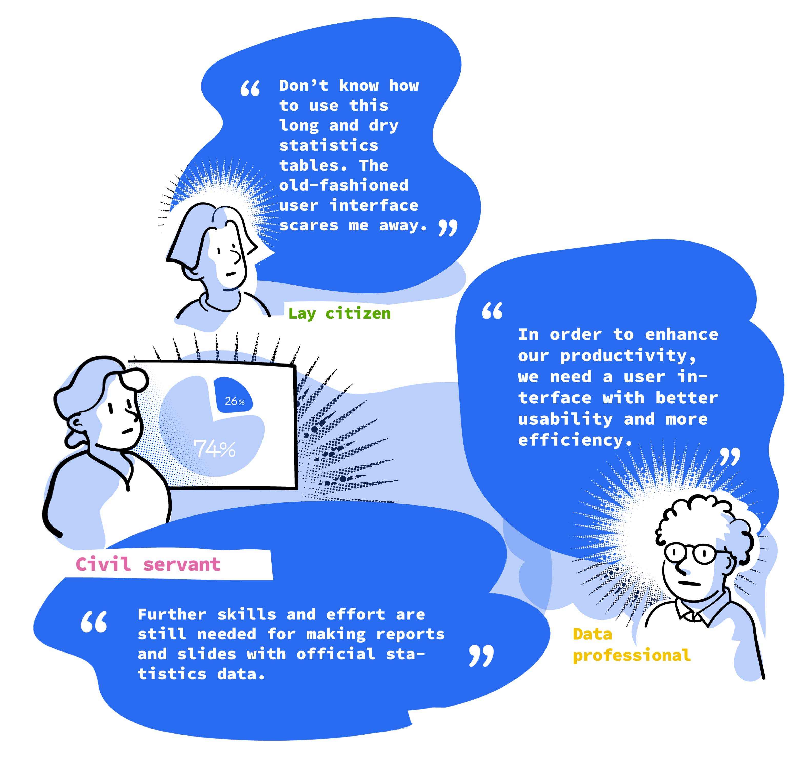

## 2. 定義

「資料」如何被用作有價值的「資訊」，與資料的可及性同等重要（Kenett & Shmueli, 2016）。優質的官方統計資料並不保證資料的合格使用或轉化。以官方統計為例，大多數常見的衡量方法僅關注統計資料品質本身，例如 Eurostat 和 OECD 使用的指標（概念相關性、估計準確性、結果發布的及時性與準確性等）。由此可見，幾乎沒有關於如何評估其可用性的共同標準，現有的評估標準可能只對熟悉如何利用原始資料進行進一步分析的專業人士有益。

為了解決這個問題，我使用體驗地圖來視覺化不同使用者群體的整體體驗。

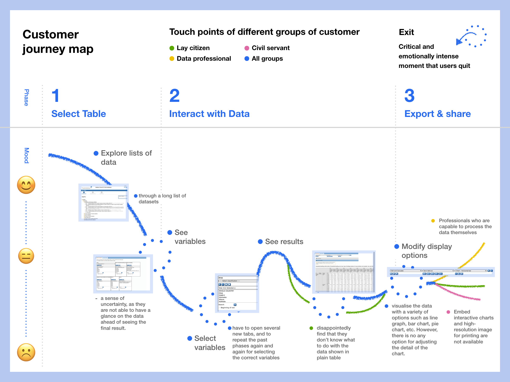

顧客旅程地圖

## 3. 開發

### 設計原則

根據體驗地圖中顯示的痛點，發展出三個設計原則作為新設計的指引。

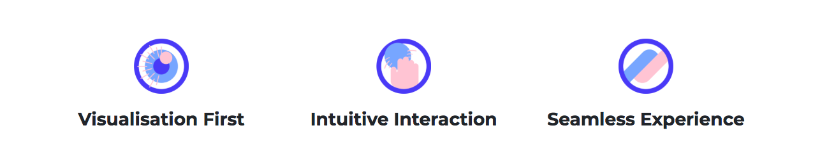

- **視覺化優先**：第一眼始終視覺化原始資料，再提供進一步探索的工具。
- **直覺式互動**：降低認知負荷，保持介面直覺且有效。
- **無縫體驗**：在製作、互動和瀏覽資訊時，讓體驗保持一致。

### 網站地圖與價值主張

接著制定網站地圖，整合浮現的設計構想。以下呈現的是最終設計後精煉的版本，提供清晰的全貌。

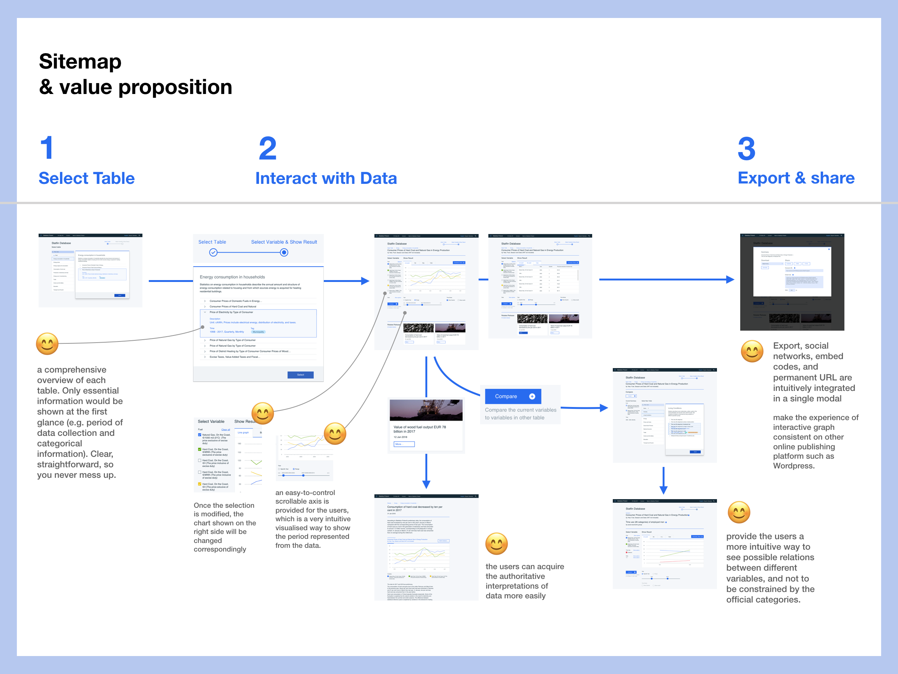

# 成果

由於時間與資源的限制，我沒有進行多輪原型製作和測試，也沒有實作完整互動的電腦原型。取而代之，我開發了一個展示設計概念的網站，作為一個「引發思考的原型」（provotype），用於轉移認知並促進進一步討論。我將這項作品投稿至 2018 年芬蘭 Visualizing Knowledge 研討會的展示徵件，並獲選入圍。

這項作品在展示期間獲得芬蘭統計局（Tilastokeskus）的注意，並受邀至其赫爾辛基總部進行非正式的作品發表。

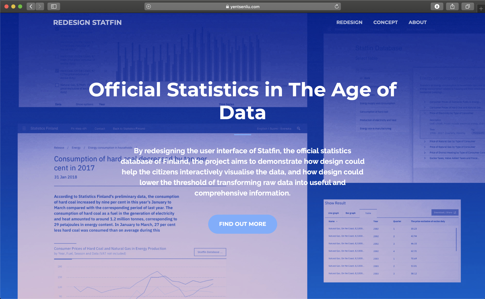

2018 年 Visualizing Knowledge 研討會網站展示一覽

您可以在 [Gitbook](https://yentsenliu.gitbook.io/redesign-statfin/) 上閱讀詳細介紹設計的報告。

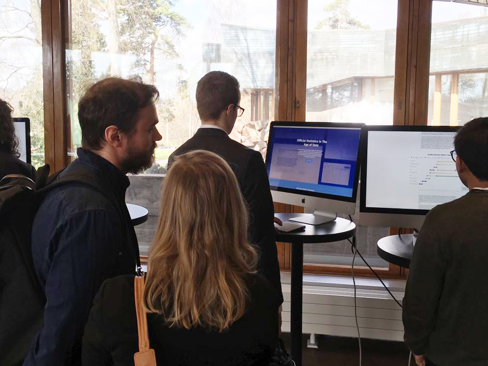

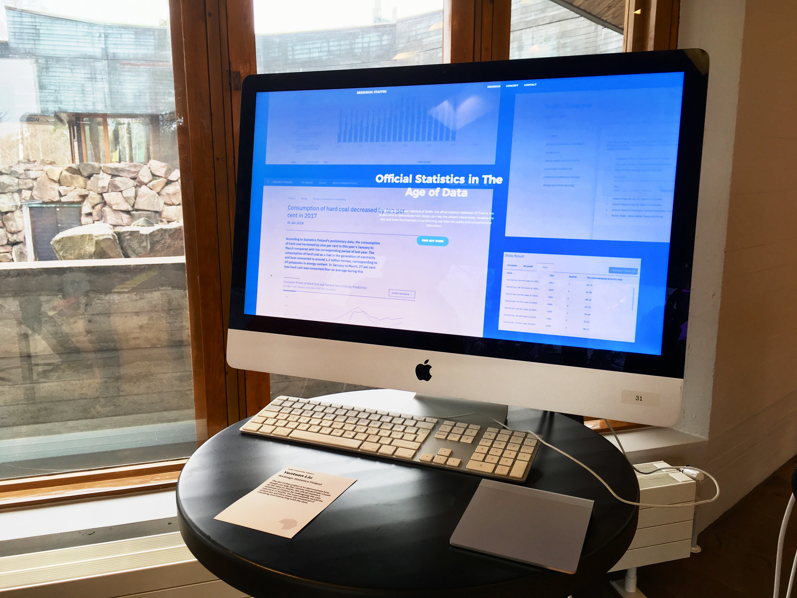

重新設計芬蘭國家統計資料庫，獲選為 2018 年芬蘭 Visualizing Knowledge 研討會的展示作品。

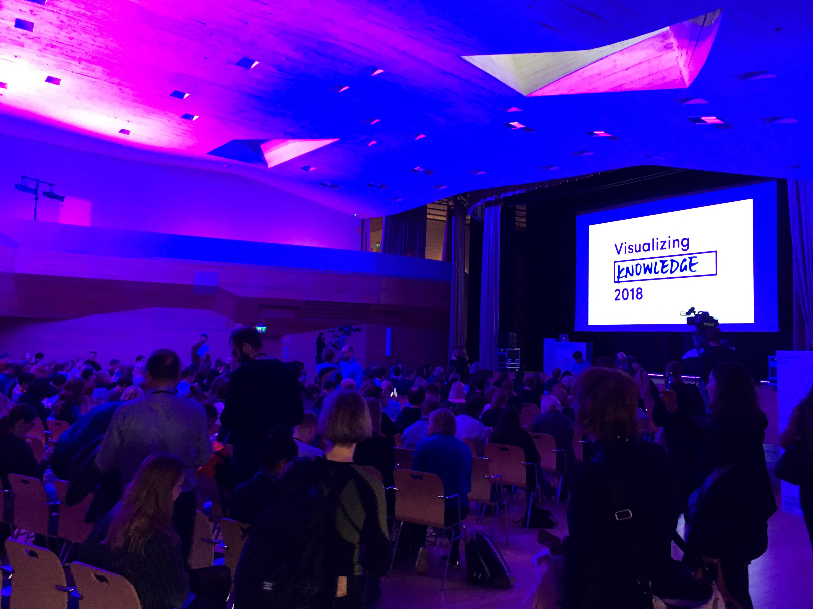

更多研討會網站展示截圖：

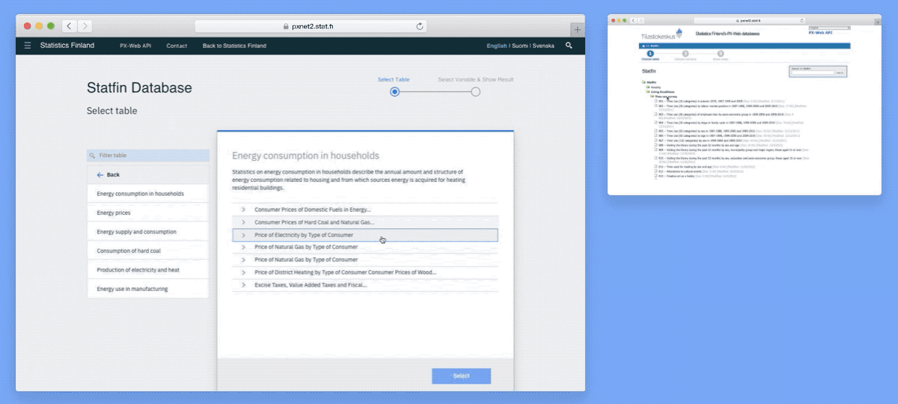

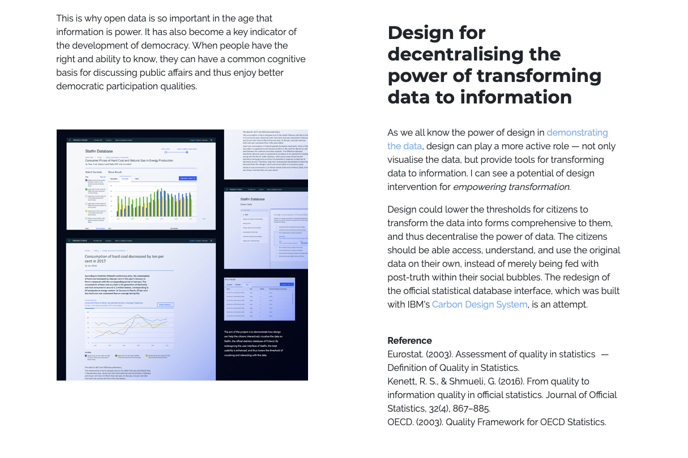

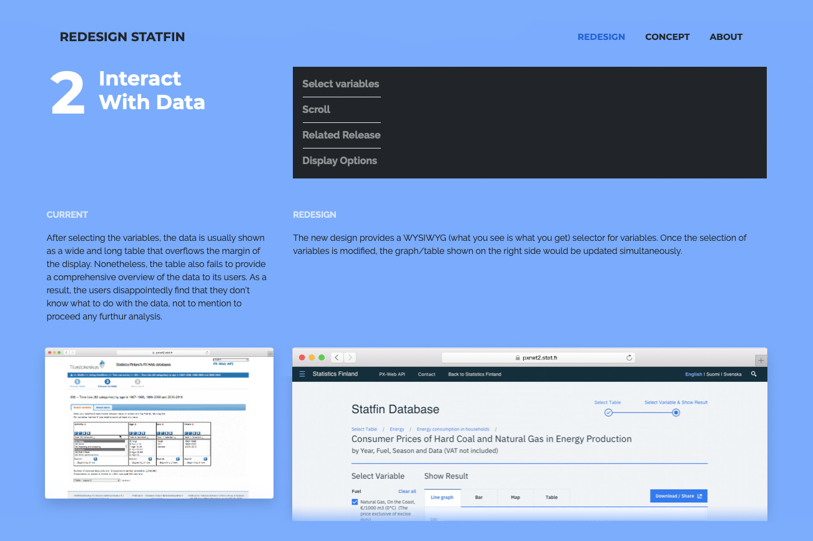

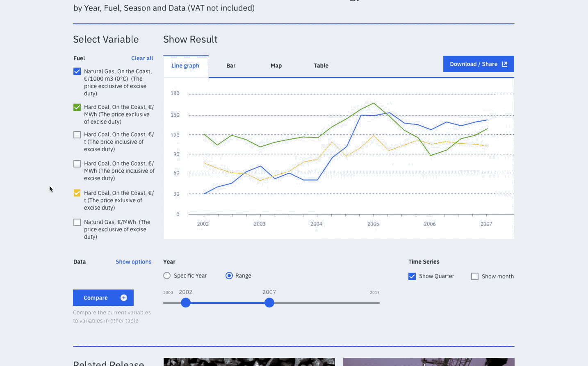
