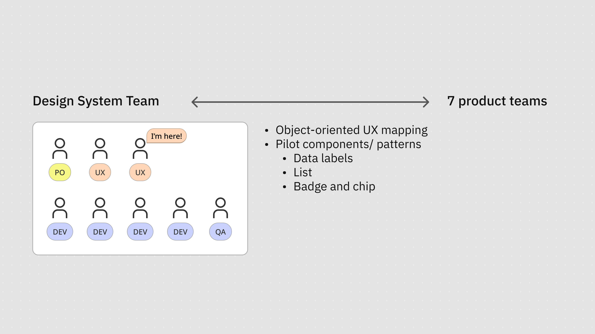
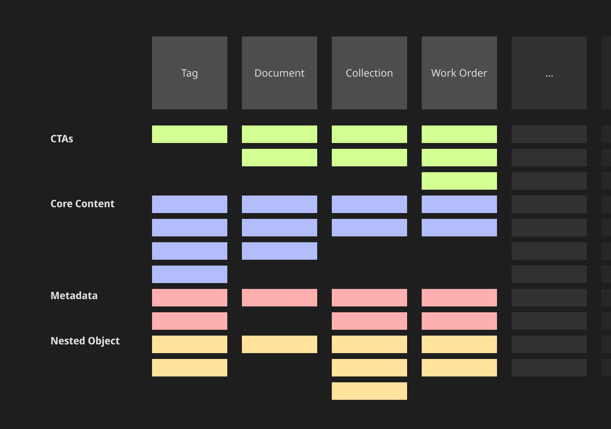

# Objectives

We wanted to align the inconsistent representation of objects in the complicated digital twin scenarios and user flow.

In the energy industries, the objects (e.g., “Tag”, “Work Order”, “Document”, “Anomalies”) look differently in the different features of our product. We need to develop a feasible way to align them and offer our users a clear mental model to do their everyday’s jobs, such as planning, operation, and maintenance for the heavy assets. 

# My role

I led the initiative by mapping the object-oriented mental models and  redesigning pilot components and patterns.

# Challenge

Our product used to be a combination of approx. 40 small applications as a spin-off from Aker Solutions. The objects are presented very differently in the different user flows of our product. The lack of consistent inner logic reflects the past company organisational structure. 

This is an example of our list pattern. The diversity without clear logic harmed our UX.

The diversity in the presentation led to cognitive fragmentation in our user flows. It also resulted in the failure to provide our users a comprehensive mental model on the objects that matches their domain knowledge on the objects.

# Approach

## 1. Mapped out the objects

We chose the [OOUX framework](https://www.ooux.com) as our mapping technique and establish the map collaboratively. It gave us an overview on the objects in our products. It also helped us to clarify and align our understanding on the objects given the deep prerequisite domain knowledge.

## 2. Defined priorities

We chose data label and list components as our two top priorities. They are both very prominent in our UX. Investing in the two components could yield most improvement.

## 3. Created pilot components

We designed and developed two pilot components, **Data Label** and **List**. They served as the pilot components for us to validate this approach and satisfied the priority needs of the product teams.

## 4. Encouraged adoption, iterated, and reviewed

Through out the process of component research and redesign, the communication with the teams is the key. We interviewed and facilitated workshops with the managers, designers, and developers to establish trust, gather feedback, and reach a shared imagination on the roadmap.

We also encouraged component adoption by organising checkin and feedback sessions. We also documented the key examples in the guidelines for references and iterations.

# Outcome

## MVP components

We designed and developed two pilot components, **Data Label** and **List**. 

The **Data Label** component signifies different object types with strong visual connections to other elements like Lists, displaying key information such as ID, description, and time series across single, group, or cluster labels. It supports colour coding for data visualisation and adapts seamlessly to both 2D and 3D industrial environments. 

The **List** component complements this by providing a consistent structure for various use cases—such as search results, object history, and user-created folders—while maintaining visual coherence with Data Labels. It includes well-defined interactive states, offers clear usage guidelines, and allows flexibility through configurable swap-in actions.

## Shared and aligned roadmap

Besides the two key components, we also designed the wireframe and guidelines for the other component updates on our **roadmap**, such as Tree, Card, and Tag component. This fostered interface coherence and cultural alignment across teams. 

Grounded in collaboration and domain respect, our scalable components empower users and creators, clarifying both product and people.

---

# Note

## Confidentiality concerns

All visual materials in this article were created solely to illustrate the process and outcomes of this project. They do not represent the actual product and respect the company’s intellectual property and the client’s business confidentiality.