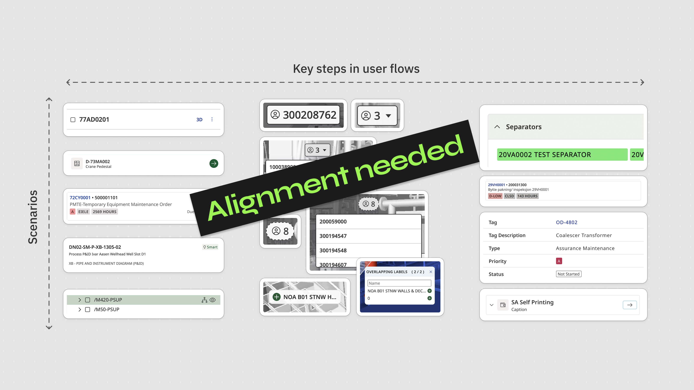
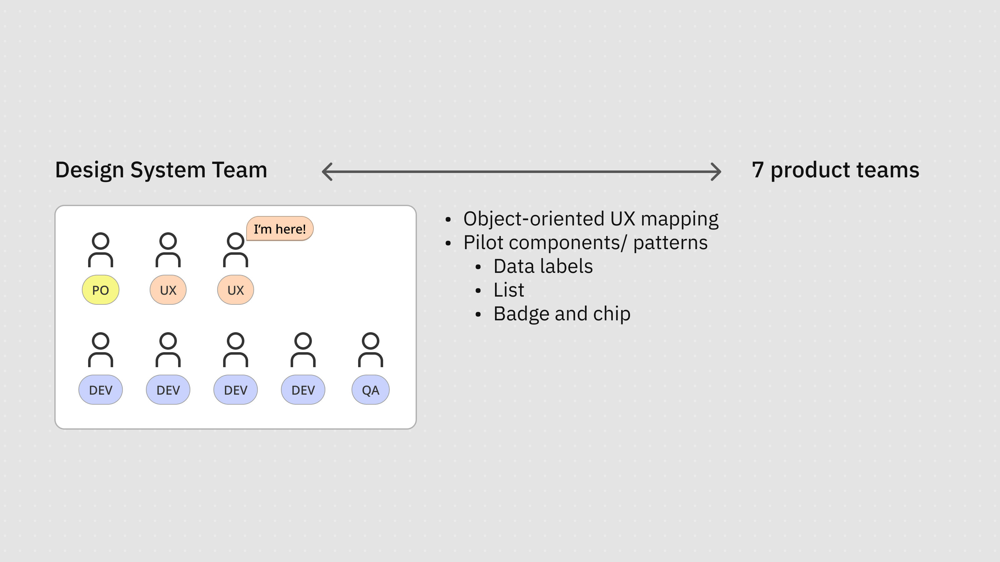
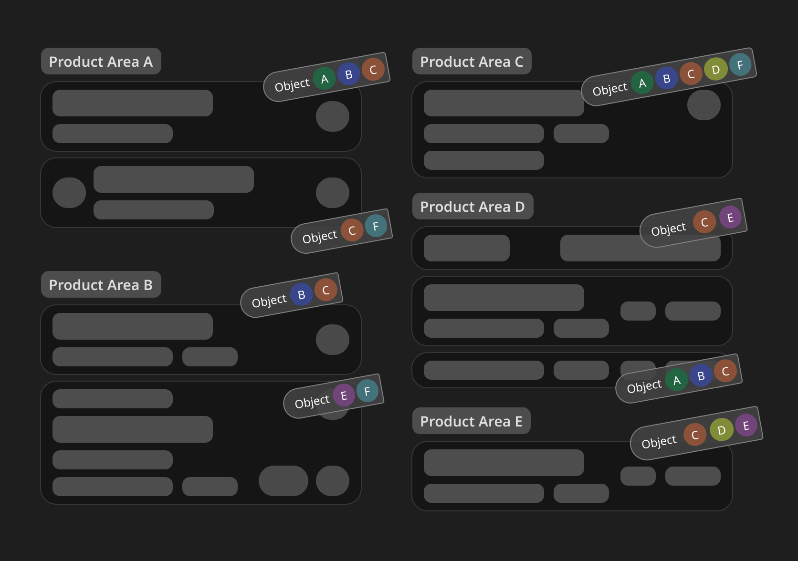
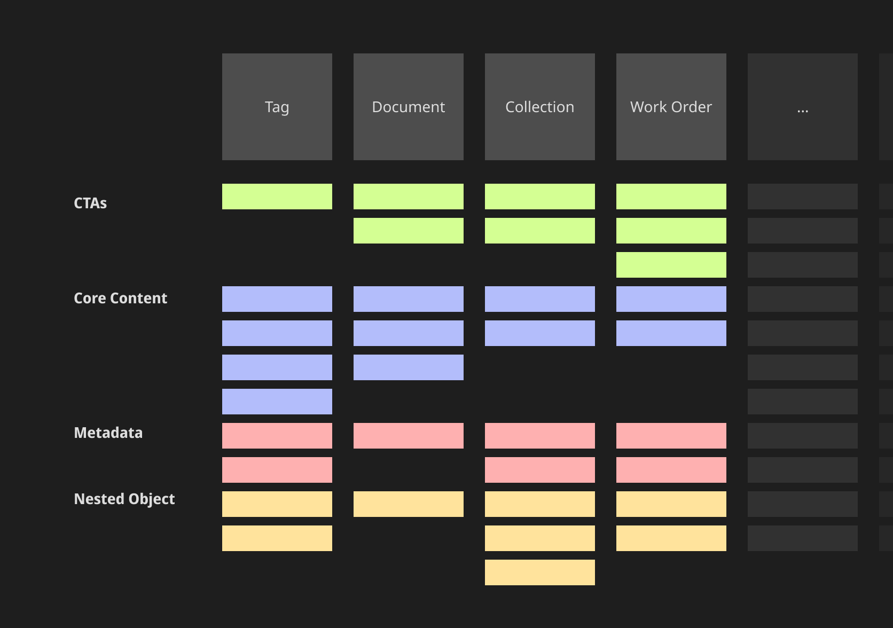
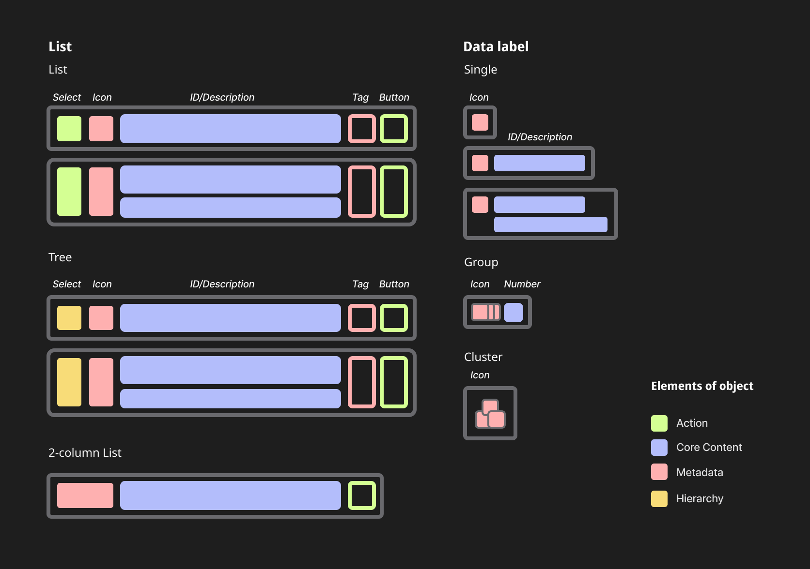
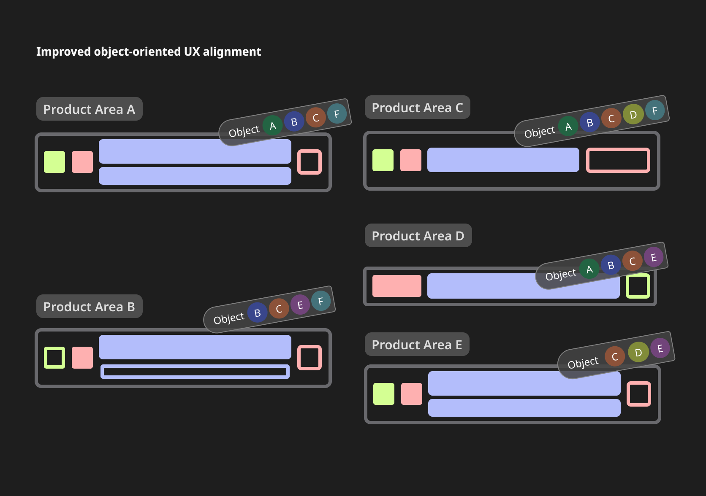
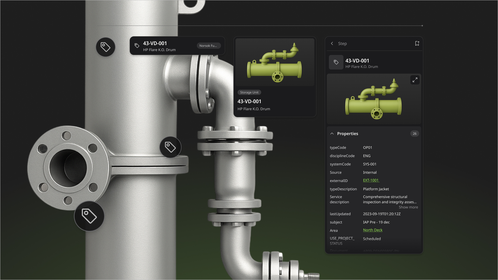
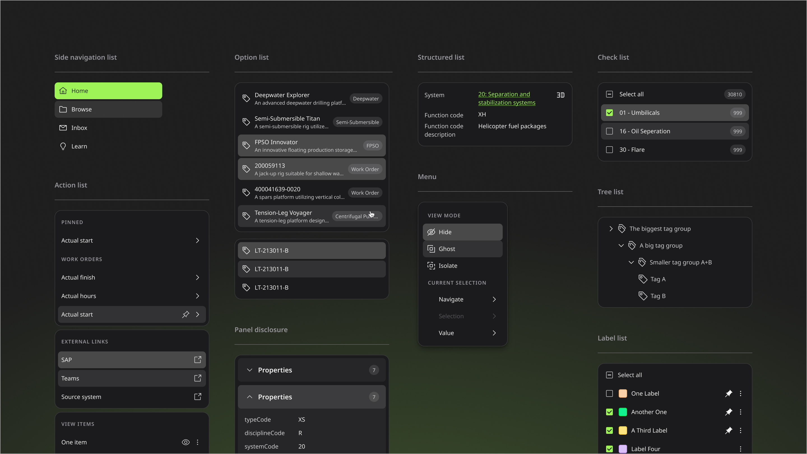

# 目標

我們希望統一物件在複雜數位孿生情境與使用者流程中的呈現方式。

在能源產業中，各種物件（如「Tag」、「工單」、「文件」、「異常事件」）在產品的不同功能模組中呈現方式各異。我們需要找到一個可行的方式來統一這些呈現，並提供使用者清晰的心智模型，以完成日常的規劃、操作和重型資產維護等任務。

# 我的角色

我主導了這項計畫，負責建立物件導向的心智模型地圖，並重新設計試驗性元件與設計模式。

# 挑戰

我們的產品原本是從 Aker Solutions 分拆出來、由約 40 個小應用程式組合而成的系統。物件在不同使用者流程中的呈現方式差異極大，缺乏一致的內在邏輯，折射出公司過去的組織架構。

這是我們 List 模式的範例。缺乏清晰邏輯的多樣性損害了我們的 UX。

這種呈現方式的分歧，導致使用者在操作流程中產生認知碎片化。也讓產品無法提供使用者一個完整的物件心智模型，與他們實際的領域知識無法接軌。

# 方法

## 1. 建立物件地圖

我們選用 [OOUX 框架](https://www.ooux.com)作為梳理工具，以協作方式共同建立物件地圖，藉此鳥瞰產品中的所有物件，並在深厚的領域知識前提下，釐清和對齊團隊對物件的理解。

## 2. 定義優先順序

我們選定 Data Label 和 List 元件作為首要優先項目——兩者在我們的 UX 中都佔有舉足輕重的地位，投資這兩個元件能帶來最大效益。

## 3. 建立試驗性元件

我們設計並開發了 **Data Label** 和 **List** 兩個試驗性元件，用以驗證這套方法的可行性，同時滿足各產品團隊的優先需求。

## 4. 推動採用、持續迭代與審查

在元件研究與重新設計的過程中，與團隊的溝通是關鍵。我們透過訪談與工作坊與主管、設計師及開發者深入交流，建立互信、蒐集回饋，並凝聚對路線圖的共同想像。

我們也透過定期舉辦回顧與意見收集會議，積極推動元件的採用，並在設計指南中記錄關鍵範例，供參考與持續迭代。

# 成果

## MVP 元件

我們設計並開發了 **Data Label** 元件，以及一套完整的 **List** 元件。

**Data Label** 元件以強烈的視覺關聯性標示不同物件類型，連結 List 等其他元素，顯示 ID、描述、時間序列等關鍵資訊，支援單一、群組或叢集標籤形式。它支援資料視覺化的色彩編碼，並能無縫適應 2D 與 3D 工業環境。

除 Data Label 外，我們也開發了一套專屬的 List 元件，以支援物件導向的使用者旅程。試驗性 **List** 元件為搜尋結果、物件歷程、使用者自建資料夾等各種使用情境提供一致的結構，同時與 Data Label 保持視覺一致性。

它涵蓋明確定義的互動狀態、清晰的使用指南，並可透過可設定的替換操作靈活調整。此外，我們也透過設計模式文件，規範其使用方式。

## 共同對齊的路線圖

除這兩個核心元件外，我們也設計了其他元件更新（如 Tree、Card、Tag 元件）的框線圖與設計指南，收錄在**路線圖**中，以促進介面一致性與跨團隊的文化對齊。

植基於協作精神與對領域的尊重，我們所打造的可擴展元件，既賦能使用者，也賦能設計者，讓產品與人的關係都更加清晰。

---

# 備註

## 保密聲明

本文所有視覺素材均為說明本專案流程與成果而製作，不代表實際產品，並尊重公司的智慧財產權及客戶的商業機密。
