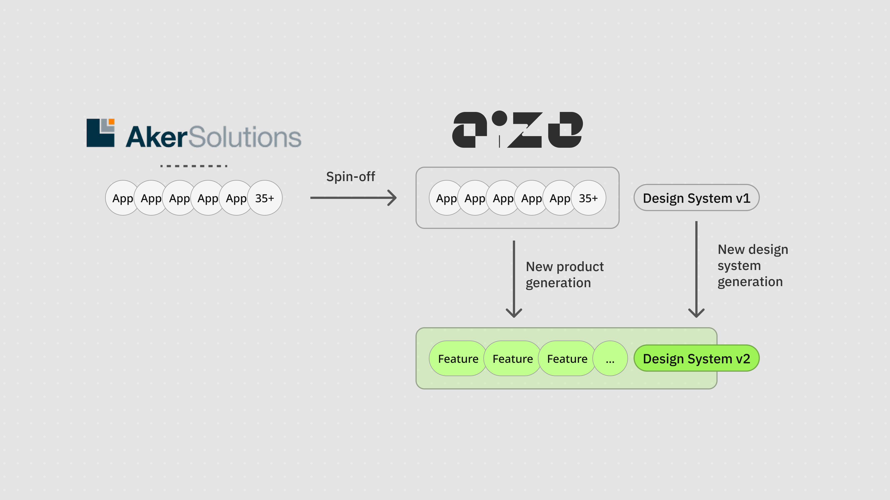
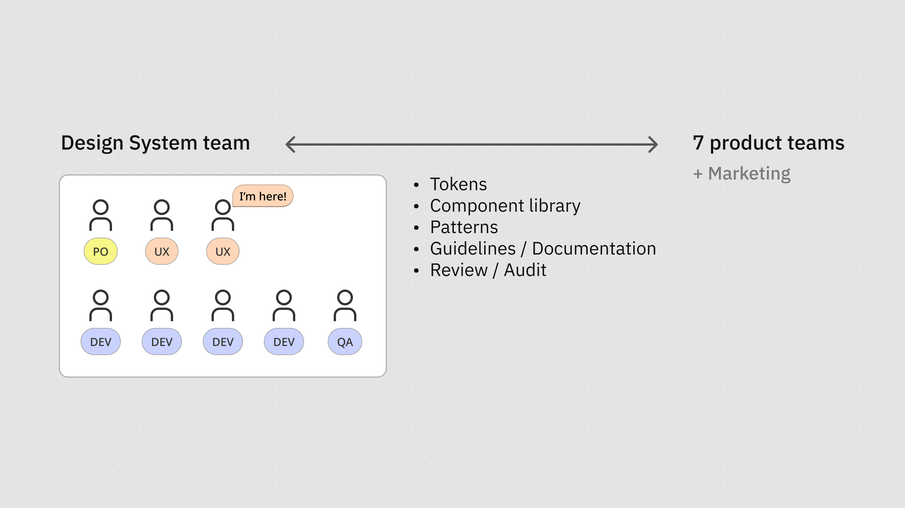
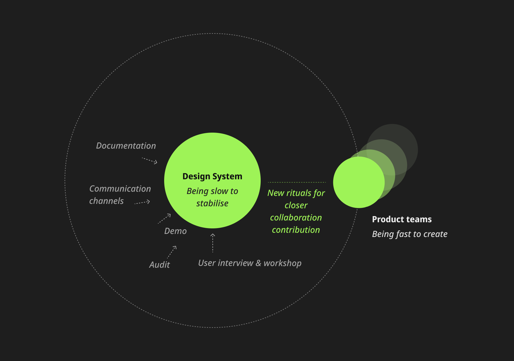
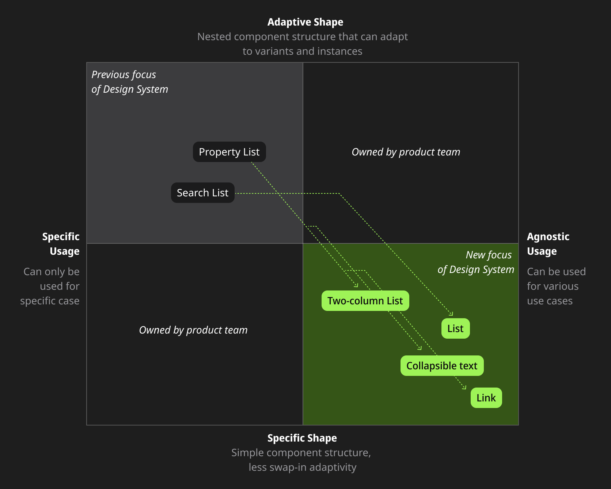
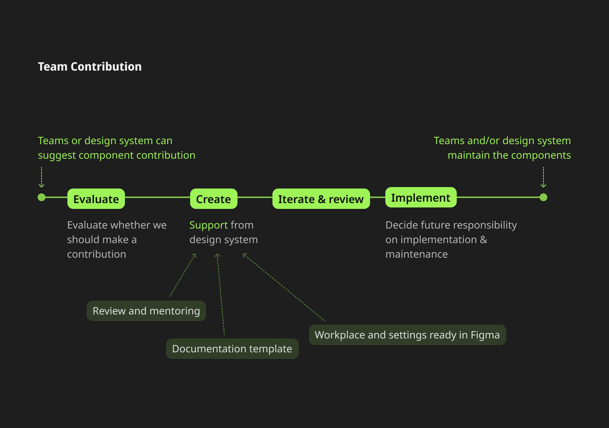

# Objectives

We were tasked to rework the entire design system in parallel with a new generation of our product. The product were a combination of around 40 small applications as a spin-off from Aker Solutions. Throughout the rebranding and product rework process, we aimed to unify the experience, learned from our previous experience, and fixed the design and tech debt that we didn’t have a proper opportunity to touch. 

# My role

I am one of the two designers in the design system team. In this initiative, I was responsible for around half of the tokens, components, and patterns. I also collaborated and helped the other designer, the design lead of the team, to define the strategy and ways of working. 

# Challenge

The major issue was twofold. 

- Firstly, the design system needed to work as fast as the product teams. We found it challenging to create mature components while the product teams were still working on novel and explorative idea. The scenarios kept changing and made it difficult to scope the components down.
- Secondly, we needed to adopt the product branding guidelines from an agency we hired. Their offering looked fancy but did not consider accessibility and component structure well. We needed to comply with the new design languages while localising them in our product context.

# Approach

## Tighten collaboration between product and design system teams

We changed our workflow. During the rebranding project, we aimed to be more active and provocative. We organised syncing session for and with designers on a weekly basis. We prepare for the theme, presentation, mini-workshop, and questions in advance. It became a new ritual and a platform for all designers to learn the latest progress on the design system side and allow them to contribute. It helped us to adopt the new design language and align in a more organic and collaborative way.

## Made simpler components by shifting philosophy

Instead of focusing on use scenarios and creating bespoke components, we shifted our focus to the shapes of design. We managed to keep the component specific and simple. We broke down the big components into smaller simple components and made them agnostic in terms of use cases. 

## Created user-contribution process

The teams needed to create their own custom components fast but still comply with the new design language. We created a process and documentation space for them to safely work with and share their documentation with the other teams. The improved transparency of documentation also allowed us to adopt and internalise their work into the new design system more efficiently.

# Outcome

The rework is still an ongoing process as of this writing. In a one-year period, we has created 

- a new token system defining the colours, spacing, typography, radius, breakpoints, etc
- a documentation framework
- a minimal set (approx. 15-20 components) of essential components that can speed up and unify the ongoing UX exploration
- a few key patterns for cross-component governance and particular use scenarios
- a regular design audit and syncing ritual that accommodates a company-wide new ways of working

It reinforced my belief that a successful design system isn’t just about components. It’s about culture, communication, and creating space for contribution and iteration.

---

# Note

## Confidentiality concerns

All visual materials in this article were created solely to illustrate the process and outcomes of this project. They do not represent the actual product and respect the company’s intellectual property and the client’s business confidentiality.