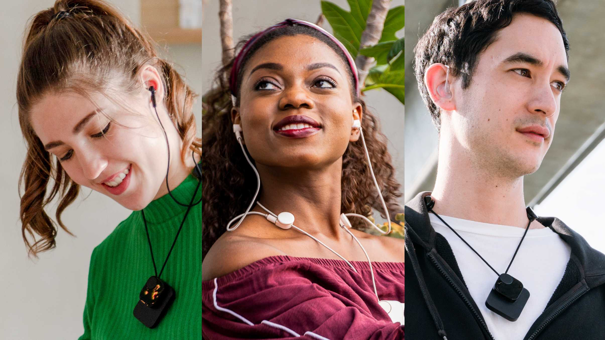

--- 
title: "Redefine music listening for the deaf"
desc: "I built a global team, ran extensive user research, and launched a crowdfunding campaign—delivering a functional prototype and a strong brand identity despite financial setbacks."
org: Rearia Ltd.
year: 2021
status: Published
slug: "/redefine-music-listening-for-the-deaf"
coverImage: "image.png"
highlightImage: "highlight.jpg"
---

# Objectives

Design and develop a user-friendly assistive headphone for the hard-of-hearing community, addressing accessibility, usability, and aesthetic gaps in existing solutions. The goal was to empower users, reduce stigma, and create an inclusive product for a niche market overlooked by mainstream manufacturers.

# My Role

As a co-founder and lead designer of a small team of four, I was responsible for a wide range of tasks across design, strategy, and team coordination. I led the industrial design and user research, developed the brand and customer experience strategy, and created marketing materials including both visuals and written content.

Beyond design work, I managed a multidisciplinary team and coordinated workflows to keep the project on track. I also played a central role in planning our crowdfunding campaign and building a community around the product, helping us connect with and grow our audience.

# Challenge

Existing headphones and earbuds are incompatible with hearing aids, making on-the-go music enjoyment challenging for hard-of-hearing users. Additionally, assistive products often lack aesthetic appeal, perpetuating stigma. The market for single-sided aid users or those with mixed-brand devices remains underserved due to limited commercial interest.

# Approach

## Research & Validation

I conducted in-depth user interviews and market analysis to understand the needs of both parents and individuals with hearing impairments. This included a survey with 133 hard-of-hearing respondents to gather insights into their diverse experiences and challenges. In parallel, I explored the technical feasibility of the product and identified potential sources of funding to support further development.

I talked to many hard-of-hearing people. Maija, the girl in the picture, joined our team later as she was also a user and found the project very motivating

## Team Formation

I brought together a multidisciplinary team of engineers, marketers, and community builders with diverse backgrounds from both Taiwan and Finland. This mix of perspectives strengthened our ability to approach the project from multiple angles.

## Design and Development

I led the design of mockups and prototypes, incorporating user feedback through multiple rounds of testing with over 20 participants. These iterations helped shape a more user-centred product. I also developed a unified branding system that reflected our core values of innovation and inclusivity.

A glance at the interview and mockup tests we did with the hard-of-hearing users. We iterated and recruited participants with the different hearing conditions to gather feedback and insights

## Crowdfunding & Outreach

I launched and managed a crowdfunding campaign, building momentum through consistent community engagement. To support this, I created visual and written content for social media and newsletters, ensuring our message was clear, engaging, and aligned with our brand identity.

# Outcome

We developed a functional prototype that addressed key user needs while balancing usability with aesthetic appeal. Along the way, we built a strong brand identity rooted in inclusive design values and reached a global audience through community outreach and a crowdfunding campaign, which raised €4,453 from 22 backers.

Although the campaign did not meet its goal, it helped surface critical challenges in our marketing and funding strategies. The experience offered valuable lessons for future projects. If you're curious about what I learned, feel free to read my reflection in [this blog post](https://medium.com/@imyentsen/my-first-and-failed-startup-experience-and-a-new-normal-since-then-cd21efcbe145).

# Gallery

## Visit the legacy website

[Rearia Hai](https://rearia.github.io/hai)

The business has been terminated in 2020, but you can still visit the archived legacy site.