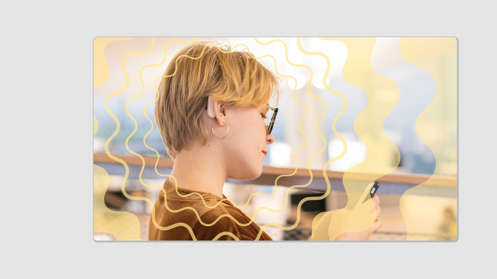
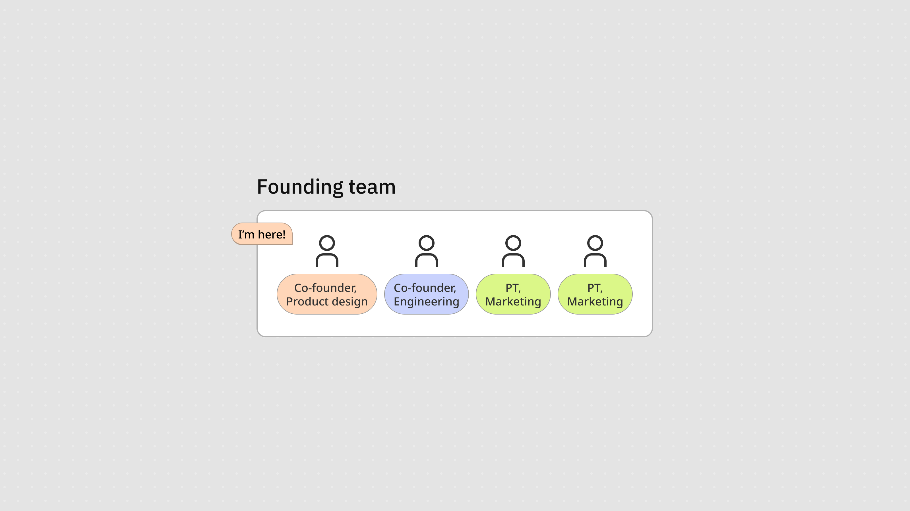
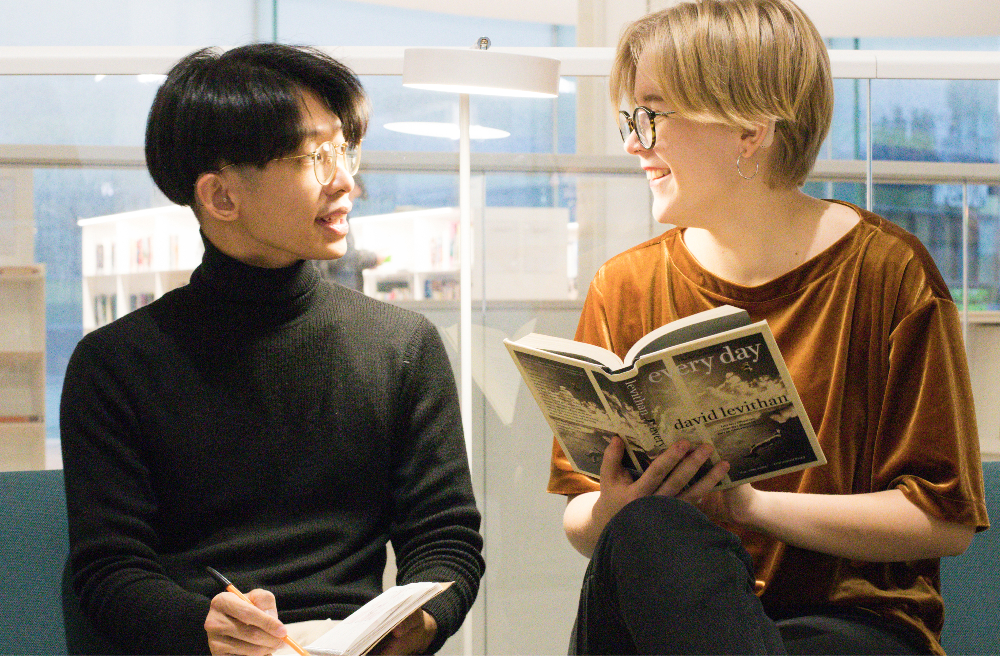
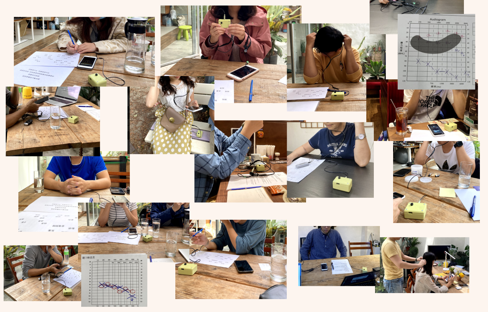
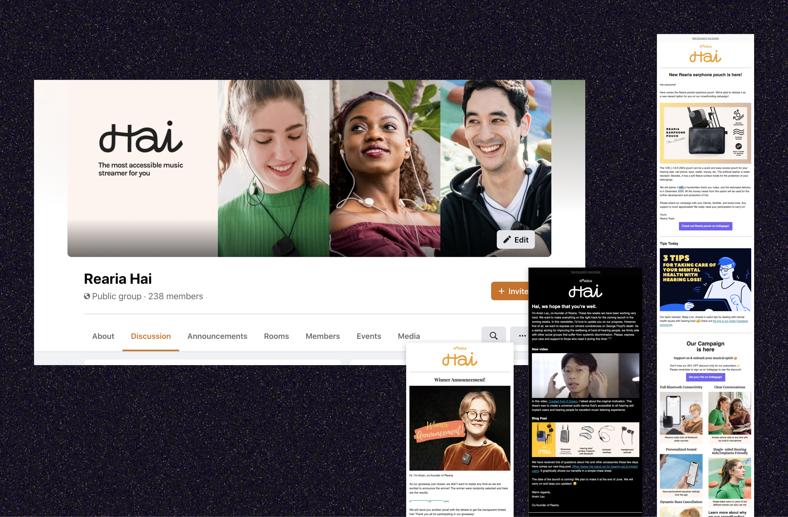
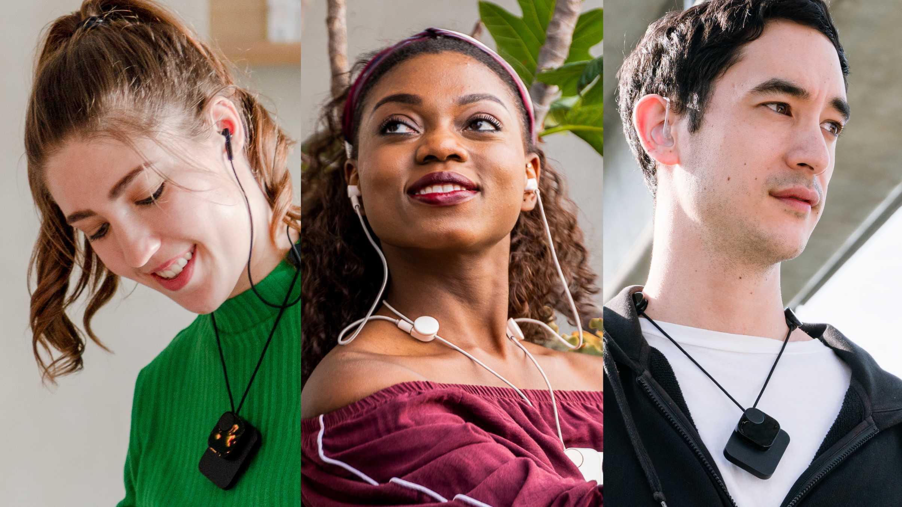
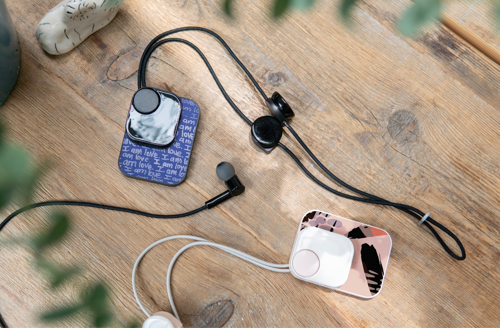
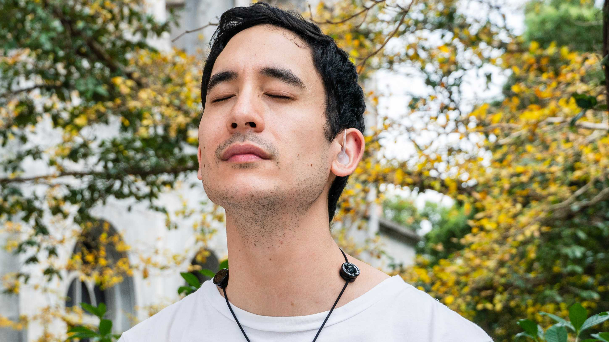
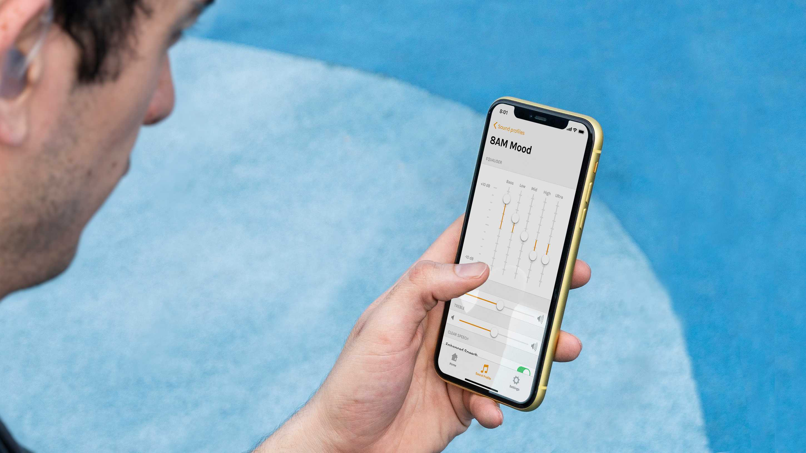
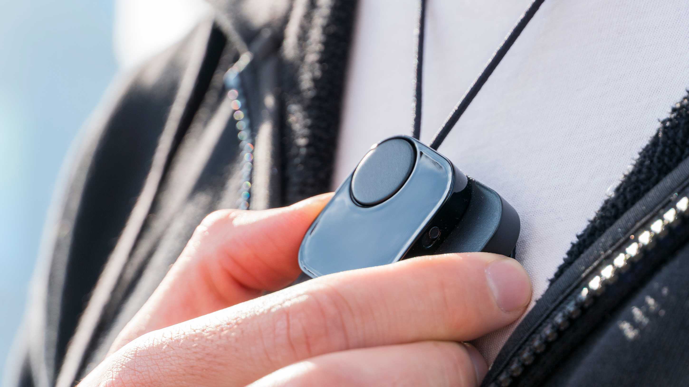

--- 
title: "重新定義聽障者的音樂體驗"
desc: "我組建了一支國際團隊、進行深度使用者研究並發起群眾募資，在財務困境中仍交付了功能性原型與完整的品牌識別。"
org: Rearia Ltd.
year: 2021
slug: "/redefine-music-listening-for-the-deaf"
coverImage: "image.png"
highlightImage: "image.png"
---

# 目標

設計並開發一款對聽障社群友善的輔助耳機，解決現有解決方案在可及性、可用性與美感上的不足。目標是賦能使用者、減少污名，並為被主流製造商忽視的利基市場打造一款具包容性的產品。

# 我的角色

作為四人小團隊的共同創辦人與首席設計師，我負責橫跨設計、策略與團隊協調的廣泛工作。我主導工業設計與使用者研究，制定品牌與顧客體驗策略，並製作包含視覺與文字的行銷素材。

在設計工作之外，我管理一支跨領域團隊、協調工作流程以確保專案推進。我也在規劃群眾募資活動與社群建立方面扮演核心角色，協助我們與受眾建立連結並持續成長。

# 挑戰

現有的耳機與耳塞無法與助聽器相容，使聽障使用者難以隨時享受音樂。此外，輔具產品通常缺乏美感，持續強化社會污名。對於單側輔具使用者或配戴不同品牌裝置的使用者，市場供給更是嚴重不足，肇因於商業利益有限。

# 方法

## 研究與驗證

我進行了深入的使用者訪談與市場分析，以了解聽障者及其家長的需求。這包含一份有 133 位聽障受訪者參與的問卷調查，深入了解他們多樣的使用體驗與挑戰。同時，我也探索了產品的技術可行性，並尋找潛在的資金來源，以支持後續開發。

我和許多聽障者進行交流。照片中的女孩 Maija 後來加入了我們的團隊，因為她本人也是使用者，並對這個專案深感認同。

## 團隊組建

我匯聚了一支來自台灣與芬蘭的跨領域團隊，成員背景涵蓋工程師、行銷人員與社群建立者。多元的視角強化了我們從不同角度推進專案的能力。

## 設計與開發

我主導設計稿與原型的設計，透過超過 20 位參與者的多輪測試，將使用者回饋融入設計迭代中，逐步打磨出更以使用者為核心的產品。我也建立了一套統一的品牌識別系統，反映我們對創新與包容性的核心價值。

這是我們與聽障使用者進行訪談和原型測試的場景縮影。我們持續迭代並招募具有不同聽力狀況的參與者，以蒐集多樣的回饋與洞察。

## 群眾募資與對外推廣

我發起並管理群眾募資活動，透過持續的社群互動累積聲勢。為此，我為社群媒體和電子報製作視覺與文字內容，確保訊息清晰、引人入勝，並與品牌識別保持一致。

# 成果

我們開發出一個功能性原型，在兼顧美感的同時，有效解決了使用者的核心需求。一路走來，我們建立了根植於包容性設計價值的強大品牌識別，並透過社群推廣與群眾募資活動觸及全球受眾，最終從 22 位支持者處籌得 €4,453。

儘管活動未能達成目標，這段歷程讓我們發現行銷與資金策略中的關鍵挑戰，也為未來的專案提供了寶貴的學習。如果你有興趣了解我的反思，歡迎閱讀[這篇文章](https://medium.com/@imyentsen/my-first-and-failed-startup-experience-and-a-new-normal-since-then-cd21efcbe145)。

# 作品集

## 參觀舊版網站

[Rearia Hai](https://rearia.github.io/hai)

公司已於 2020 年結束營運，但您仍可前往瀏覽封存的舊版網站。
