# Objective

Although Taiwan has been considered as one of the most progressive countries in gender equality in Asia, the oppression from the gender binary exists. Many of us are constantly putting ourselves and others in gender boxes that we just don’t fit into, whether or not we identify as transgender. In this case, there is a lack of all-gender restroom in university campuses as well as public spaces.

In 2016, I was invited to develop the first visual identity system for all-gender restroom in Taiwan by the Campus Planning Office of National Taiwan University(NTU). Our all-gender Restroom Plan aims to offer safe and friendly spaces for toilet-using regardless the sexualities and gender identities of the users. We finally established the first installation guide for all gender restroom in Taiwan, which demonstrates the detailed to be concerned in order to reach a balance between safety, privacy, openness, comfortableness, reasonable budget and spatial efficiency.

# My role

As a designer, I **conducted the background research**, **organised the workshops for co-creating** with the stakeholders, and designed the **visual identity** as well as the wayfinding system for the installation guide. I also votunteered in **hosting some of the talks, designing the questionnaires, and reviewing the editorial content**. I am very proud to be part of this project making some positive changes for more friendly public spaces.

# Approach

## Participatory design process

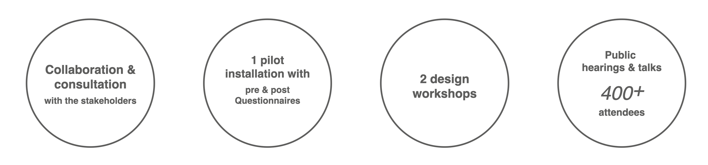

All gender restroom, needless to say, is a type of public facility so that we have to make it public from its beginning. It is crucial for designers to involve the participation of the stakeholders, especially the underrepresented disadvantaged groups, in shaping the design outcome for public spaces.

I attended the executive team organised by the Campus Planning Office and Student Association of NTU. We held a series of speeches attended by over 400 audiences, 2 design workshops, and public hearing events before every restroom installation so as to collect the ideas about the design from the public. Moreover, the executive team is composed of heterogeneous members from different disciplines and backgrounds, which comprises the scholars specialising in gender issues, LGBTQIA rights activists, the student representatives, designers, architects and the manager of Campus Planning Office. In addtion, in general, the transgender and intersex people are not willing to show up in public events because of the pressure of coming-out, so we consulted some of them in person.

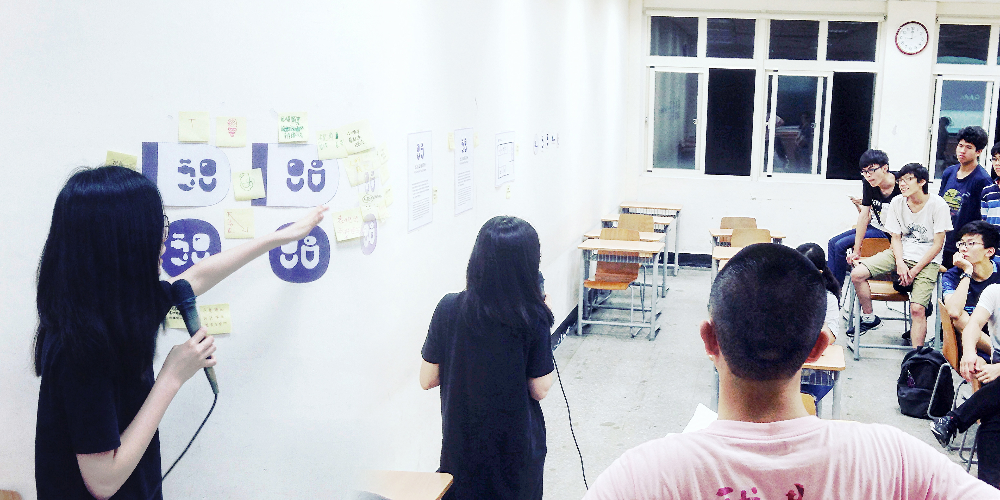

A workshop organised for collecting the ideas on the images used in the identity design, July, 2016

## Design Concept

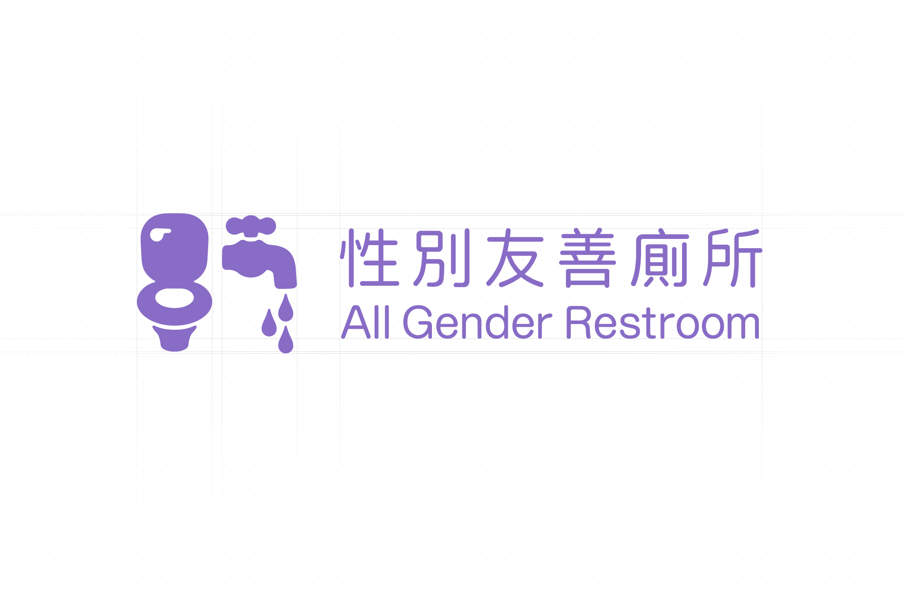

There are four primary elements in this design: **Gender-neutral, Legibility, Emotionally Friendly, and Environmentally Adaptive.**

## 1. Gender-neutral

We avoided utilising the elements consolidating gender stereotypes such as smoking pipe, high-heeled shoes, and a female figure wearing skirt. Instead, we chose toilet and tap as the elements for design in order to imply some of the main functions of a restroom.

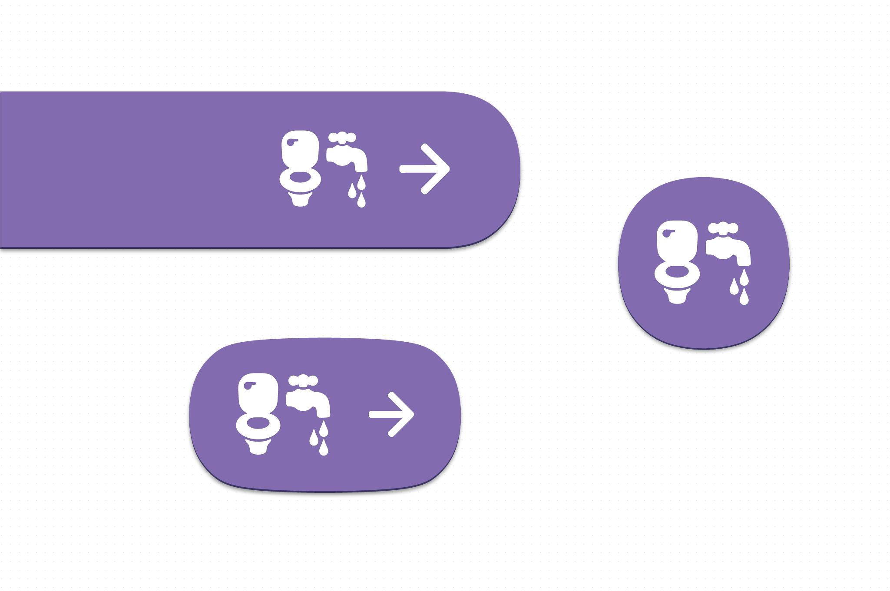

We hope that the primary colors would also be gender-neutral and have the cognitive connection with restroom. An elegant purple, which is made by combining red and blue, is the best choice. The reason is that red and blue are the most common colors used on restroom gender sign of female and male respectively.

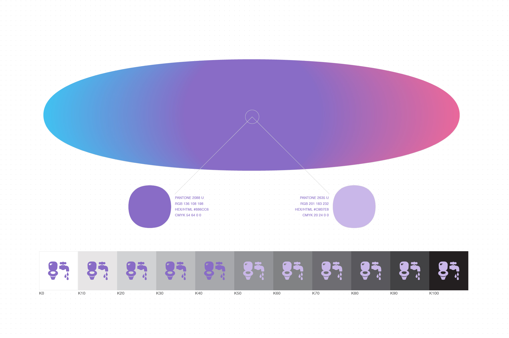

## 2. Legibility

The logo of “All Gender Restroom/ 性別友善廁所” is designed in a sans typeface, which is more legible than most of sans-serif and other decorative alternatives. The designated font for the related applications is Noto Traditional Chinese developed by Google, which is an open-source font with a good legibility and thus could be used by every sector without any doubt of infringement.

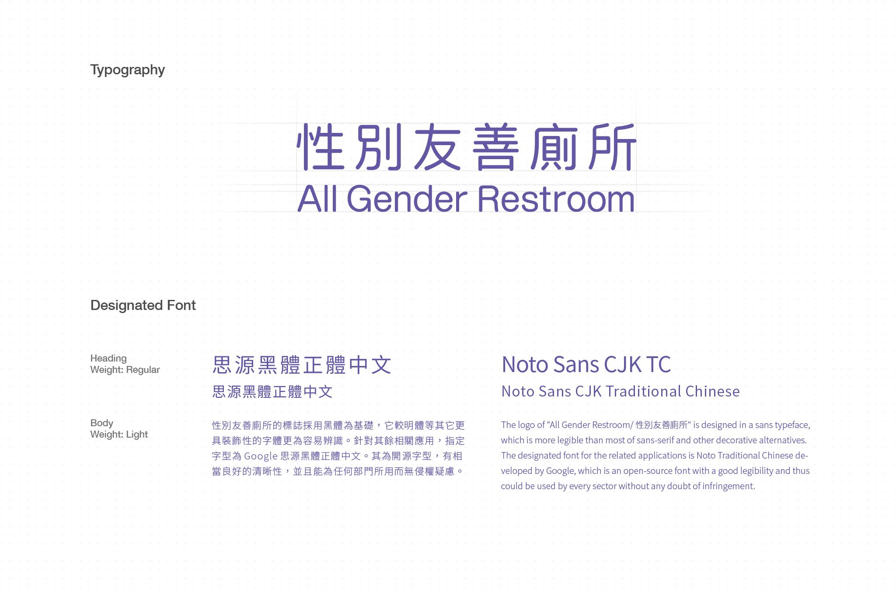

## 3. Emotionally friendly

The logo and the extensive applications are designed with rounded edges in order to give the audiences an emotionally friendly impression, which indicates that this design an anti-oppression practice.

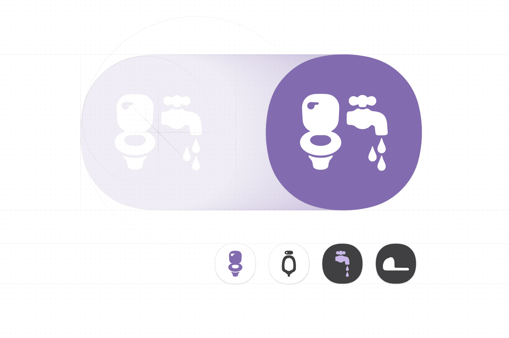

## 4. Environmentally adaptive

We released the design into the public domain within the full guide book for everyone who needs it, so it is necessary to take the concept “design after design” into consideration. For example, what kind of surrounding will the all gender restroom be installed with? It is impossible for us to know. Therefore, the best strategy is to make the design detailed but minimalist. It will maximise its adaptiveness.

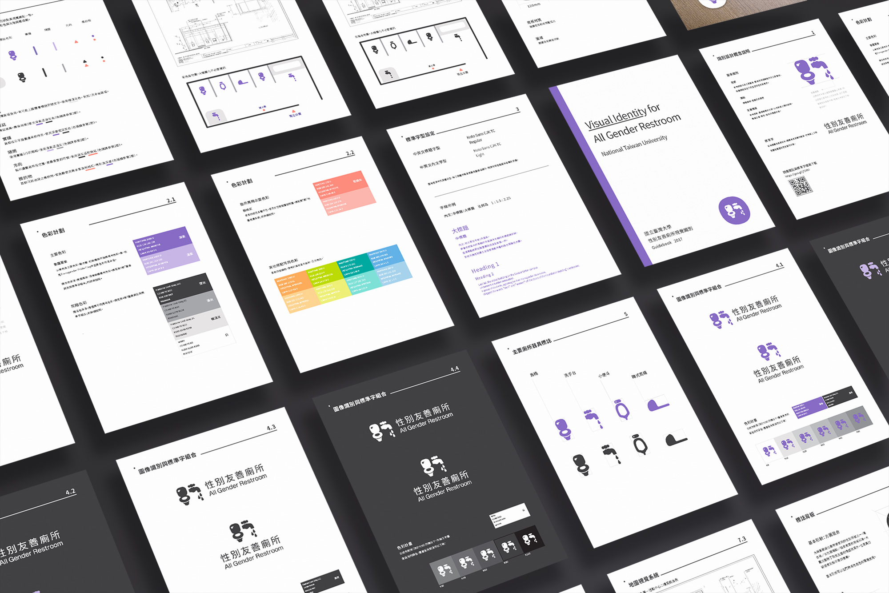

The full guidelines and the original files was released in 2018.

# Outcome

1. [A full documentation of this work](https://medium.com/@imyentsen/installation-guide-for-all-gender-restroom-1182b6d7ee2d) (in English)
2. [The guidelines released by National Taiwan University](http://homepage.ntu.edu.tw/~cpo/enactment/Handbook_for_All_Gender_Restroom_NTU.pdf) (in Mandarin)
3. Media exposure of the work: [The New Lens](https://hk.thenewslens.com/article/102699) and [Womany](https://womany.net/read/article/16597) (both are in Mandarin).

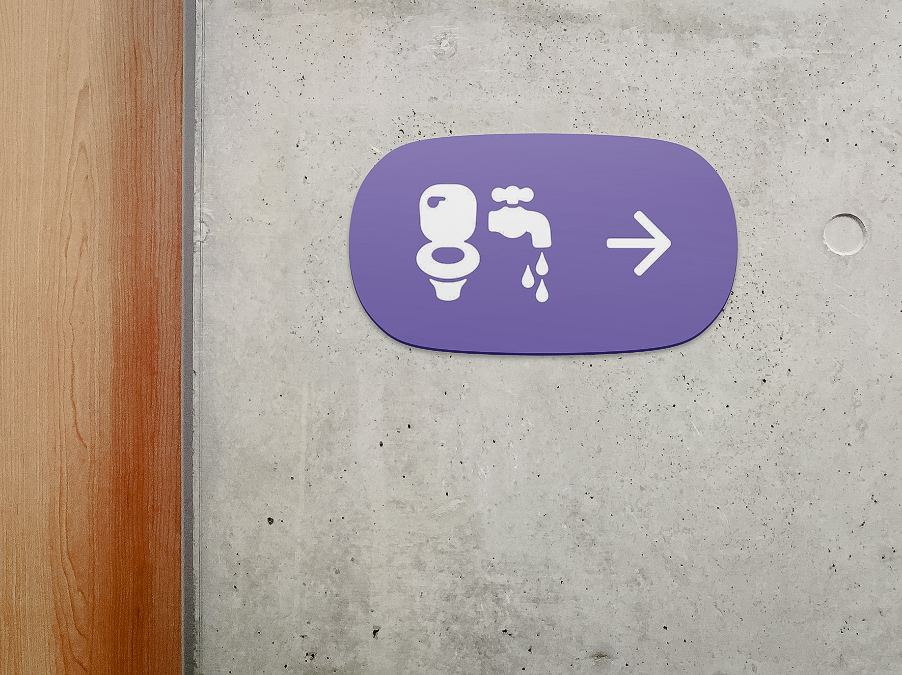

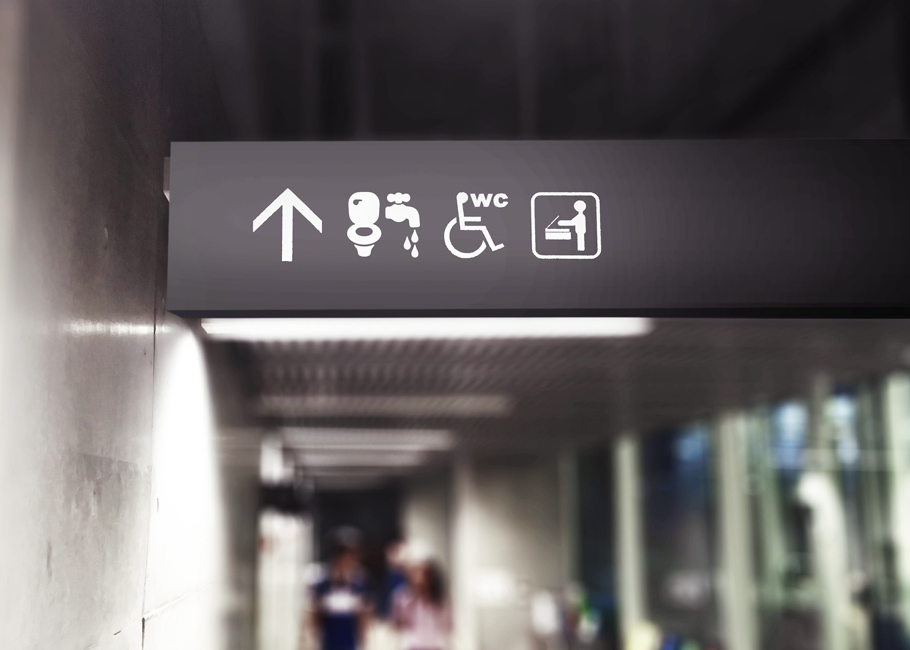

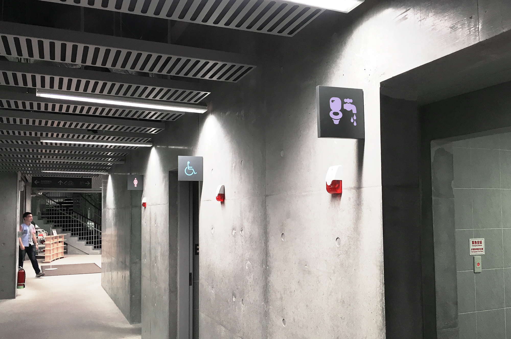

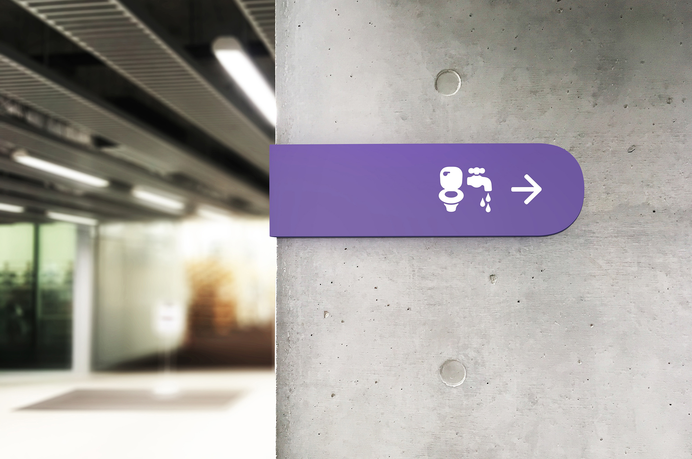

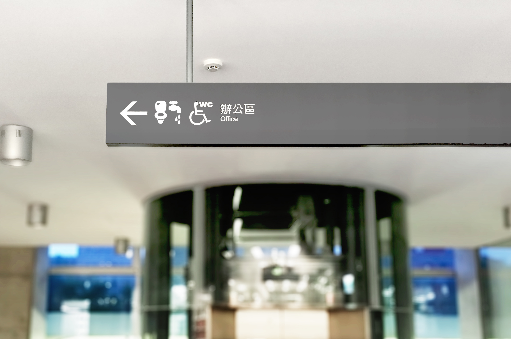