# 目標

儘管台灣被視為亞洲在性別平等方面最進步的國家之一，性別二元框架帶來的壓迫依然存在。無論是否為跨性別者，我們許多人都持續地將自己與他人放入不符合的性別框框中。在大學校園和公共空間中，全性別廁所的設置仍嚴重不足。

2016 年，我受國立臺灣大學校園規劃小組邀請，為台灣的全性別廁所開發第一套視覺識別系統。我們的全性別廁所計畫旨在為所有性取向和性別認同的使用者，提供安全且友善的如廁空間。我們最終建立了台灣第一套全性別廁所設置指南，詳述在安全、隱私、開放性、舒適度、合理預算與空間效率之間取得平衡所需考量的細節。

# 我的角色

身為設計師，我**進行了背景研究**、**組織了與利害關係人共創的工作坊**，並設計了設置指南的**視覺識別**與導覽系統。我也自願**主持部分講座、設計問卷及審閱編輯內容**。能參與這個為更友善公共空間帶來正向改變的計畫，我深感榮幸。

# 方法

## 參與式設計流程

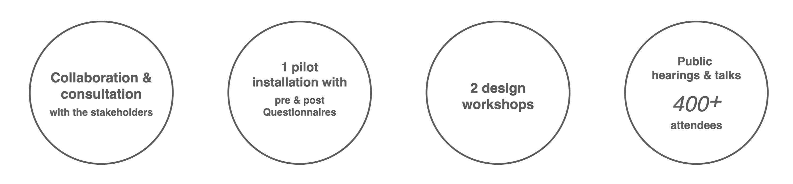

全性別廁所無庸置疑是一種公共設施，因此必須從一開始就以公開的方式推進。設計師讓利害關係人——尤其是代表性不足的弱勢群體——參與塑造公共空間的設計成果，至關重要。

我參與了由台大校園規劃小組與學生會組成的執行團隊。在每次廁所設置前，我們舉辦了一系列超過 400 人參加的演講、2 場設計工作坊，以及公開說明會，以廣泛蒐集公眾對設計的意見。此外，執行團隊由來自不同學科與背景的異質成員組成，包含性別議題學者、LGBTQIA 權利倡議者、學生代表、設計師、建築師與校園規劃小組管理者。由於跨性別者和雙性人通常因出櫃壓力而不願公開露面，我們也私下諮詢了部分當事人的意見。

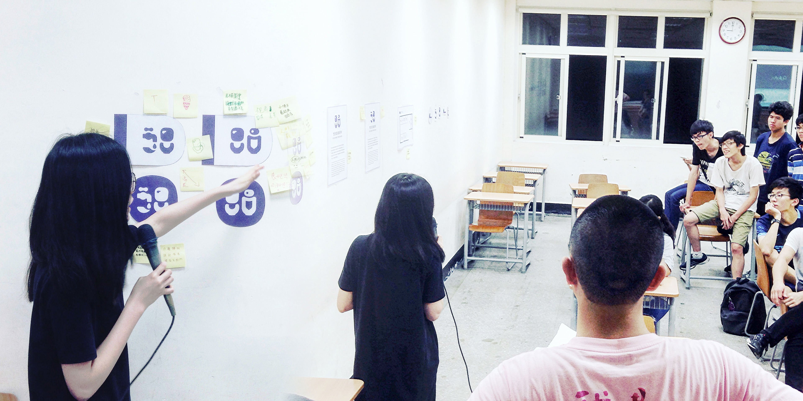

2016 年 7 月，為蒐集識別設計圖像的意見而組織的工作坊

## 設計概念

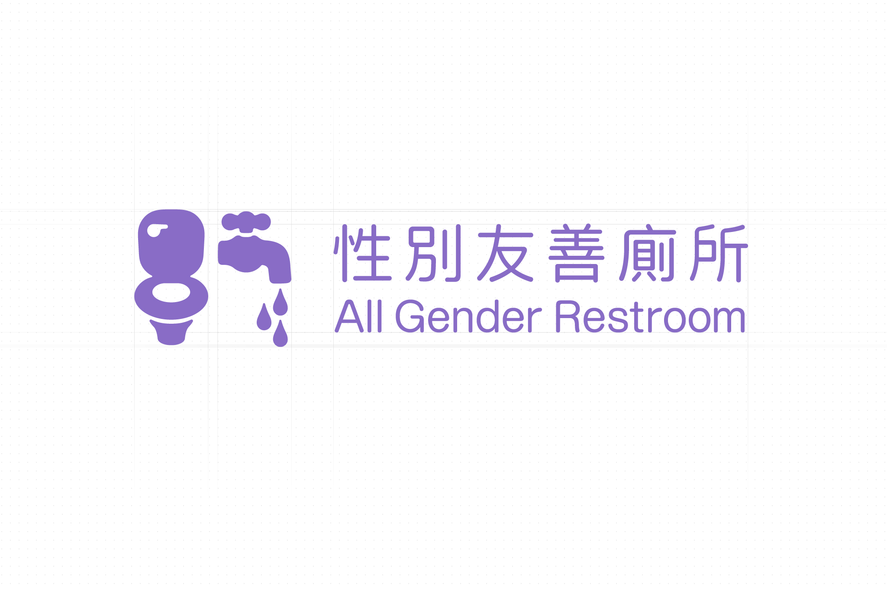

這套設計有四個核心元素：**性別中立、易讀性、情感友善與環境適應性**。

## 1. 性別中立

我們避免使用強化性別刻板印象的元素，如煙斗、高跟鞋和穿裙子的女性圖案。我們選用馬桶和水龍頭作為設計元素，以隱含廁所的主要功能。

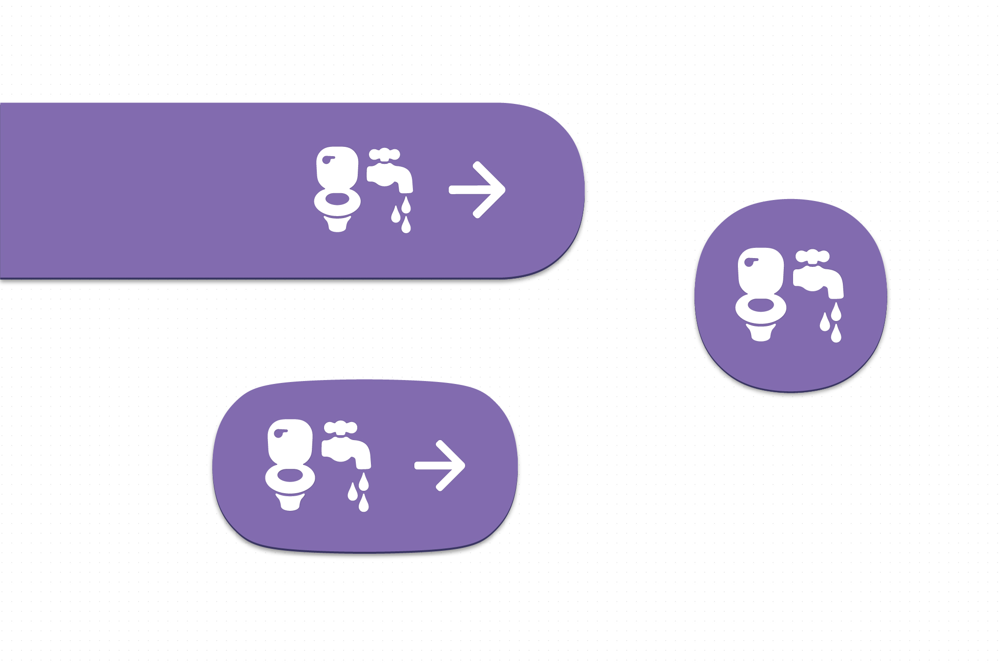

我們希望主色調也能保持性別中立，並與廁所產生認知連結。優雅的紫色——由紅色與藍色混合而成——是最佳選擇，因為紅色和藍色分別是女性和男性廁所標誌最常用的顏色。

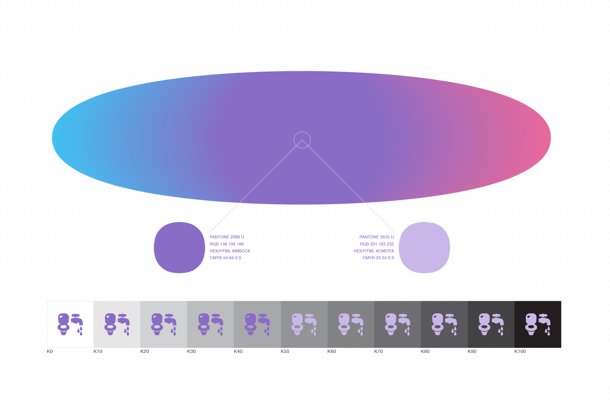

## 2. 易讀性

「全性別廁所／性別友善廁所」的標誌採用無裝飾線字體設計，比大多數有裝飾線或其他裝飾性字體更易辨識。相關應用的指定字型為 Google 開發的 Noto 繁體中文，這是一套具有良好易讀性的開源字型，各界均可使用而無侵權疑慮。

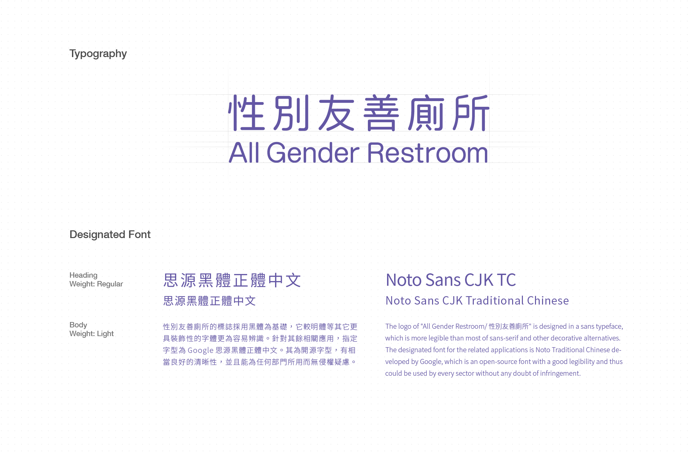

## 3. 情感友善

標誌與延伸應用均採用圓角設計，以給予觀看者情感友善的印象，傳達這套設計是一種反壓迫的實踐。

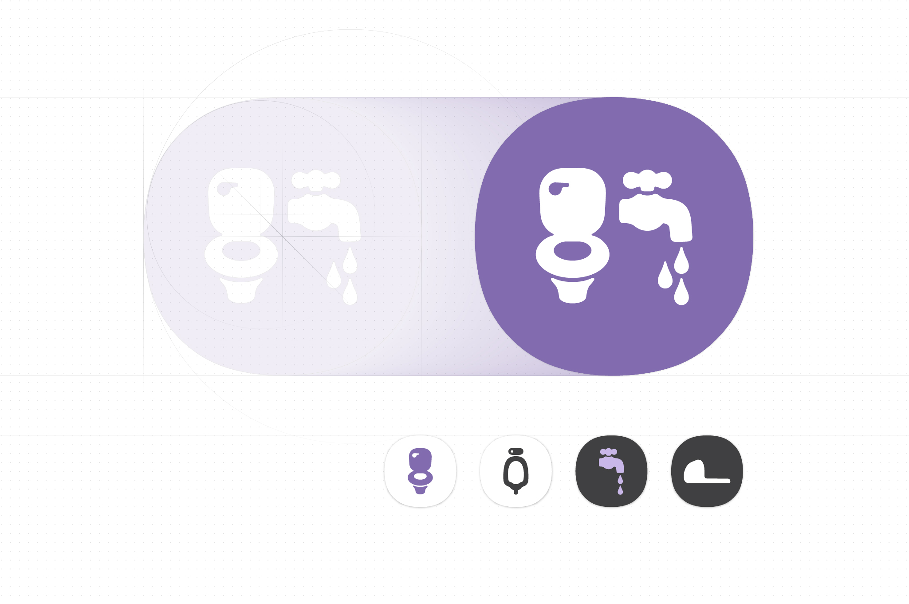

## 4. 環境適應性

我們將完整指南書釋出至公眾領域，供任何有需要的人使用，因此有必要將「設計之後的設計」納入考量。例如，全性別廁所將被安裝在什麼樣的環境中？這是我們無從預知的。因此，最佳策略是讓設計詳盡而簡約，以最大化其適應性。

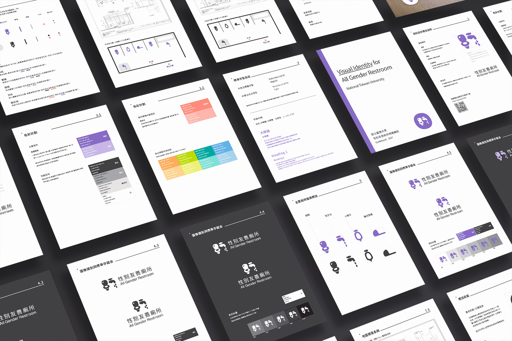

完整指南與原始檔案於 2018 年正式發布。

# 成果

1. [本作品完整文件](https://medium.com/@imyentsen/installation-guide-for-all-gender-restroom-1182b6d7ee2d)（英文）
2. [國立臺灣大學發布的設置指南](http://homepage.ntu.edu.tw/~cpo/enactment/Handbook_for_All_Gender_Restroom_NTU.pdf)（中文）
3. 媒體報導：[The News Lens 關鍵評論網](https://hk.thenewslens.com/article/102699) 與 [女人迷](https://womany.net/read/article/16597)（均為中文）。

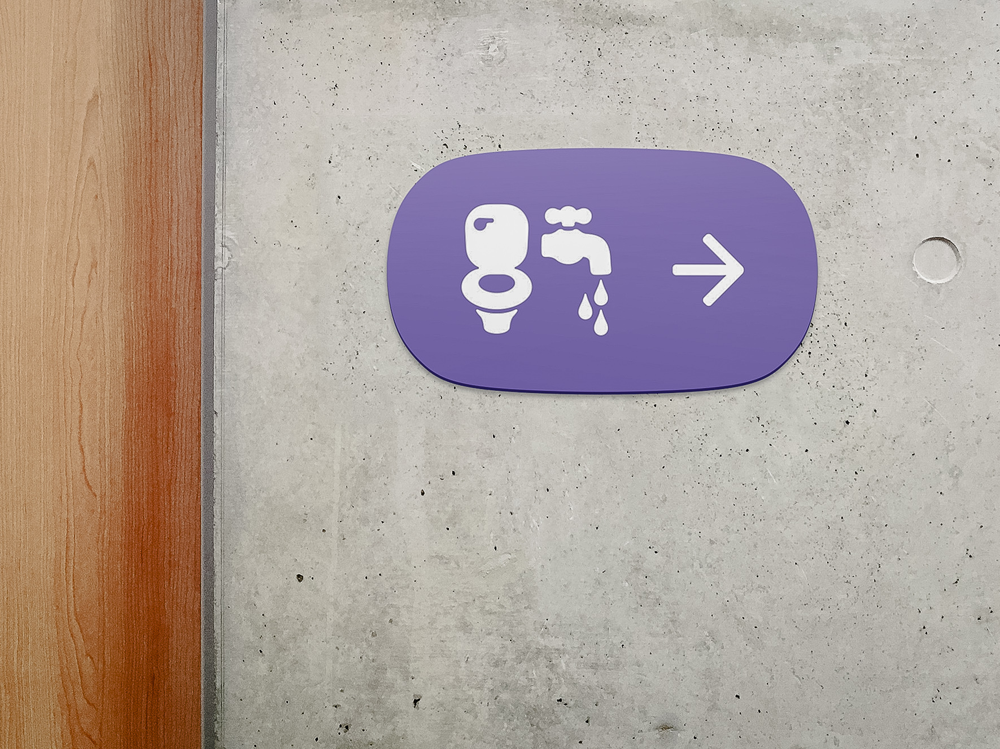

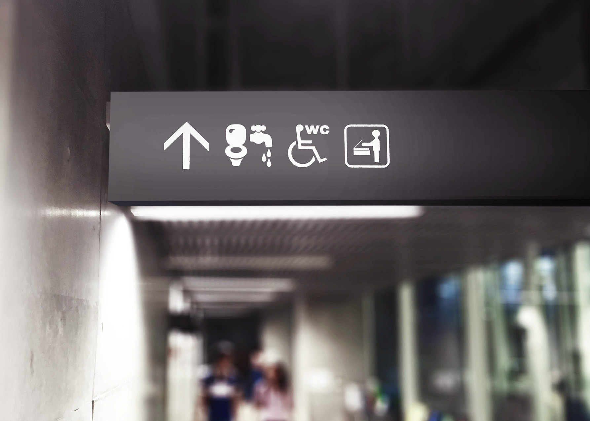

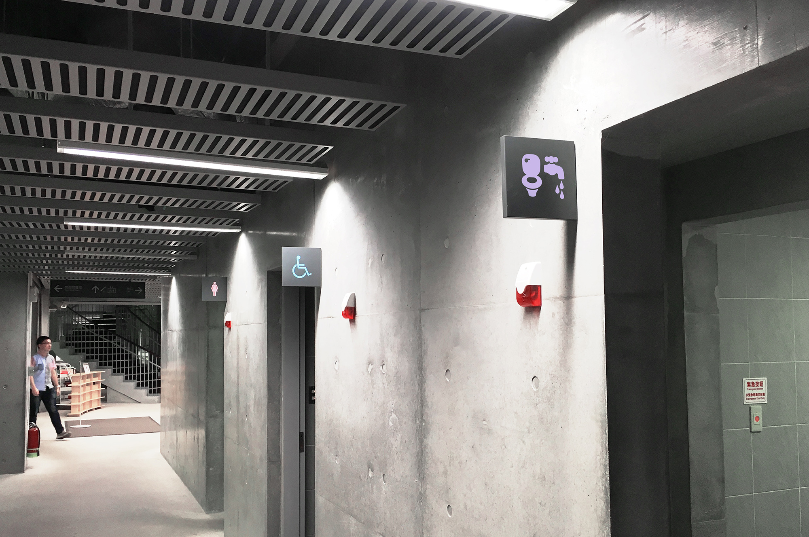

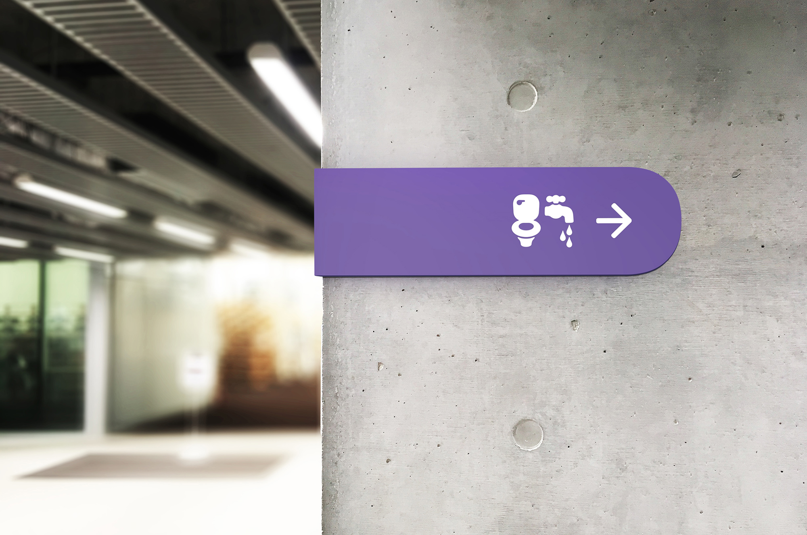

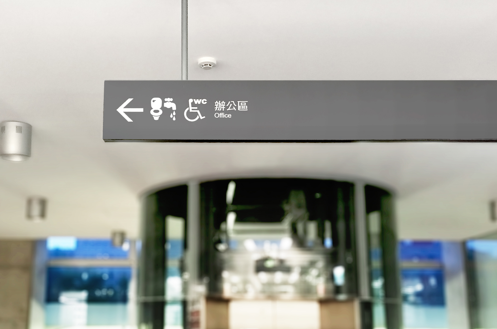
