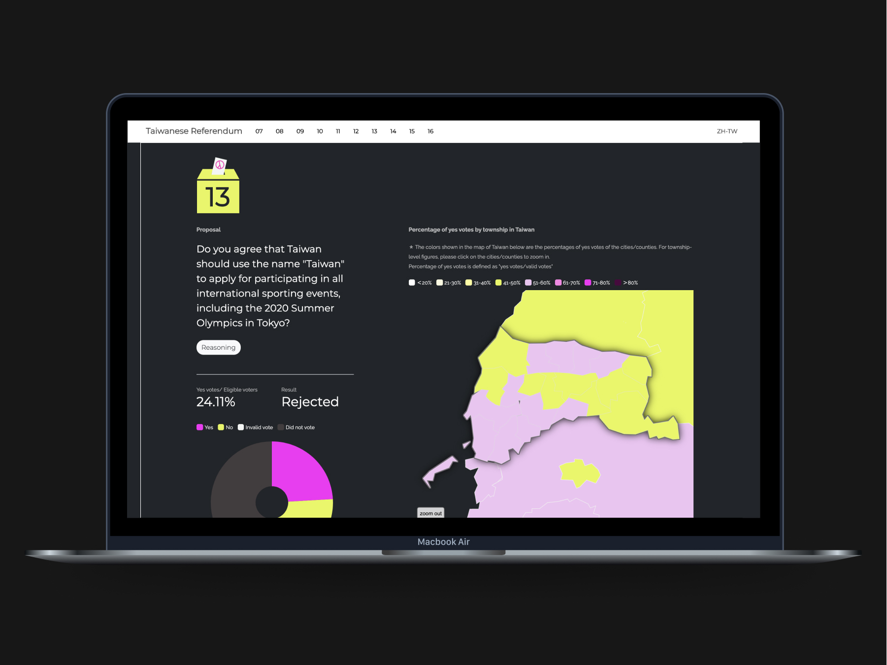
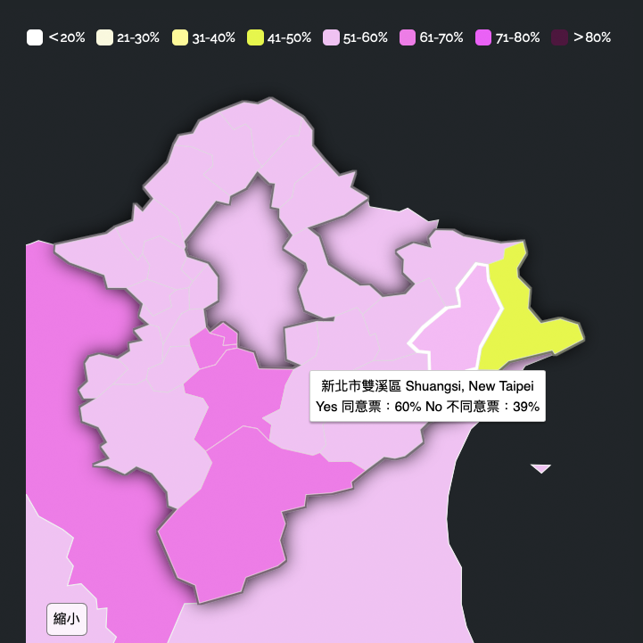
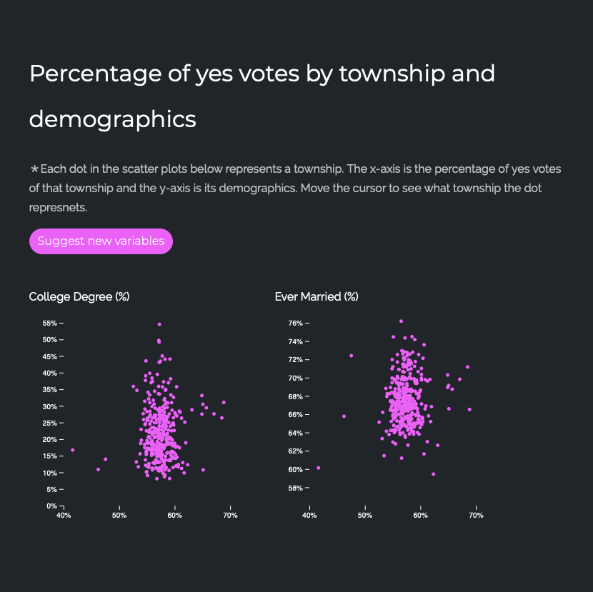

# Objectives

We aim to visualise the results of Taiwan’s referendums and present public opinion in English. The year 2018 was particularly significant in Taiwan’s democratic history, as ten referendums were held simultaneously—the highest number since full democratisation. At the time, however, Taiwan’s social and political developments attracted relatively little attention from the West, as tensions with China were less pronounced than they would become in the 2020s.

# My role

I was responsible for the UI/UX design and front-end development of the website, using HTML, CSS, JavaScript, and D3.js. This was a civic hacking project, carried out voluntarily by all six team members, aimed at addressing the lack of accessible and comprehensive visualisations of the referendum results in both Mandarin and English.

# Approach

We organised this initiative in a spontaneous, hackathon-like format. The idea came together less than two weeks before the referendums, and we quickly moved into planning. It became a fast-paced process, with each of us taking on responsibilities based on our professional backgrounds and areas of study.

We structured the website into several key sections: a brief introduction to the topic of referendums, a guided view of the results, and further analysis exploring correlations and distributions in relation to demographic factors such as income, education, age, and marital status. Our goal was to help users understand how public opinion in Taiwan may be connected to these underlying factors.

# Outcome

The website features visualisations of the referendum results alongside background information, available in both Mandarin and English. By using spatial maps and scatter plots, the visualisations offer a more comprehensive view—highlighting correlations between the voting outcomes and demographic characteristics of districts across Taiwan.

The project was well received, attracting over 15,000 visits and gaining coverage in local media, including *TechNews Taiwan* ([Link](https://technews.tw/2018/11/30/taiwanese-referendum-2018/)).

## Link

[Taiwanese Referendum 2018](https://rfrd-tw.github.io/en/) website.