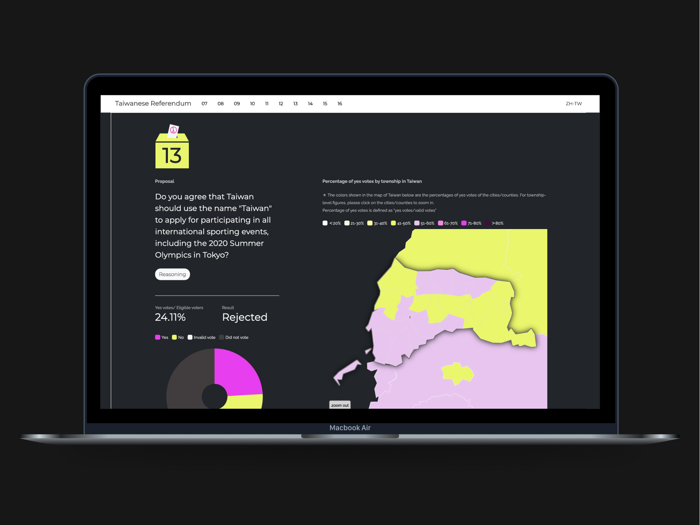
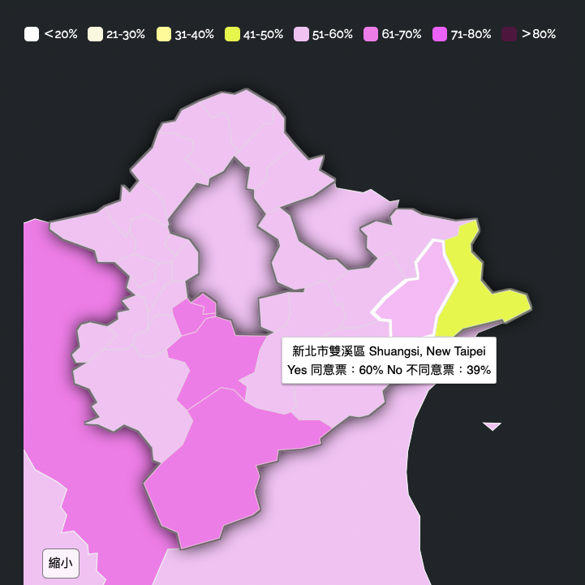
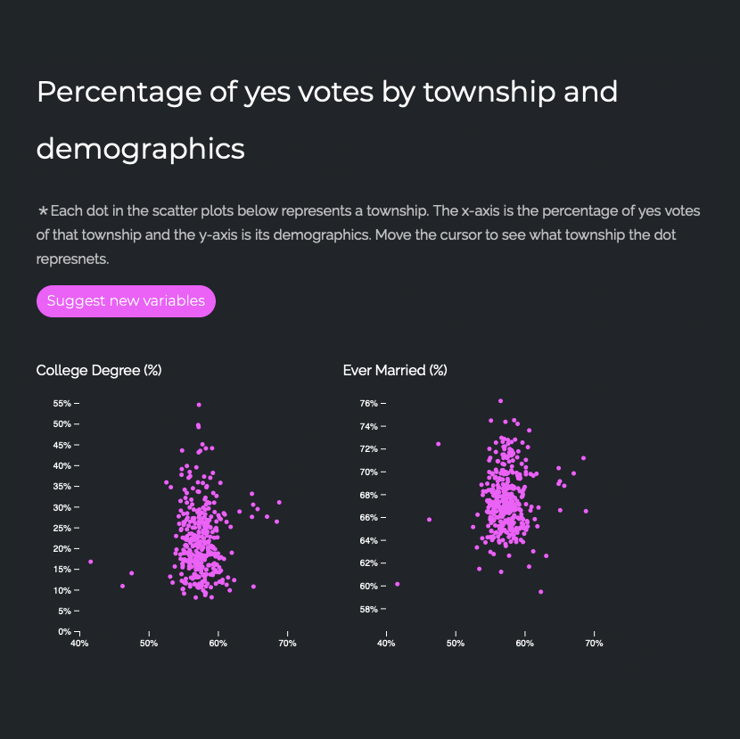

# 目標

我們的目標是以英文視覺化呈現台灣公投結果，讓國際社會了解台灣的民意。2018 年對台灣民主史具有特殊意義——10 項公投同時舉行，創下全面民主化以來的最高紀錄。然而在當時，台灣的社會與政治發展在西方世界獲得的關注相對有限，因為台海緊張局勢尚未如 2020 年代般顯著。

# 我的角色

我負責網站的 UI/UX 設計與前端開發，使用 HTML、CSS、JavaScript 和 D3.js。這是一個公民黑客計畫，由全部六位團隊成員自願參與，旨在填補中英文版公投結果視覺化不足的空缺。

# 方法

我們以自發性的黑客松形式組織這項計畫。構想在公投舉行前不到兩週成形，我們隨即進入規劃階段，節奏緊湊，每位成員依據各自的專業背景與研究領域分擔職責。

我們將網站規劃為數個核心區塊：對公投主題的簡介、引導式結果瀏覽，以及進一步分析，探討投票結果與所得、教育、年齡、婚姻狀況等人口統計因素之間的關聯與分布情形，幫助使用者理解台灣民意與這些深層因素可能存在的關係。

# 成果

網站以中英雙語呈現公投結果視覺化與背景資訊。透過空間地圖與散佈圖，視覺化提供了更全面的視角——突顯投票結果與台灣各地區人口特徵之間的關聯性。

本專案獲得廣泛迴響，吸引超過 15,000 次瀏覽，並獲得台灣本地媒體報導，包含《科技新報》（[連結](https://technews.tw/2018/11/30/taiwanese-referendum-2018/)）。

## 連結

[台灣公投 2018](https://rfrd-tw.github.io/en/) 網站。
