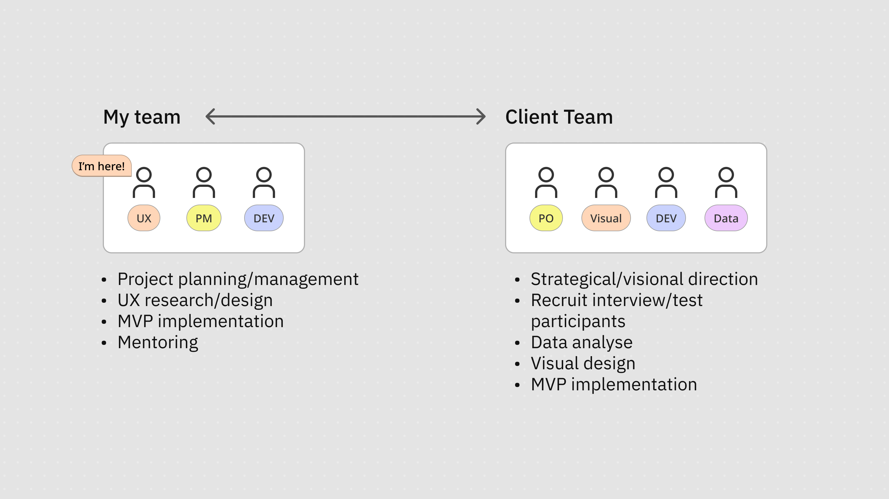
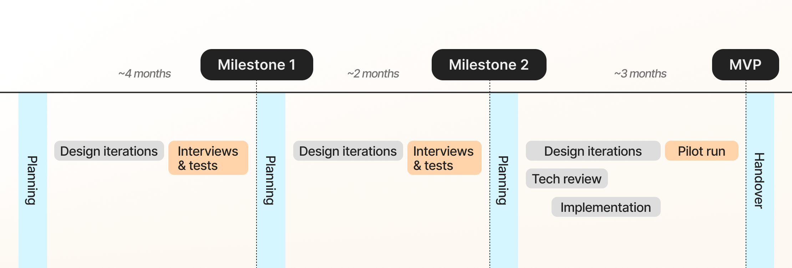
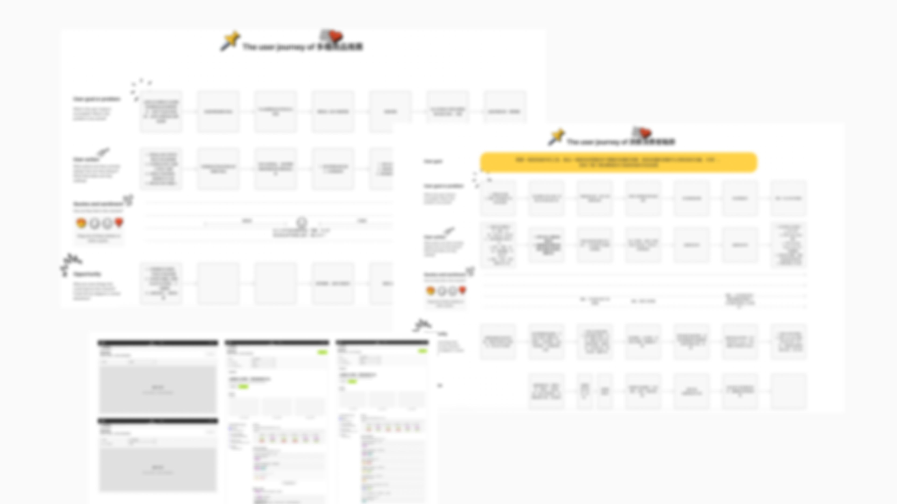
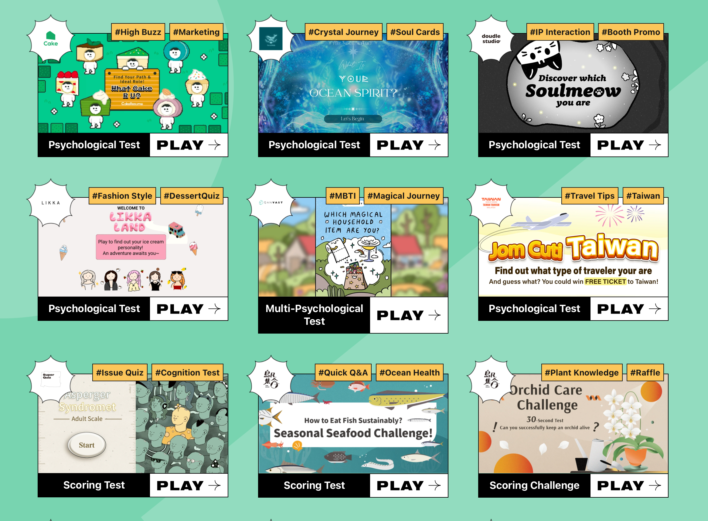

# Objectives

My client and I aimed to transform their consultancy business, RE:LAB, from a marketing design service to a SaaS company. 

The client had a strong track of record designing gamified surveys for the marketing purposes. They wanted to turn their labour-intensive service into a scalable software business that empower their users to create gamified campaign on their own.

The product has been released and is now available in English. **[Visit here](https://ooopenlab.cc/en).**

# My role

As an external product design consultant, I led a small product trio (UX, PM, Dev) from my agency to proceed with the project.  

Through out the 10-month contract period for creating the first MVP, we closely collaborated with my client’s team consisting of product owner, visual designer, developer, and data scientist.

# Challenge

My client is a marketing consultancy with 12 years of experience. Despite their rich experience in interactive marketing website and survey design, my client didn’t have any experience in the product context. 

As such, my client didn’t have a clear image on product-oriented culture. They only offered bespoke marketing design services. Although their clients consist of a great variety of globally leading companies, such as Pfizer, Bayer, Mercedes-Benz, TSMC, Greenpeace, etc, they didn’t know how to shift the focus from their individual client project to a product-oriented mindset and scalable solution. Additionally, they didn’t have the experience in facing end-users and iterating product design lifecycle.

# Approach

My approach focused on both the establishment of product development cycles and team organisation. Throughout a 10-month course of project, we **delivered a MVP and transformed a consultancy team into a product development team.** 

In this project, I took a structured and collaborative approach from the start. Together with the team, we **clarified the key value propositions and set clear goals, timelines, ways of working, and milestones**. 

At the early stages, I focused on developing and refining user journeys and interactive wireframes, which we **tested through interviews with participants from 16 different client companies**. We used the data to solidify the key user journeys.

Early wireframes and key user journeys. They are blurred because of the confidentiality concerns.

As we moved toward the MVP, I improved the design quality for implementation and worked closely with developers to bring it to life. I also collaborated with a potential client to turn the MVP into a gamified survey, which was used in **a real pilot marketing case and received over 3000 responses**. 

At the handover stage, I **helped present the design process and provided guidance for building a future design system.**

# Outcome

We delivered a successful minimal viable product and a solid foundation of work flow for the client company to continue to scale. The product, [**OOOPEN Lab**](https://ooopenlab.cc/en), has obtained 60+ clients in Taiwan and now preparing to expand oversea.

## Note

### Confidentiality concerns

All visual materials in this article were created solely to illustrate the process and outcomes of this project. They do not represent the actual product and respect the company’s intellectual property and the client’s business confidentiality.