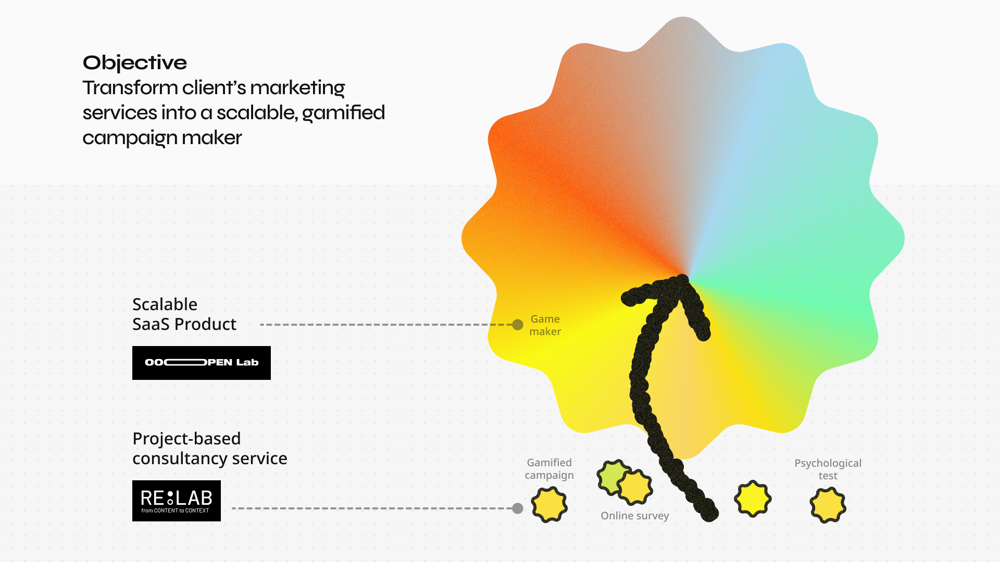
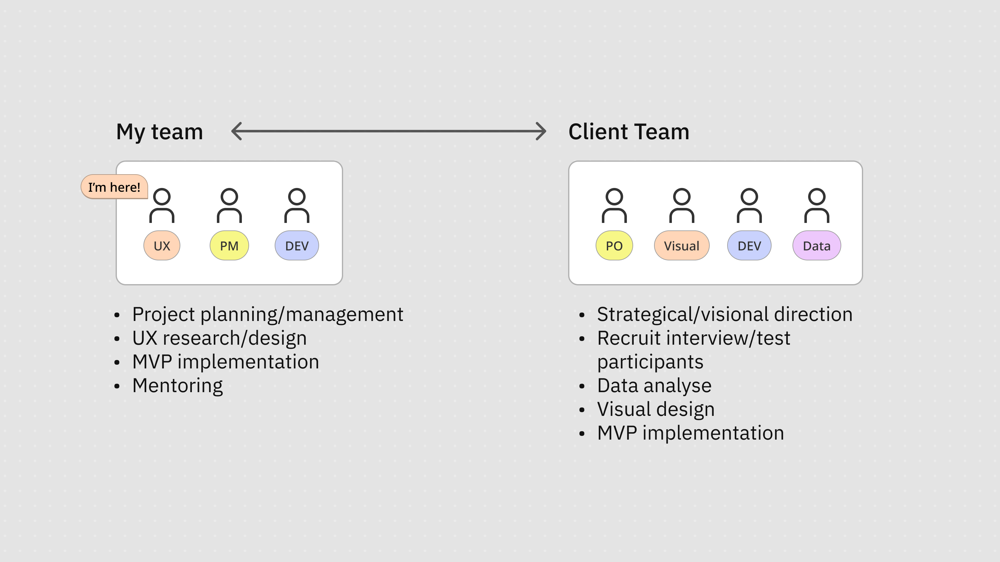
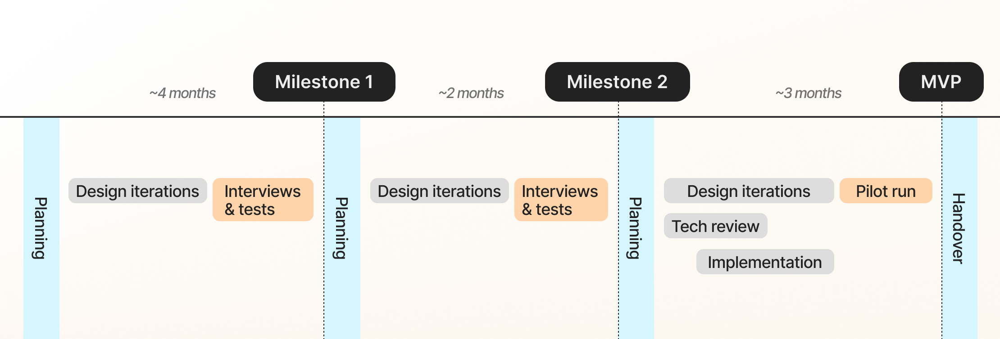
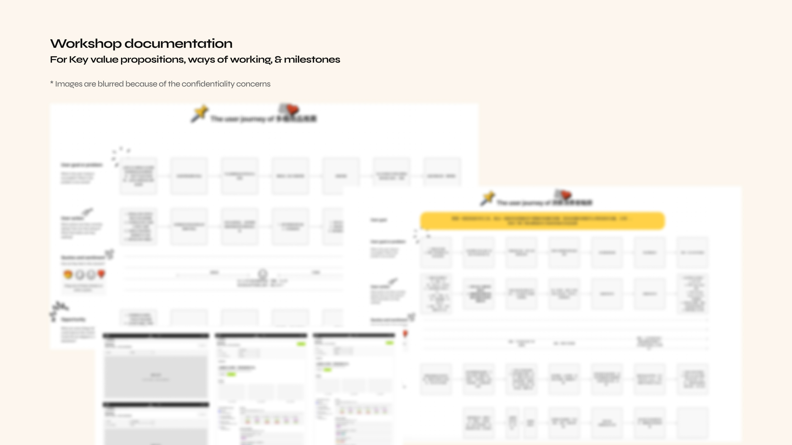
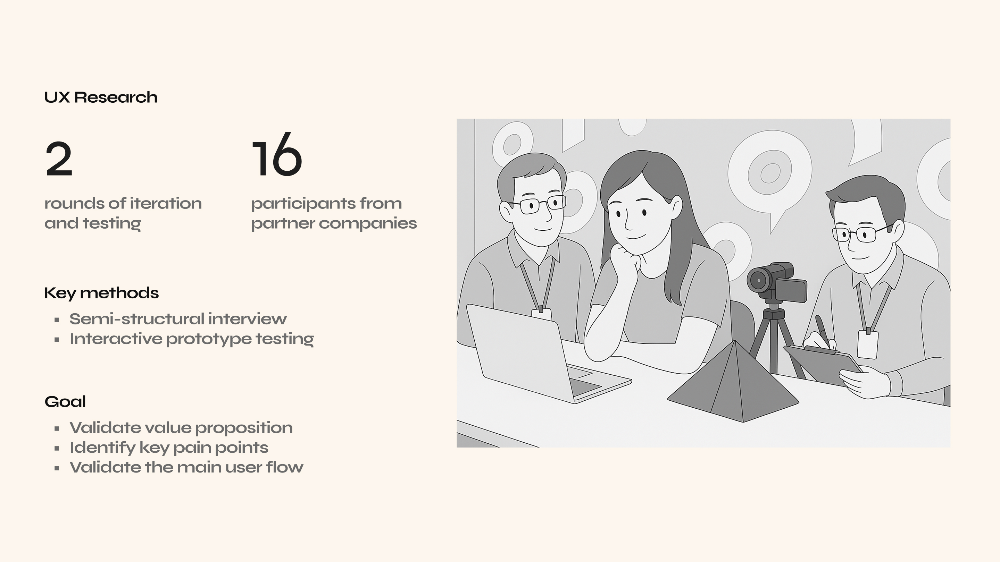
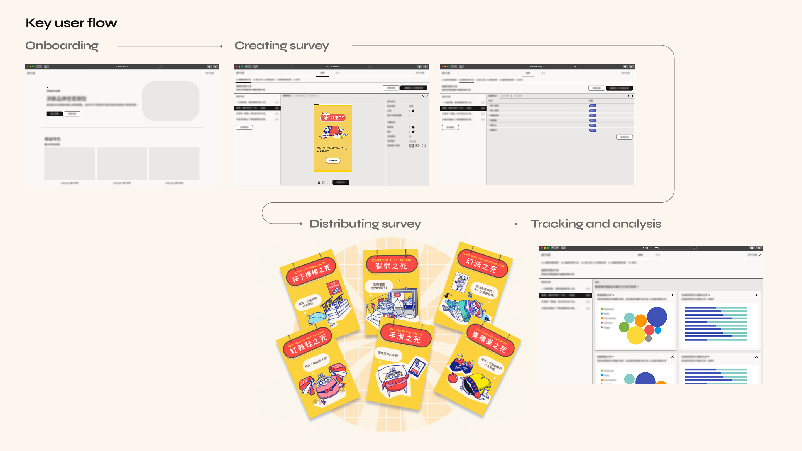
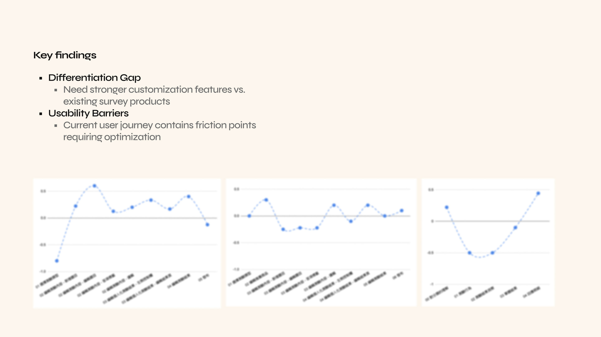
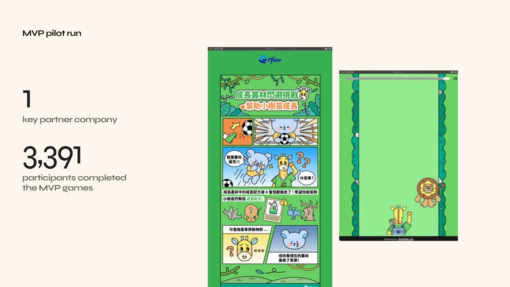
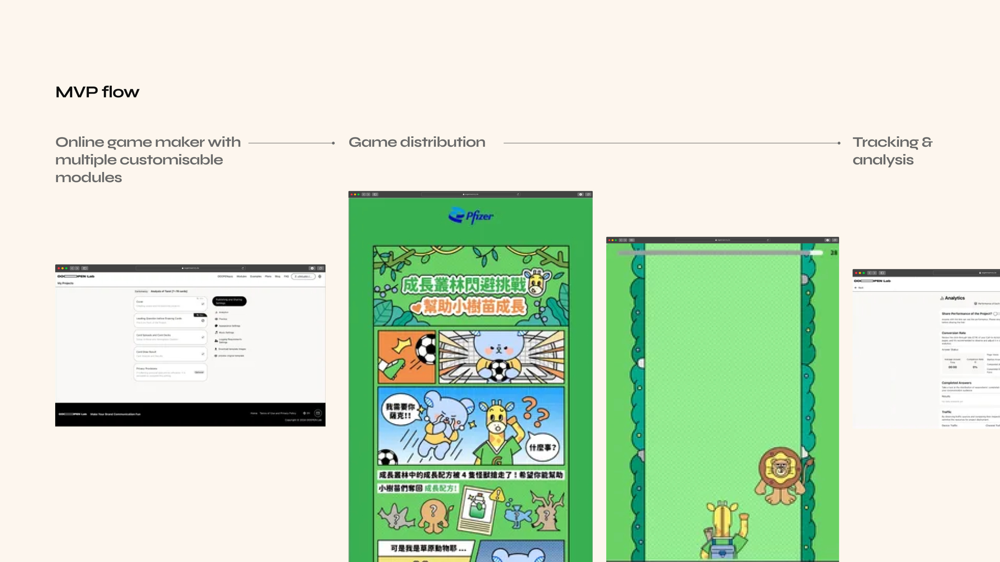
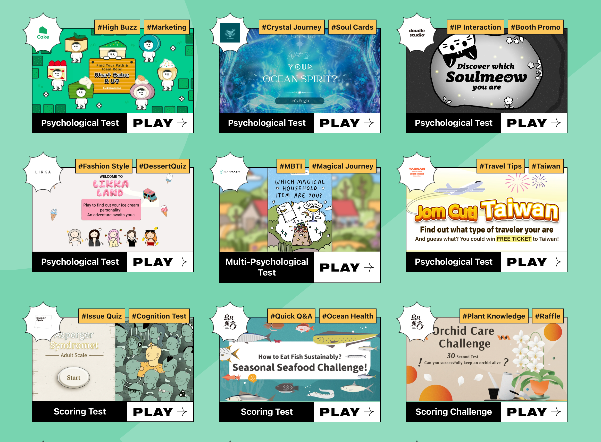

# Objectives

My client and I aimed to transform their consultancy business, RE:LAB, from a marketing design service to a SaaS company. 

The client had a strong track of record designing gamified surveys for the marketing purposes. They wanted to turn their labour-intensive service into a scalable software business that empower their users to create gamified campaign on their own.

The product has been released and is now available in English. **[Visit here](https://ooopenlab.cc/en).**

# My role

As an external product design consultant, I led a small product trio (UX, PM, Dev) from my agency to proceed with the project.  

Through out the 10-month contract period for creating the first MVP, we closely collaborated with my client’s team consisting of product owner, visual designer, developer, and data scientist.

# Challenge

My client is a marketing consultancy with 12 years of experience. Despite their rich experience in interactive marketing website and survey design, my client didn’t have any experience in the product context. 

As such, my client didn’t have a clear image on product-oriented culture. They only offered bespoke marketing design services. Although their clients consist of a great variety of globally leading companies, such as Pfizer, Bayer, Mercedes-Benz, TSMC, Greenpeace, etc, they didn’t know how to shift the focus from their individual client project to a product-oriented mindset and scalable solution. Additionally, they didn’t have the experience in facing end-users and iterating product design lifecycle.

# Approach

My approach focused on both the establishment of product development cycles and team organisation. Throughout a 10-month course of project, we **delivered a MVP and transformed a consultancy team into a product development team.** 

In this project, I took a structured and collaborative approach from the start. Together with the team, we **clarified the key value propositions and set clear goals, timelines, ways of working, and milestones**. 

At the early stages, I focused on developing and refining user journeys and interactive wireframes, which we **tested through interviews with participants from 16 different client companies**. 

We interviewed the participants about their major pain points on adopting new marketing and survey tools in their coroporate settins, and invited them to go through the **key user flow** with an interactive prototype on Figma. We used the data gathered to solidify the key value proposition and the fundamental usability.

During the research stage, we faced an important turning point. **The key finding indicates that we should differentiate the product from our competitor further**. 

At first, we assumed that our potential users needed an easy-to-use survey maker with bespoke visual material and templates. However, the interviews showed a different reality: the direction makes the product too similar to the existing survey solution. **What they actually wanted was an online game maker that could be customised for marketing purposes**.  

This meant our initial direction did not fully align with the real user needs. At that point, the project was already in the middle phase, with limited time and budget left. To address this challenge, we reviewed the entire product flow, identified the key opportunity to narrow down the scope, and adjusted the design to match the scope.  

We defined the game experience as the key scope, and aimed to keep the change on the other user steps (e.g., analysis dashboard) minimal. Within half a year, we successfully reshaped the survey creation module for game creation. 

Furthermore, in order to validate our idea, we worked closely with a partner company and delivered **an MVP for pilot test**. The pilot run was combined with the partner's marketing campaign, receiving over 3000 responses, and became a stepping stone for the product’s success in Taiwan and beyond.  

Besides the practical design and research skills I applied during the process, the most valuable takeaway for me was a mindset: **when working on a startup product, always stay open to change**. Adjustments can be painful and stressful, but they often lead to rewarding outcomes when they truly address the users’ pain points.  

# Outcome

We delivered a successful minimal viable product and a solid foundation of work flow for the client company to continue to scale. The product, [**OOOPEN Lab**](https://ooopenlab.cc/en), has obtained 60+ clients in Taiwan and now preparing to expand oversea as of this writing (mid 2025).

After the project, the collaboration continued. I **helped the client to present the design process to their investors and provided guidance for building a future design system**.

## Note

### Confidentiality concerns

All visual materials in this article were created solely to illustrate the process and outcomes of this project. They do not represent the actual product and respect the company’s intellectual property and the client’s business confidentiality.
