## Objectives

MATRIX Robotics would like to renovate its official website and upgrade it to a newer version of WordPress CMS. I developed an agile roadmap with them to redefine the website structure and to create a novel website UI system. The UI design complies with both the new componentised WordPress Gutenberg block system and the established branding style of MATRIX Robotics.

## My role

I led the project on the design side as an external contract design consultant. I collaborated with the project manager and the developers from the client company to carry on and deliver the new generation of company website including an online shop based on Wordpress CMS.

## Approach

### Agile roadmap for design development

The project lasted around 2 months with four agile cycles. Throughout the iterations, there were four core members involved: a project manager, a full-stack engineer, a branding designer, and I. The iterations allowed us to develop the new website UI system from a rough and general level of scale to every top-notch detail.

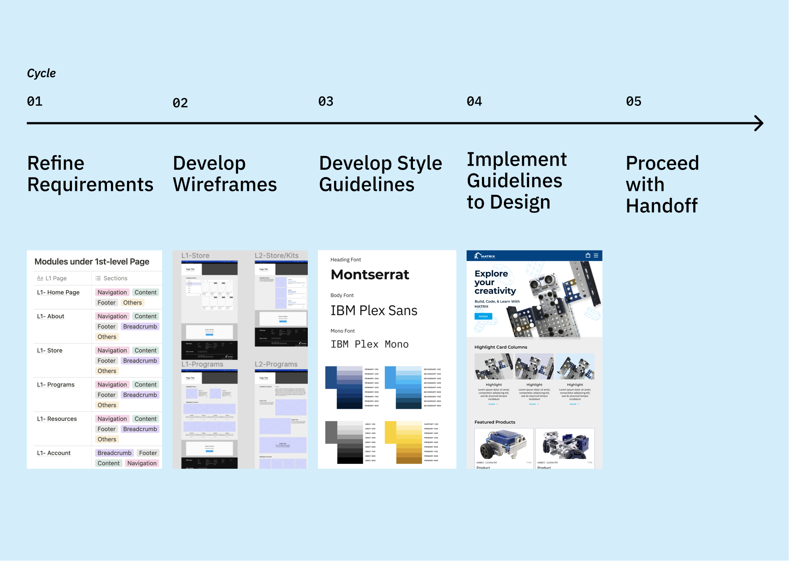

Each cycle took two weeks. At the end of each cycle, we arranged a meeting for progress reporting, feedback gathering, and evaluation. The meetings were the key events where the team members brainstormed and gathered the ideas for further design improvements.

In the first cycle, we collaboratively refined the requirements of the project, which included the website structure, and module functions. It was our first-time collaboration and the client company did not have any previous experience working with external design professionals in website design. As such, I introduced the concepts of agile cycles and design iterations to them and concretized the timeframe and schedule of the project. It took two rounds of meetings between the executive teams, and several other internal meetings for the communication across the company departments. Finally, we established a nested list of website structure. Every item on the list was agreed upon based on continuous communication during this cycle.

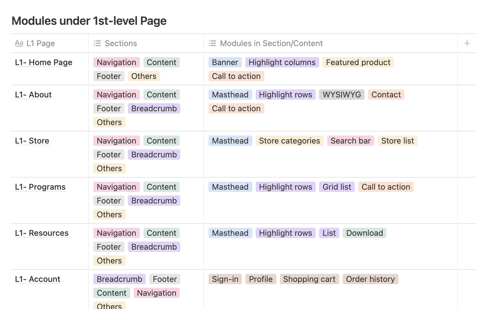

In the second cycle, I developed the wireframes of the pages and the WordPress modules inside each page. With the wireframes, I built up a mockup of rather low-fidelity. The mockup helped us to focus on the functionalities and arrangement of the webpages. We checked if every item on the list have been fulfilled, and we also discussed if there is any better way on the wireframe level to achieve the same functionalities.

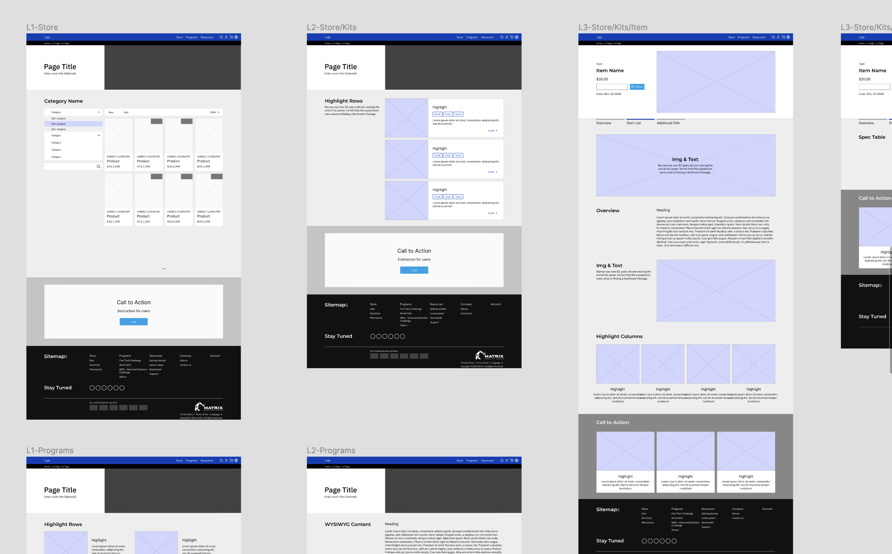

In the third cycle, I kept improving the wireframes based on the feedback agreed in the previous meeting. I also created the general guidelines for the website visual style. We arranged a meeting to review the results on both sides. Throughout the cycle, I also worked closely with the engineer to ensure that the file structure on Figma is comprehensive for further handoff.

In the last round, I applied the general guidelines of website visual style to the wireframes. As we have concretized the overall wireframes of the site, the effort on the style application won’t be made in vain due to unexpected changes. At the end of the cycle, I completed an exhaustive design system with abundant details. The meeting of this round was a final review of all the outcome. We also arranged several other meetups for the complete handoff to the engineering team of the company.

### Website UI system

Based on the overall website and module structure, we built up a scaffolding where the UI guidelines and the further design implementation situated. The UI guidelines are a system that describes the overall logic of the website interaction､ such as the mental model that determines the general layout arrangement and the events regarding mouse and finger movements.

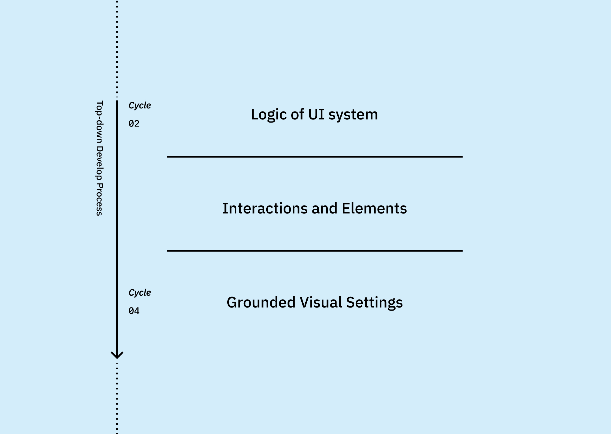

The logic of the UI system is the “why” of the user interface. The interactions and their elements are the “how” to achieve the "why". We asked about how the users would do to experience consistent interactions, for example, how would the users know that a section is more important than the others? How could we design the section and its visual language to facilitate them with a higher priority in interaction?

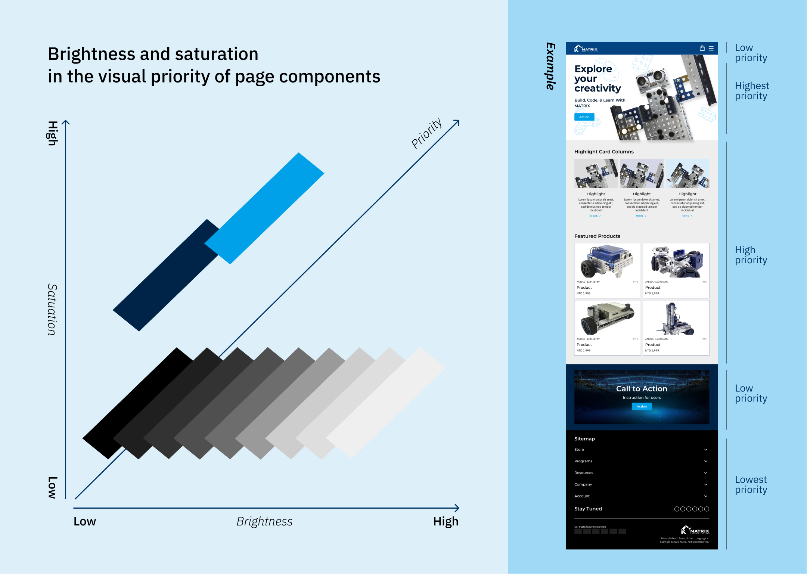

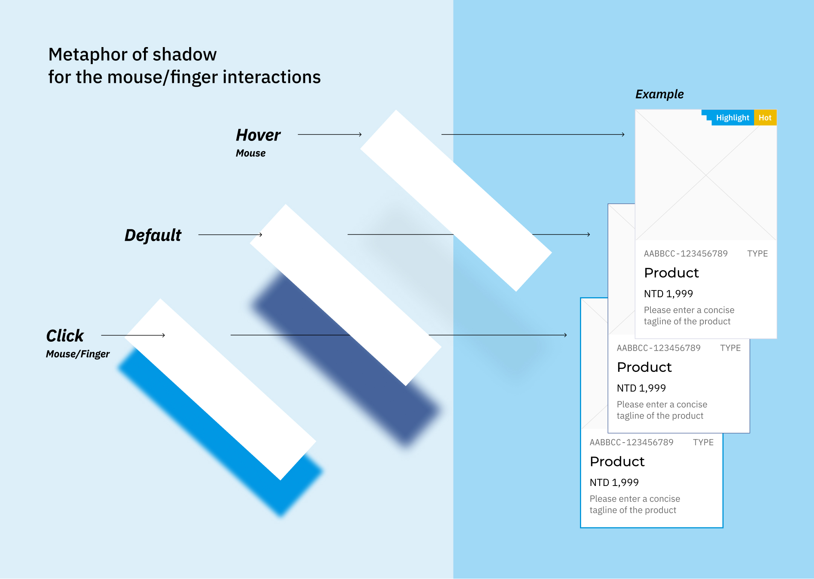

At the bottom of the system is the most “grounded” part of the whole system, such as the color palette and the typographic system. For the interactable components on the webpage, there are also a few default settings in common, such as the transition animation of the fading process.

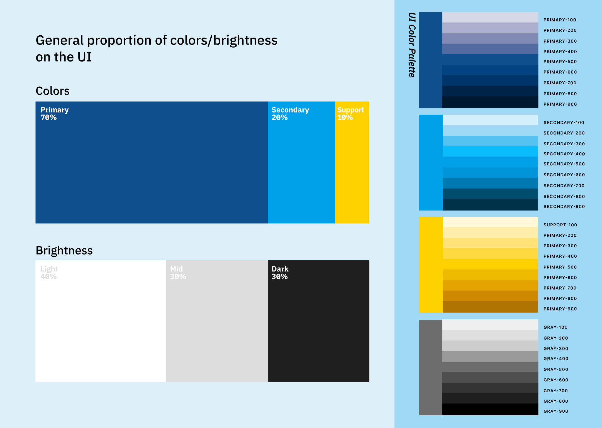

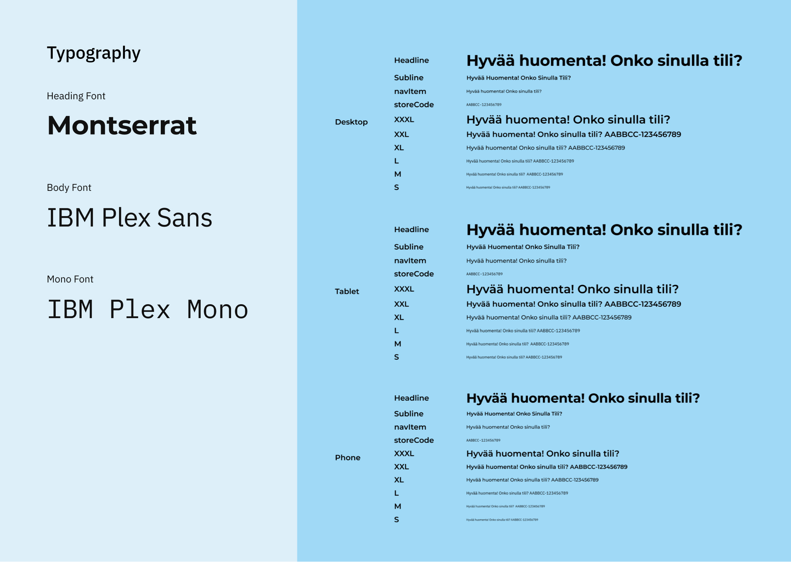

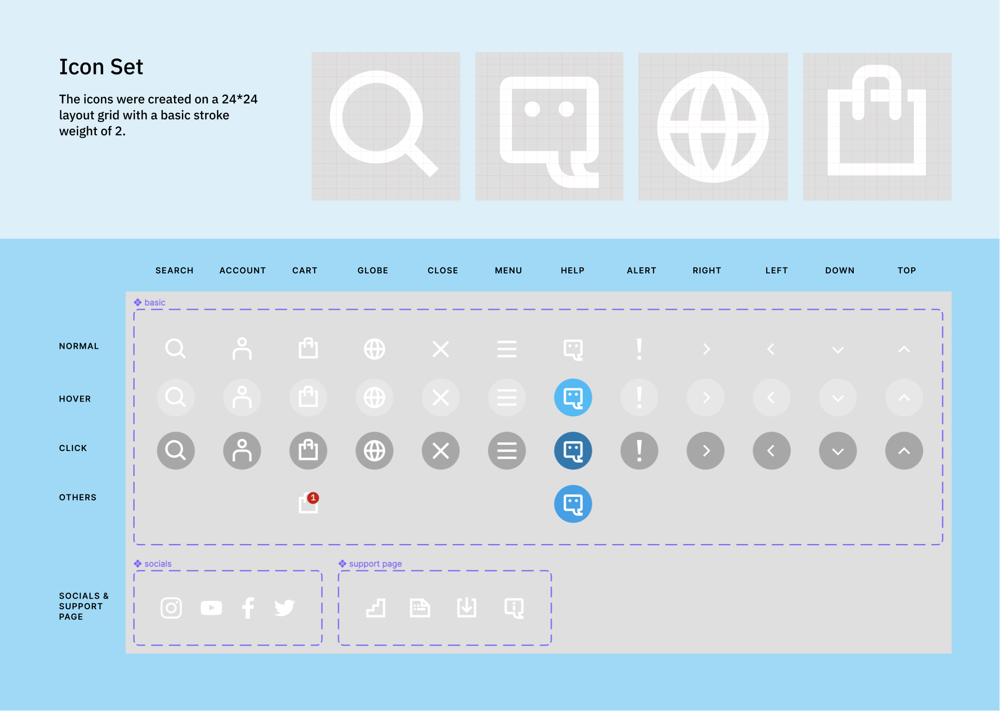

### Implementation of design

Applying the guidelines to the wireframe is the last step of the design process. In the meantime during this final stage, I was also working closely with the engineers of the company in order to make the coming handoff go more smoothly.

I typically share part of the working files with the engineers a few weeks earlier than the actual handoff so that we could check how to properly export and interpret the design into codes together. In this project, we used the working files to build a minor part of the landing page as a "pilot run". It also helped me to find several interactions missing in my design.

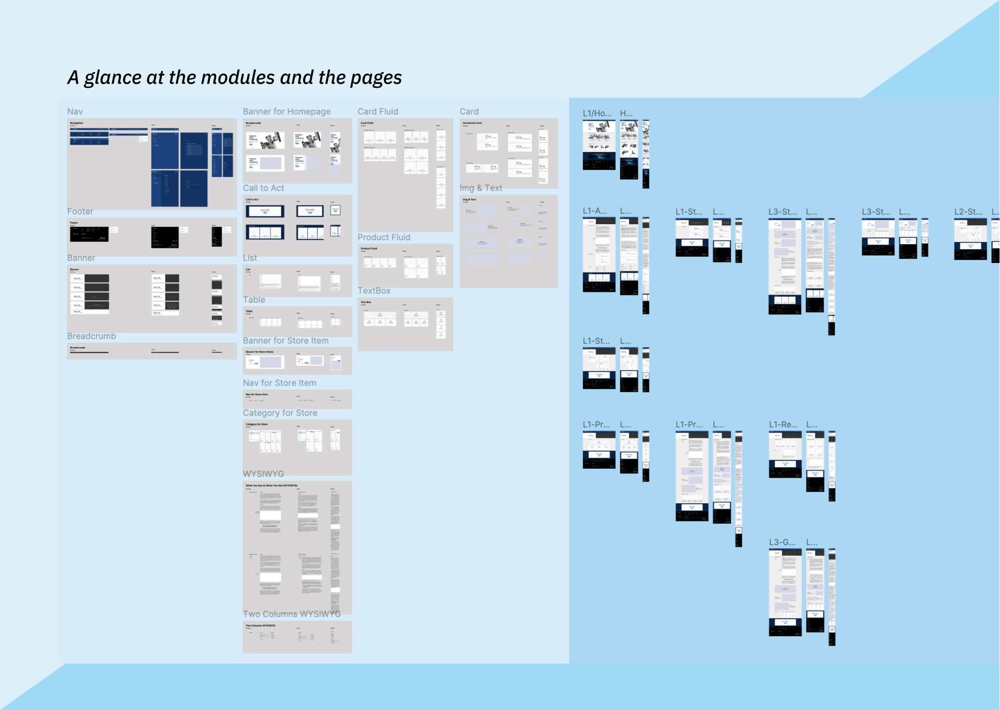

## Outcome

A new company website were successfully delivered and implemented. 

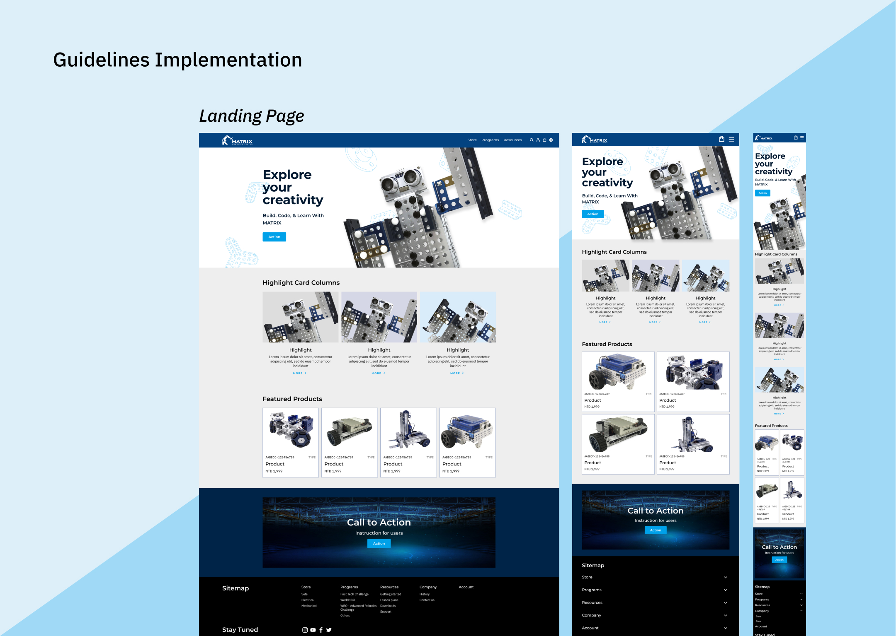

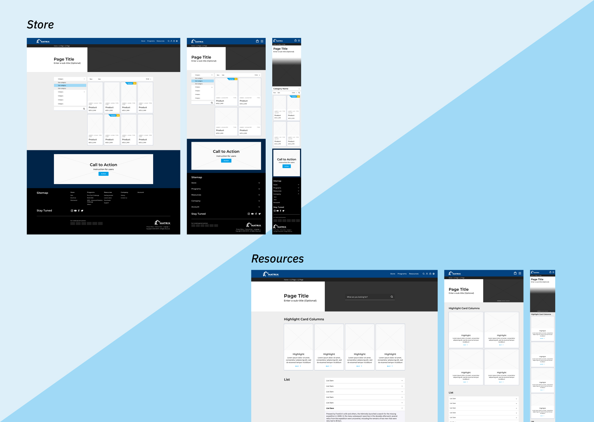